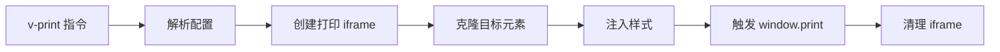

# vue3-print-nb 使用文档

## 📋 目录

- [基本介绍](#基本介绍)
- [核心特点](#核心特点)
- [性能数据](#性能数据)
- [分页能力](#分页能力)
- [完整 API 文档](#完整-api-文档)
- [实战示例](#实战示例)
- [最佳实践](#最佳实践)
- [常见问题](#常见问题)

---

## 基本介绍

### 什么是 vue3-print-nb?

vue3-print-nb 是一个专为 Vue 3 设计的轻量级打印插件（~8KB），提供了简洁的指令式和编程式 API，可以快速实现页面内容的打印功能。它是 print-nb 的 Vue 3 版本，与 Vue 3 的组合式 API 完美集成。

### 官方资源

- 📦 **NPM**: [vue3-print-nb](https://www.npmjs.com/package/vue3-print-nb)
- 📚 **GitHub**: https://github.com/Power-kxLee/vue3-print-nb
- ⭐ **Star数**: 500+
- 📖 **文档**: [GitHub README](https://github.com/Power-kxLee/vue3-print-nb#readme)

### 工作原理



### 适用场景

✅ **推荐使用：**

- Vue 3 项目的打印需求
- 订单、报表、凭证打印
- 表单、合同打印
- 需要打印预览功能
- 希望使用指令式 API

❌ **不推荐使用：**

- Vue 2 项目（使用 vue-print-nb）
- 需要生成 PDF 文件
- 需要精确分页控制
- 复杂的打印布局

---

## 核心特点

### ✨ 优势

| 特点           | 说明                 | 评分       |
| -------------- | -------------------- | ---------- |
| **Vue 集成**   | 与 Vue 3 无缝集成    | ⭐⭐⭐⭐⭐ |
| **指令式 API** | v-print 指令简单易用 | ⭐⭐⭐⭐⭐ |
| **轻量级**     | 仅 8KB，无额外依赖   | ⭐⭐⭐⭐⭐ |
| **打印预览**   | 内置预览功能         | ⭐⭐⭐⭐⭐ |
| **编程式调用** | 支持 $print() 方法   | ⭐⭐⭐⭐⭐ |
| **样式控制**   | 支持自定义打印样式   | ⭐⭐⭐⭐   |
| **回调函数**   | 提供生命周期钩子     | ⭐⭐⭐⭐   |
| **中文支持**   | 完美支持中文         | ⭐⭐⭐⭐⭐ |

### ⚠️ 劣势

| 问题           | 说明                   | 影响程度 |
| -------------- | ---------------------- | -------- |
| **Vue 3 限定** | 仅支持 Vue 3           | 🔴 高    |
| **功能简单**   | 相比专业打印库功能较少 | 🟡 中    |
| **依赖浏览器** | 打印效果依赖浏览器实现 | 🟡 中    |
| **分页控制**   | 分页能力有限           | 🟡 中    |
| **维护频率**   | 更新不频繁             | 🟢 低    |

### 与其他方案对比

| 方案           | Vue 集成   | 易用性     | 体积       | 功能     | 综合评分 |
| -------------- | ---------- | ---------- | ---------- | -------- | -------- |
| vue3-print-nb  | ⭐⭐⭐⭐⭐ | ⭐⭐⭐⭐⭐ | ⭐⭐⭐⭐⭐ | ⭐⭐⭐   | ⭐⭐⭐⭐ |
| Print.js       | ⭐⭐       | ⭐⭐⭐⭐   | ⭐⭐⭐⭐   | ⭐⭐⭐⭐ | ⭐⭐⭐⭐ |
| window.print() | ⭐⭐⭐     | ⭐⭐⭐⭐⭐ | ⭐⭐⭐⭐⭐ | ⭐⭐⭐   | ⭐⭐⭐⭐ |

---

## 性能数据

### 基准测试结果

```
测试环境：Chrome 120, Windows 11, Vue 3.3
测试内容：1000 行表格数据

┌─────────────────┬──────────────┬─────────────┐
│ 指标            │ 数值         │ 备注        │
├─────────────────┼──────────────┼─────────────┤
│ 库体积          │ 8 KB         │ 轻量级      │
│ 指令注册        │ < 1 ms       │ 即时        │
│ 元素克隆        │ 30-80 ms     │ 依赖内容量  │
│ 样式应用        │ 20-50 ms     │ CSS 处理    │
│ iframe 创建     │ 10-20 ms     │ DOM 操作    │
│ 打印触发        │ 100-300 ms   │ 浏览器响应  │
│ 内存占用        │ 1-3 MB       │ 临时 iframe │
│ CPU 占用        │ 3-8%         │ 克隆渲染时  │
└─────────────────┴──────────────┴─────────────┘
```

### 性能对比

| 方案           | 初始化     | 克隆/渲染  | 内存       | 综合       |
| -------------- | ---------- | ---------- | ---------- | ---------- |
| vue3-print-nb  | ⭐⭐⭐⭐⭐ | ⭐⭐⭐⭐   | ⭐⭐⭐⭐⭐ | ⭐⭐⭐⭐   |
| Print.js       | ⭐⭐⭐⭐   | ⭐⭐⭐⭐   | ⭐⭐⭐⭐   | ⭐⭐⭐⭐   |
| window.print() | ⭐⭐⭐⭐⭐ | ⭐⭐⭐⭐⭐ | ⭐⭐⭐⭐⭐ | ⭐⭐⭐⭐⭐ |

**优势：**

- 轻量级，几乎无性能开销
- 与 Vue 3 响应式系统无缝集成
- 内存占用低，自动清理

---

## 分页能力

### CSS 分页控制

vue3-print-nb 依赖标准 CSS 分页属性：

```css
@media print {
  /* 强制分页 */
  .page-break {
    page-break-after: always;
  }

  /* 避免元素内部分页 */
  .no-break {
    page-break-inside: avoid;
  }

  /* 页面设置 */
  @page {
    size: A4;
    margin: 20mm;
  }
}
```

### 通过 extraHead 配置分页

```javascript
const printConfig = {
  id: 'print-content',
  extraHead: `
    <style>
      @media print {
        @page {
          size: A4 portrait;
          margin: 15mm;
        }
        
        /* 表格行避免分页 */
        table tr {
          page-break-inside: avoid;
        }
        
        /* 标题后强制分页 */
        h1 {
          page-break-after: always;
        }
        
        /* 表头每页重复 */
        thead {
          display: table-header-group;
        }
      }
    </style>
  `,
}
```

### 分页限制

⚠️ **注意事项：**

1. 分页效果完全依赖浏览器实现
2. 无法精确控制每页内容数量
3. 复杂布局可能分页不准确
4. 不同浏览器可能有差异

### 浏览器兼容性

| 分页功能      | Chrome        | Firefox       | Safari        | Edge          |
| ------------- | ------------- | ------------- | ------------- | ------------- |
| page-break-\* | ✅ 完全支持   | ✅ 完全支持   | ✅ 完全支持   | ✅ 完全支持   |
| @page         | ✅ 部分支持   | ✅ 部分支持   | ✅ 部分支持   | ✅ 部分支持   |
| 页眉页脚      | ⚠️ 浏览器控制 | ⚠️ 浏览器控制 | ⚠️ 浏览器控制 | ⚠️ 浏览器控制 |

---

## 完整 API 文档

### 安装与注册

#### 1. 安装

```bash
npm install vue3-print-nb
# 或
yarn add vue3-print-nb
# 或
pnpm add vue3-print-nb
```

#### 2. 全局注册（推荐）

```javascript
// main.ts / main.js
import { createApp } from 'vue'
import print from 'vue3-print-nb'
import App from './App.vue'

const app = createApp(App)
app.use(print)
app.mount('#app')
```

#### 3. 局部注册

```javascript
// 在组件中使用
import print from 'vue3-print-nb'

export default {
  directives: {
    print,
  },
}
```

---

### v-print 指令

#### 基本用法

**语法：**

```html
<button v-print="config">打印</button>
```

**参数类型：**

- `string` - 要打印的元素 ID 或选择器
- `object` - 完整配置对象

#### 示例

```vue
<template>
  <!-- 方式 1: 简写（字符串） -->
  <button v-print="'#print-area'">打印</button>

  <!-- 方式 2: 完整配置（对象） -->
  <button v-print="printConfig">打印</button>
</template>

<script setup>
const printConfig = {
  id: 'print-area',
  popTitle: '打印标题',
}
</script>
```

---

### 配置对象属性

#### id

**类型**: `string`  
**必需**: 是  
**说明**: 要打印的元素 ID（不带 `#` 符号）

```javascript
{
  id: 'print-content' // 对应 <div id="print-content">
}
```

#### popTitle

**类型**: `string`  
**默认值**: `''`  
**说明**: 打印页面的标题（显示在浏览器标题栏和页眉）

```javascript
{
  id: 'print-content',
  popTitle: '销售报表 - 2024年12月'
}
```

#### extraHead

**类型**: `string`  
**默认值**: `''`  
**说明**: 额外的 `<head>` 内容（通常是样式）

```javascript
{
  id: 'print-content',
  extraHead: `
    <style>
      @media print {
        body { font-size: 12pt; }
        .no-print { display: none; }
      }
    </style>
  `
}
```

#### preview

**类型**: `boolean`  
**默认值**: `false`  
**说明**: 是否在打印前显示预览窗口

```javascript
{
  id: 'print-content',
  preview: true  // 显示预览
}
```

#### previewTitle

**类型**: `string`  
**默认值**: `'打印预览'`  
**说明**: 预览窗口的标题

```javascript
{
  id: 'print-content',
  preview: true,
  previewTitle: '订单预览'
}
```

#### previewPrintBtnLabel

**类型**: `string`  
**默认值**: `'打印'`  
**说明**: 预览窗口中打印按钮的文字

```javascript
{
  id: 'print-content',
  preview: true,
  previewPrintBtnLabel: '确认打印'
}
```

#### zIndex

**类型**: `number`  
**默认值**: `20002`  
**说明**: 打印 iframe 和预览窗口的 z-index

```javascript
{
  id: 'print-content',
  zIndex: 99999  // 确保在最上层
}
```

#### clickMounted

**类型**: `boolean`  
**默认值**: `false`  
**说明**: 是否在元素挂载时自动触发打印

```javascript
{
  id: 'print-content',
  clickMounted: true  // 页面加载后自动打印
}
```

---

### 回调函数

#### previewBeforeOpenCallback

**类型**: `Function`  
**参数**: 无  
**说明**: 预览窗口打开前调用

```javascript
{
  id: 'print-content',
  preview: true,
  previewBeforeOpenCallback() {
    console.log('预览窗口即将打开')
    // 可以做一些准备工作
  }
}
```

#### previewOpenCallback

**类型**: `Function`  
**参数**: `(previewWindow: Window) => void`  
**说明**: 预览窗口打开后调用

```javascript
{
  id: 'print-content',
  preview: true,
  previewOpenCallback(previewWindow) {
    console.log('预览窗口已打开', previewWindow)
    // 可以操作预览窗口
  }
}
```

#### beforeOpenCallback

**类型**: `Function`  
**参数**: `(vue: ComponentPublicInstance) => void`  
**说明**: 打印对话框打开前调用

```javascript
{
  id: 'print-content',
  beforeOpenCallback(vue) {
    console.log('即将打开打印对话框', vue)
    // 可以修改数据、显示加载提示等
  }
}
```

#### openCallback

**类型**: `Function`  
**参数**: 无  
**说明**: 打印对话框打开后调用

```javascript
{
  id: 'print-content',
  openCallback() {
    console.log('打印对话框已打开')
  }
}
```

#### closeCallback

**类型**: `Function`  
**参数**: 无  
**说明**: 打印对话框关闭后调用

```javascript
{
  id: 'print-content',
  closeCallback() {
    console.log('打印对话框已关闭')
    // 清理工作、隐藏加载提示等
  }
}
```

---

### 编程式调用

#### this.$print()

在 Options API 中使用：

```vue
<template>
  <button @click="handlePrint">打印</button>
</template>

<script>
export default {
  methods: {
    handlePrint() {
      this.$print({
        id: 'print-content',
        popTitle: '打印文档',
      })
    },
  },
}
</script>
```

#### getCurrentInstance + $print

在 Composition API 中使用：

```vue
<template>
  <button @click="handlePrint">打印</button>
</template>

<script setup>
import { getCurrentInstance } from 'vue'

const instance = getCurrentInstance()

const handlePrint = () => {
  instance?.proxy?.$print({
    id: 'print-content',
    popTitle: '打印文档',
  })
}
</script>
```

---

## 实战示例

### 示例 1：基础打印

```vue
<template>
  <div>
    <div id="print-area">
      <h1>订单详情</h1>
      <p>订单号: {{ orderId }}</p>
      <p>金额: ¥{{ amount }}</p>
    </div>

    <button v-print="'print-area'">打印订单</button>
  </div>
</template>

<script setup>
import { ref } from 'vue'

const orderId = ref('20241229001')
const amount = ref(1299.0)
</script>
```

### 示例 2：带标题的打印

```vue
<template>
  <div>
    <div id="report">
      <table>
        <thead>
          <tr>
            <th>产品</th>
            <th>数量</th>
            <th>金额</th>
          </tr>
        </thead>
        <tbody>
          <tr v-for="item in data" :key="item.id">
            <td>{{ item.name }}</td>
            <td>{{ item.qty }}</td>
            <td>¥{{ item.price }}</td>
          </tr>
        </tbody>
      </table>
    </div>

    <button v-print="printConfig">打印报表</button>
  </div>
</template>

<script setup>
const data = [
  { id: 1, name: '产品A', qty: 10, price: 100 },
  { id: 2, name: '产品B', qty: 5, price: 200 },
]

const printConfig = {
  id: 'report',
  popTitle: '销售报表 - ' + new Date().toLocaleDateString(),
}
</script>
```

### 示例 3：自定义打印样式

```vue
<template>
  <div>
    <div id="invoice">
      <div class="header">
        <h1>发票</h1>
        <p>发票号: {{ invoiceNo }}</p>
      </div>

      <div class="content">
        <p>客户: {{ customer }}</p>
        <p>金额: ¥{{ totalAmount }}</p>
      </div>

      <div class="footer no-print">
        <button>操作按钮（不打印）</button>
      </div>
    </div>

    <button v-print="printConfig">打印发票</button>
  </div>
</template>

<script setup>
import { ref } from 'vue'

const invoiceNo = ref('INV-2024-001')
const customer = ref('张三公司')
const totalAmount = ref(50000)

const printConfig = {
  id: 'invoice',
  popTitle: '发票 - ' + invoiceNo.value,
  extraHead: `
    <style>
      @media print {
        /* 页面设置 */
        @page {
          size: A4;
          margin: 20mm;
        }
        
        /* 字体和颜色 */
        body {
          font-family: "Microsoft YaHei", Arial, sans-serif;
          color: #333;
        }
        
        /* 标题样式 */
        .header {
          text-align: center;
          border-bottom: 3px solid #333;
          padding-bottom: 20px;
          margin-bottom: 30px;
        }
        
        .header h1 {
          font-size: 28pt;
          color: #000;
        }
        
        /* 内容样式 */
        .content {
          font-size: 14pt;
          line-height: 2;
        }
        
        /* 隐藏不打印的元素 */
        .no-print {
          display: none !important;
        }
      }
    </style>
  `,
}
</script>
```

### 示例 4：打印预览

```vue
<template>
  <div>
    <div id="contract">
      <h1>合同协议</h1>
      <div class="content">
        <p>甲方: {{ partyA }}</p>
        <p>乙方: {{ partyB }}</p>
        <p>签订日期: {{ date }}</p>
      </div>
    </div>

    <button v-print="printWithPreview">预览并打印</button>
  </div>
</template>

<script setup>
import { ref } from 'vue'

const partyA = ref('ABC公司')
const partyB = ref('XYZ公司')
const date = ref(new Date().toLocaleDateString())

const printWithPreview = {
  id: 'contract',
  popTitle: '合同协议',
  preview: true,
  previewTitle: '合同预览 - 请仔细核对',
  previewPrintBtnLabel: '确认无误，打印',
}
</script>
```

### 示例 5：带回调的打印

```vue
<template>
  <div>
    <div v-if="loading" class="loading">正在准备打印...</div>

    <div id="document">
      <h1>{{ title }}</h1>
      <div>{{ content }}</div>
    </div>

    <button v-print="printWithCallbacks">打印</button>
  </div>
</template>

<script setup>
import { ref } from 'vue'

const loading = ref(false)
const title = ref('重要文件')
const content = ref('文件内容...')

const printWithCallbacks = {
  id: 'document',
  popTitle: title.value,

  beforeOpenCallback() {
    console.log('打印前')
    loading.value = true
    // 可以在这里进行数据处理
  },

  openCallback() {
    console.log('打印对话框已打开')
  },

  closeCallback() {
    console.log('打印完成')
    loading.value = false
    // 清理工作
  },
}
</script>

<style scoped>
.loading {
  position: fixed;
  top: 50%;
  left: 50%;
  transform: translate(-50%, -50%);
  padding: 20px;
  background: rgba(0, 0, 0, 0.8);
  color: white;
  border-radius: 8px;
  z-index: 9999;
}
</style>
```

### 示例 6：编程式打印

```vue
<template>
  <div>
    <div id="data-table">
      <table>
        <tr v-for="row in tableData" :key="row.id">
          <td>{{ row.name }}</td>
          <td>{{ row.value }}</td>
        </tr>
      </table>
    </div>

    <button @click="printTable">编程式打印</button>
  </div>
</template>

<script setup>
import { ref, getCurrentInstance } from 'vue'

const instance = getCurrentInstance()
const tableData = ref([
  { id: 1, name: '项目A', value: 1000 },
  { id: 2, name: '项目B', value: 2000 },
])

const printTable = () => {
  if (instance?.proxy?.$print) {
    instance.proxy.$print({
      id: 'data-table',
      popTitle: '数据表格',
      extraHead: `
        <style>
          table { border-collapse: collapse; width: 100%; }
          td { border: 1px solid #ddd; padding: 8px; }
        </style>
      `,
    })
  }
}
</script>
```

### 示例 7：打印表格（自动重复表头）

```vue
<template>
  <div>
    <div id="long-table">
      <table>
        <thead>
          <tr>
            <th>序号</th>
            <th>姓名</th>
            <th>部门</th>
            <th>薪资</th>
          </tr>
        </thead>
        <tbody>
          <tr v-for="(item, index) in employees" :key="item.id">
            <td>{{ index + 1 }}</td>
            <td>{{ item.name }}</td>
            <td>{{ item.dept }}</td>
            <td>¥{{ item.salary }}</td>
          </tr>
        </tbody>
      </table>
    </div>

    <button v-print="tablePrintConfig">打印员工表</button>
  </div>
</template>

<script setup>
import { ref } from 'vue'

const employees = ref(
  Array.from({ length: 100 }, (_, i) => ({
    id: i + 1,
    name: `员工${i + 1}`,
    dept: `部门${(i % 5) + 1}`,
    salary: 5000 + Math.random() * 10000,
  })),
)

const tablePrintConfig = {
  id: 'long-table',
  popTitle: '员工薪资表',
  extraHead: `
    <style>
      @media print {
        /* 表格样式 */
        table {
          width: 100%;
          border-collapse: collapse;
          font-size: 10pt;
        }
        
        th, td {
          border: 1px solid #333;
          padding: 6px;
          text-align: left;
        }
        
        th {
          background: #f0f0f0;
          font-weight: bold;
        }
        
        /* 表头每页重复 */
        thead {
          display: table-header-group;
        }
        
        /* 表格行避免跨页断裂 */
        tr {
          page-break-inside: avoid;
        }
      }
    </style>
  `,
}
</script>
```

### 示例 8：响应式打印

```vue
<template>
  <div>
    <div id="responsive-content">
      <h1>响应式打印示例</h1>
      <div class="desktop-only">桌面端内容</div>
      <div class="mobile-only">移动端内容</div>
    </div>

    <button v-print="responsivePrintConfig">打印</button>
  </div>
</template>

<script setup>
import { computed } from 'vue'

const isMobile = computed(() => window.innerWidth < 768)

const responsivePrintConfig = computed(() => ({
  id: 'responsive-content',
  popTitle: '响应式文档',
  extraHead: `
    <style>
      @media print {
        @page {
          size: ${isMobile.value ? 'A5' : 'A4'};
          margin: ${isMobile.value ? '10mm' : '20mm'};
        }
        
        body {
          font-size: ${isMobile.value ? '10pt' : '12pt'};
        }
        
        ${isMobile.value ? '.desktop-only { display: none; }' : '.mobile-only { display: none; }'}
      }
    </style>
  `,
}))
</script>
```

### 示例 9：页面加载后自动打印

```vue
<template>
  <div>
    <div id="auto-print-content">
      <h1>自动打印内容</h1>
      <p>本页面加载后将自动触发打印</p>
    </div>

    <!-- clickMounted: true 会在挂载后自动打印 -->
    <button v-print="autoPrintConfig" style="display: none;">自动打印</button>
  </div>
</template>

<script setup>
const autoPrintConfig = {
  id: 'auto-print-content',
  popTitle: '自动打印文档',
  clickMounted: true, // 关键配置
}
</script>
```

---

## 最佳实践

### 1. 样式隔离

```javascript
// ✅ 推荐：使用 extraHead 添加专用打印样式
const printConfig = {
  id: 'content',
  extraHead: `
    <style>
      @media print {
        /* 打印专用样式 */
      }
    </style>
  `,
}

// ❌ 不推荐：依赖页面样式（可能包含不需要的样式）
```

### 2. 性能优化

```vue
<script setup>
// ✅ 推荐：配置对象声明在外部，避免每次渲染重新创建
const printConfig = {
  id: 'content',
  popTitle: '文档',
}
</script>

<template>
  <button v-print="printConfig">打印</button>
</template>
```

```vue
<!-- ❌ 不推荐：每次渲染都创建新对象 -->
<template>
  <button v-print="{ id: 'content', popTitle: '文档' }">打印</button>
</template>
```

### 3. 错误处理

```javascript
const printConfig = {
  id: 'content',
  beforeOpenCallback() {
    // 打印前检查
    const element = document.getElementById('content')
    if (!element) {
      alert('找不到要打印的内容')
      throw new Error('Print element not found')
    }
  },
  closeCallback() {
    // 打印后清理
    console.log('打印完成')
  },
}
```

### 4. 中文字体处理

```javascript
const printConfig = {
  id: 'content',
  extraHead: `
    <style>
      @media print {
        body {
          font-family: "Microsoft YaHei", "微软雅黑", "SimSun", "宋体", Arial, sans-serif;
        }
      }
    </style>
  `,
}
```

### 5. 预览功能使用

```javascript
// ✅ 推荐：重要文档使用预览
const contractPrintConfig = {
  id: 'contract',
  preview: true,
  previewTitle: '请仔细核对合同内容',
  previewPrintBtnLabel: '确认无误，打印',
}

// 普通文档可以直接打印
const receiptPrintConfig = {
  id: 'receipt',
  preview: false,
}
```

### 6. 响应式设计

```javascript
import { ref, computed } from 'vue'

const windowWidth = ref(window.innerWidth)

const printConfig = computed(() => ({
  id: 'content',
  extraHead: `
    <style>
      @media print {
        @page {
          size: ${windowWidth.value < 768 ? 'A5' : 'A4'};
        }
      }
    </style>
  `,
}))
```

---

## 常见问题

### Q1: 打印内容不完整？

**问题**：部分内容没有打印出来。

**原因**：

1. 元素 ID 不正确
2. 内容在 `display: none` 或 `visibility: hidden` 状态
3. 内容在打印时被 CSS 隐藏

**解决方案：**

```javascript
// 检查元素 ID
const printConfig = {
  id: 'print-content', // 确保 ID 正确，不带 #
  beforeOpenCallback() {
    const element = document.getElementById('print-content')
    console.log('打印元素:', element)
    if (!element) {
      alert('找不到打印元素')
    }
  },
}
```

```css
/* 确保打印时内容可见 */
@media print {
  #print-content {
    display: block !important;
    visibility: visible !important;
  }
}
```

### Q2: 样式丢失？

**问题**：打印时样式与页面显示不一致。

**解决方案：**

```javascript
const printConfig = {
  id: 'content',
  extraHead: `
    <meta charset="UTF-8">
    <style>
      /* 引入完整的打印样式 */
      @media print {
        body {
          font-family: Arial, sans-serif;
          font-size: 12pt;
          color: #000;
        }
        
        /* 重置样式 */
        * {
          box-sizing: border-box;
        }
        
        /* 你的自定义样式 */
        .title {
          font-size: 18pt;
          font-weight: bold;
        }
      }
    </style>
    
    <!-- 或引入外部样式 -->
    <link rel="stylesheet" href="/css/print.css">
  `,
}
```

### Q3: 预览窗口不显示？

**问题**：设置 `preview: true` 但没有预览窗口。

**原因**：

1. 浏览器阻止了弹窗
2. z-index 太低被遮挡

**解决方案：**

```javascript
const printConfig = {
  id: 'content',
  preview: true,
  zIndex: 999999, // 设置更高的 z-index
  previewBeforeOpenCallback() {
    // 检查是否被阻止
    console.log('即将打开预览')
  },
}
```

### Q4: 打印大表格时表头不重复？

**问题**：多页表格只在第一页显示表头。

**解决方案：**

```javascript
const printConfig = {
  id: 'table-content',
  extraHead: `
    <style>
      @media print {
        /* 关键：使表头在每页重复 */
        thead {
          display: table-header-group;
        }
        
        tfoot {
          display: table-footer-group;
        }
        
        /* 避免表格行被截断 */
        tr {
          page-break-inside: avoid;
        }
      }
    </style>
  `,
}
```

### Q5: 如何隐藏某些元素？

**问题**：想在打印时隐藏按钮、导航栏等。

**解决方案：**

```javascript
const printConfig = {
  id: 'content',
  extraHead: `
    <style>
      @media print {
        /* 隐藏特定元素 */
        .no-print,
        button,
        .sidebar,
        .navbar {
          display: none !important;
        }
      }
    </style>
  `,
}
```

```html
<!-- 或在 HTML 中添加 class -->
<div class="no-print">
  <button>不打印的按钮</button>
</div>
```

### Q6: 编程式调用报错？

**问题**：`this.$print is not a function` 或 `instance.proxy.$print is undefined`

**原因**：插件未正确注册。

**解决方案：**

```javascript
// main.ts
import { createApp } from 'vue'
import print from 'vue3-print-nb'
import App from './App.vue'

const app = createApp(App)
app.use(print) // 确保注册
app.mount('#app')
```

```vue
<!-- 组件中 -->
<script setup>
import { getCurrentInstance } from 'vue'

const instance = getCurrentInstance()

const handlePrint = () => {
  // 检查是否存在
  if (instance?.proxy?.$print) {
    instance.proxy.$print({
      id: 'content',
    })
  } else {
    console.error('打印插件未注册')
    // 降级方案
    window.print()
  }
}
</script>
```

### Q7: 打印内容被截断？

**问题**：长表格或大图片被截断分页。

**解决方案：**

```javascript
const printConfig = {
  id: 'content',
  extraHead: `
    <style>
      @media print {
        /* 防止元素被截断 */
        table, .important-section {
          page-break-inside: avoid;
        }
        
        /* 图片不截断 */
        img {
          page-break-inside: avoid;
          max-width: 100%;
        }
        
        /* 如果内容确实太长，允许特定元素截断 */
        .allow-break {
          page-break-inside: auto;
        }
      }
    </style>
  `,
}
```

### Q8: 如何添加打印日期时间？

**问题**：想在打印内容中显示打印时间。

**解决方案：**

```vue
<template>
  <div>
    <div id="document">
      <h1>文档标题</h1>
      <p class="print-time">打印时间: {{ printTime }}</p>
      <div>文档内容...</div>
    </div>

    <button v-print="printConfig">打印</button>
  </div>
</template>

<script setup>
import { ref } from 'vue'

const printTime = ref('')

const printConfig = {
  id: 'document',
  beforeOpenCallback() {
    // 在打印前更新时间
    printTime.value = new Date().toLocaleString('zh-CN')
  },
}
</script>
```

### Q9: Vue 2 项目能用吗？

**问题**：想在 Vue 2 项目中使用。

**答案**：vue3-print-nb 仅支持 Vue 3。

**Vue 2 替代方案：**

```bash
# 使用 vue-print-nb（Vue 2 版本）
npm install vue-print-nb
```

```javascript
// Vue 2 用法
import Vue from 'vue'
import print from 'vue-print-nb'

Vue.use(print)
```

---

## 总结

### 适用场景评分

| 场景           | 适用度     | 说明     |
| -------------- | ---------- | -------- |
| Vue 3 项目打印 | ⭐⭐⭐⭐⭐ | 最佳选择 |
| 简单内容打印   | ⭐⭐⭐⭐⭐ | 推荐     |
| 需要打印预览   | ⭐⭐⭐⭐⭐ | 内置支持 |
| 表单/订单打印  | ⭐⭐⭐⭐⭐ | 推荐     |
| 复杂布局       | ⭐⭐⭐     | 需要调试 |
| 生成 PDF       | ❌         | 不支持   |

### 技术选型建议

**✅ 选择 vue3-print-nb 当：**

- 使用 Vue 3 框架
- 需要简单快速的打印功能
- 希望使用指令式 API
- 需要打印预览功能
- 项目对库大小有要求

**❌ 不选择 vue3-print-nb 当：**

- 使用 Vue 2（选择 vue-print-nb）
- 不使用 Vue（选择 Print.js）
- 需要生成 PDF 文件
- 需要精确的分页控制
- 需要后台自动打印

### 与其他方案配合使用

vue3-print-nb 可以与其他打印方案配合使用：

```vue
<script setup>
import { getCurrentInstance } from 'vue'
import jsPDF from 'jspdf'

const instance = getCurrentInstance()

// 简单打印：使用 vue3-print-nb
const simplePrint = () => {
  instance.proxy.$print({ id: 'content' })
}

// 生成 PDF：使用 jsPDF
const generatePDF = () => {
  const doc = new jsPDF()
  // ... PDF 生成逻辑
  doc.save('document.pdf')
}
</script>
```

---

## 相关资源

- [NPM 包](https://www.npmjs.com/package/vue3-print-nb)
- [GitHub 仓库](https://github.com/Power-kxLee/vue3-print-nb)
- [Vue 2 版本 (vue-print-nb)](https://github.com/Power-kxLee/vue-print-nb)
- [Print.js（非 Vue 方案）](https://printjs.crabbly.com/)
