# jsPDF 使用文档

## 📋 目录

- [基本介绍](#基本介绍)
- [核心特点](#核心特点)
- [性能数据](#性能数据)
- [分页能力](#分页能力)
- [完整 API 文档](#完整-api-文档)
- [中文字体支持](#中文字体支持)
- [实战示例](#实战示例)
- [最佳实践](#最佳实践)
- [常见问题](#常见问题)

---

## 基本介绍

### 什么是 jsPDF?

jsPDF 是一个功能强大的客户端 PDF 生成库，可以在浏览器中直接生成 PDF 文档。它提供了完整的 API 来绘制文本、图形、图片，并支持自定义字体和多页文档。

### 官方资源

- 📦 **NPM**: [jspdf](https://www.npmjs.com/package/jspdf)
- 🌐 **官网**: https://parall.ax/products/jspdf
- 📚 **GitHub**: https://github.com/parallax/jsPDF
- ⭐ **Star数**: 28k+
- 📖 **API 文档**: https://raw.githack.com/MrRio/jsPDF/master/docs/

### 工作原理

```mermaid
graph LR
    A[创建 jsPDF 实例] --> B[绘制文本/图形]
    B --> C[添加图片]
    C --> D[设置字体样式]
    D --> E[分页处理]
    E --> F[生成 PDF Blob]
    F --> G[下载/预览]
```



### 适用场景

✅ **推荐使用：**

- 需要精确控制 PDF 布局
- 生成报表、发票、合同
- 需要矢量图形输出
- 客户端生成 PDF
- 需要自定义字体（如中文）

❌ **不推荐使用：**

- 简单打印需求（用 window.print()）
- HTML 直接转 PDF（用 html2pdf.js）
- 需要极致性能
- 不需要下载 PDF 文件

---

## 核心特点

### ✨ 优势

| 特点           | 说明                   | 评分       |
| -------------- | ---------------------- | ---------- |
| **精确控制**   | 像素级布局控制         | ⭐⭐⭐⭐⭐ |
| **矢量输出**   | 清晰的矢量图形         | ⭐⭐⭐⭐⭐ |
| **功能丰富**   | 文本、图形、图片、字体 | ⭐⭐⭐⭐⭐ |
| **分页控制**   | 完全可编程的分页       | ⭐⭐⭐⭐⭐ |
| **插件生态**   | autoTable 等实用插件   | ⭐⭐⭐⭐⭐ |
| **客户端生成** | 无需服务器             | ⭐⭐⭐⭐⭐ |
| **自定义字体** | 支持 TTF 字体          | ⭐⭐⭐⭐   |
| **浏览器兼容** | 支持现代浏览器         | ⭐⭐⭐⭐   |

### ⚠️ 劣势

| 问题         | 说明                 | 影响程度 |
| ------------ | -------------------- | -------- |
| **学习曲线** | API 较底层，需要学习 | 🟡 中    |
| **中文配置** | 需要手动加载字体     | 🟡 中    |
| **体积较大** | 150KB (gzip 后)      | 🟡 中    |
| **性能**     | 大文档生成较慢       | 🟡 中    |
| **HTML转换** | 不直接支持 HTML      | 🔴 高    |

### 与其他方案对比

| 方案        | 精确控制   | 易用性     | 体积   | 中文支持   | 综合评分   |
| ----------- | ---------- | ---------- | ------ | ---------- | ---------- |
| jsPDF       | ⭐⭐⭐⭐⭐ | ⭐⭐⭐     | ⭐⭐⭐ | ⭐⭐⭐⭐   | ⭐⭐⭐⭐   |
| pdfmake     | ⭐⭐⭐⭐⭐ | ⭐⭐⭐⭐   | ⭐⭐   | ⭐⭐⭐⭐⭐ | ⭐⭐⭐⭐⭐ |
| html2pdf.js | ⭐⭐⭐     | ⭐⭐⭐⭐⭐ | ⭐⭐⭐ | ⭐⭐⭐⭐   | ⭐⭐⭐⭐   |

---

## 性能数据

### 基准测试结果

```
测试环境：Chrome 120, Windows 11
测试内容：100 页文档，每页 1000 字

┌─────────────────┬──────────────┬─────────────┐
│ 指标            │ 数值         │ 备注        │
├─────────────────┼──────────────┼─────────────┤
│ 库体积          │ 150 KB       │ gzip 压缩后 │
│ 中文字体        │ 17 MB        │ 可变字体    │
│ 初始化          │ 10-30 ms     │ 创建实例    │
│ 单页生成        │ 50-150 ms    │ 含文本图形  │
│ 100页生成       │ 5-8 秒       │ 包含字体加载│
│ 字体加载        │ 1-2 秒       │ 内网环境    │
│ PDF 输出        │ 200-500 ms   │ 转 Blob     │
│ 内存占用        │ 30-80 MB     │ 大文档时    │
│ CPU 占用        │ 20-40%       │ 生成时      │
└─────────────────┴──────────────┴─────────────┘
```

### 性能对比

| 方案              | 初始化   | 生成速度   | 内存     | 综合     |
| ----------------- | -------- | ---------- | -------- | -------- |
| jsPDF             | ⭐⭐⭐⭐ | ⭐⭐⭐⭐   | ⭐⭐⭐   | ⭐⭐⭐⭐ |
| pdfmake           | ⭐⭐⭐   | ⭐⭐⭐⭐⭐ | ⭐⭐⭐⭐ | ⭐⭐⭐⭐ |
| html2canvas+jsPDF | ⭐⭐     | ⭐⭐       | ⭐⭐     | ⭐⭐     |

**优势：**

- 比 html2canvas 方案快 5-10 倍
- 矢量输出，文件更小
- 可编程控制，灵活性高

---

## 分页能力

### 完全可编程的分页

jsPDF 提供了完全的分页控制，可以精确决定何时换页：

```javascript
const doc = new jsPDF()
const pageHeight = doc.internal.pageSize.height
let yPosition = 20

// 手动分页逻辑
if (yPosition > pageHeight - 20) {
  doc.addPage()
  yPosition = 20
}
```

### 分页 API

#### addPage()

```javascript
// 添加新页（与当前页相同格式）
doc.addPage()

// 添加指定方向的新页
doc.addPage('landscape') // 横向
doc.addPage('portrait') // 纵向

// 添加指定格式的新页
doc.addPage('a4', 'landscape')
```

#### setPage()

```javascript
// 切换到指定页
doc.setPage(2) // 切换到第2页

// 在指定页添加内容
for (let i = 1; i <= doc.internal.getNumberOfPages(); i++) {
  doc.setPage(i)
  doc.text(`第 ${i} 页`, 105, 10, { align: 'center' })
}
```

#### getNumberOfPages()

```javascript
// 获取总页数
const totalPages = doc.internal.getNumberOfPages()
console.log(`共 ${totalPages} 页`)
```

#### deletePage()

```javascript
// 删除指定页
doc.deletePage(3) // 删除第3页
```

### 自动分页示例

```javascript
const doc = new jsPDF()
const pageWidth = doc.internal.pageSize.width
const pageHeight = doc.internal.pageSize.height
const margin = 20
let y = margin

const addText = (text) => {
  // 检查是否需要换页
  if (y > pageHeight - margin) {
    doc.addPage()
    y = margin
  }

  doc.text(text, margin, y)
  y += 10
}

// 使用
for (let i = 0; i < 100; i++) {
  addText(`第 ${i + 1} 行内容`)
}
```

### 页眉页脚

```javascript
const doc = new jsPDF()
const totalPages = 10

// 生成内容...
for (let i = 1; i <= totalPages; i++) {
  if (i > 1) doc.addPage()

  // 页眉
  doc.setFontSize(10)
  doc.text('公司报表', 105, 10, { align: 'center' })

  // 页面内容
  doc.setFontSize(12)
  doc.text(`第 ${i} 页内容`, 20, 30)

  // 页脚
  doc.setFontSize(8)
  const pageHeight = doc.internal.pageSize.height
  doc.text(`第 ${i} 页 / 共 ${totalPages} 页`, 105, pageHeight - 10, { align: 'center' })
}
```

---

## 完整 API 文档

### 安装与导入

#### 安装

```bash
npm install jspdf
# 或
yarn add jspdf
# 或
pnpm add jspdf
```

#### 导入

```javascript
// ES6 模块
import { jsPDF } from 'jspdf'

// CommonJS
const { jsPDF } = require('jspdf')

// 浏览器 (CDN)
<script src="https://cdnjs.cloudflare.com/ajax/libs/jspdf/2.5.1/jspdf.umd.min.js"></script>
```

---

### 构造函数

#### new jsPDF(options)

```javascript
// 方式 1: 默认 (A4, 纵向, mm)
const doc = new jsPDF()

// 方式 2: 简写参数
const doc = new jsPDF(orientation, unit, format)
const doc = new jsPDF('landscape', 'mm', 'a4')

// 方式 3: 配置对象 (推荐)
const doc = new jsPDF({
  orientation: 'portrait', // portrait 或 landscape
  unit: 'mm', // pt, mm, cm, in
  format: 'a4', // a4, a3, letter 或 [width, height]
  compress: true, // 压缩 PDF
  precision: 2, // 数值精度
  userUnit: 1.0, // 用户单位比例
})
```

#### 参数说明

**orientation** (方向)

- `'portrait'` - 纵向 (默认)
- `'landscape'` - 横向

**unit** (单位)

- `'pt'` - 点 (1/72 英寸)
- `'mm'` - 毫米 (默认)
- `'cm'` - 厘米
- `'in'` - 英寸

**format** (格式)

- `'a4'` - A4 (210 x 297 mm)
- `'a3'` - A3 (297 x 420 mm)
- `'letter'` - Letter (8.5 x 11 inch)
- `[width, height]` - 自定义尺寸

---

### 文本 API

#### text()

**基本用法：**

```javascript
doc.text(text, x, y, options)
```

**参数：**

- `text`: `string | string[]` - 文本内容
- `x`: `number` - X 坐标
- `y`: `number` - Y 坐标
- `options`: `object` - 配置选项

**示例：**

```javascript
// 简单文本
doc.text('Hello World', 10, 10)

// 多行文本
doc.text(['第一行', '第二行', '第三行'], 10, 10)

// 带选项
doc.text('居中文本', 105, 10, {
  align: 'center', // left, center, right, justify
  maxWidth: 180, // 最大宽度
  lineHeightFactor: 1.5, // 行高倍数
})

// 旋转文本
doc.text('旋转文本', 100, 100, {
  angle: 45, // 旋转角度
})
```

#### setFont()

```javascript
doc.setFont(fontName, fontStyle)

// 示例
doc.setFont('helvetica', 'normal') // 普通
doc.setFont('helvetica', 'bold') // 粗体
doc.setFont('helvetica', 'italic') // 斜体
doc.setFont('helvetica', 'bolditalic') // 粗斜体

// 自定义字体 (中文字体)
doc.setFont('SourceHanSansSC', 'normal')
```

#### setFontSize()

```javascript
doc.setFontSize(size)

// 示例
doc.setFontSize(12) // 12pt
doc.setFontSize(24) // 24pt
```

#### setTextColor()

```javascript
// RGB
doc.setTextColor(255, 0, 0) // 红色

// 灰度
doc.setTextColor(128) // 灰色

// 十六进制
doc.setTextColor('#FF0000') // 红色
```

#### getTextWidth()

```javascript
// 获取文本宽度
const width = doc.getTextWidth('Hello World')
console.log(width) // 单位与创建时指定的单位一致
```

#### splitTextToSize()

```javascript
// 将文本拆分为适应指定宽度的行
const lines = doc.splitTextToSize('很长的文本内容...', 180)
lines.forEach((line, i) => {
  doc.text(line, 10, 10 + i * 10)
})
```

---

### 图形 API

#### line()

```javascript
doc.line(x1, y1, x2, y2, style)

// 示例
doc.line(10, 10, 100, 10) // 横线
doc.line(10, 10, 10, 100) // 竖线
```

#### rect()

```javascript
doc.rect(x, y, width, height, style)

// 示例
doc.rect(10, 10, 50, 30) // 空心矩形
doc.rect(10, 10, 50, 30, 'F') // 填充矩形
doc.rect(10, 10, 50, 30, 'FD') // 填充+描边
```

#### roundedRect()

```javascript
doc.roundedRect(x, y, width, height, radiusX, radiusY, style)

// 示例
doc.roundedRect(10, 10, 50, 30, 3, 3, 'FD')
```

#### circle()

```javascript
doc.circle(x, y, radius, style)

// 示例
doc.circle(50, 50, 20) // 空心圆
doc.circle(50, 50, 20, 'F') // 填充圆
```

#### ellipse()

```javascript
doc.ellipse(x, y, radiusX, radiusY, style)

// 示例
doc.ellipse(50, 50, 30, 20, 'FD')
```

#### triangle()

```javascript
doc.triangle(x1, y1, x2, y2, x3, y3, style)

// 示例
doc.triangle(50, 10, 10, 100, 90, 100, 'FD')
```

#### setLineWidth()

```javascript
doc.setLineWidth(width)

// 示例
doc.setLineWidth(0.5) // 细线
doc.setLineWidth(2) // 粗线
```

#### setDrawColor()

```javascript
// 设置描边颜色
doc.setDrawColor(255, 0, 0) // RGB
doc.setDrawColor(128) // 灰度
doc.setDrawColor('#FF0000') // 十六进制
```

#### setFillColor()

```javascript
// 设置填充颜色
doc.setFillColor(0, 255, 0) // RGB
doc.setFillColor(200) // 灰度
doc.setFillColor('#00FF00') // 十六进制
```

---

### 图片 API

#### addImage()

```javascript
doc.addImage(imageData, format, x, y, width, height, alias, compression, rotation)
```

**参数：**

- `imageData`: Base64 字符串、Canvas、Image 对象
- `format`: 'PNG', 'JPEG', 'JPG', 'WEBP'
- `x, y`: 坐标
- `width, height`: 尺寸
- `alias`: 图片别名（复用时使用）
- `compression`: 'NONE', 'FAST', 'MEDIUM', 'SLOW'
- `rotation`: 旋转角度

**示例：**

```javascript
// Base64 图片
const imgData = 'data:image/png;base64,iVBORw0KG...'
doc.addImage(imgData, 'PNG', 10, 10, 100, 100)

// Canvas
const canvas = document.getElementById('myCanvas')
doc.addImage(canvas, 'PNG', 10, 10, 100, 100)

// 图片压缩
doc.addImage(imgData, 'JPEG', 10, 10, 100, 100, '', 'SLOW')

// 旋转图片
doc.addImage(imgData, 'PNG', 10, 10, 100, 100, '', 'NONE', 45)
```

**从文件加载图片：**

```javascript
const loadImage = (src) => {
  return new Promise((resolve) => {
    const img = new Image()
    img.onload = () => {
      const canvas = document.createElement('canvas')
      canvas.width = img.width
      canvas.height = img.height
      const ctx = canvas.getContext('2d')
      ctx.drawImage(img, 0, 0)
      resolve(canvas.toDataURL('image/png'))
    }
    img.src = src
  })
}

const imgData = await loadImage('/path/to/image.jpg')
doc.addImage(imgData, 'JPEG', 10, 10, 100, 100)
```

---

### 页面 API

#### addPage()

```javascript
// 添加新页
doc.addPage()

// 添加指定方向的页
doc.addPage('landscape')
doc.addPage('portrait')

// 添加指定格式的页
doc.addPage('a4', 'portrait')
doc.addPage([210, 297], 'landscape')
```

#### setPage()

```javascript
// 跳转到指定页
doc.setPage(2)

// 在所有页添加页码
const totalPages = doc.internal.getNumberOfPages()
for (let i = 1; i <= totalPages; i++) {
  doc.setPage(i)
  doc.text(`第 ${i} 页`, 105, 10, { align: 'center' })
}
```

#### deletePage()

```javascript
// 删除指定页
doc.deletePage(3)

// 删除最后一页
doc.deletePage(doc.internal.getNumberOfPages())
```

#### internal.getNumberOfPages()

```javascript
// 获取总页数
const totalPages = doc.internal.getNumberOfPages()
```

#### internal.pageSize

```javascript
// 获取页面尺寸
const pageWidth = doc.internal.pageSize.width
const pageHeight = doc.internal.pageSize.height
const pageSize = doc.internal.pageSize.getWidth()
```

---

### 输出 API

#### save()

```javascript
// 下载 PDF
doc.save('filename.pdf')
```

#### output()

```javascript
// 返回 Blob
const blob = doc.output('blob')

// 返回 Base64 字符串
const base64 = doc.output('datauristring')

// 返回 Blob URL
const blobUrl = doc.output('bloburl')

// 返回 ArrayBuffer
const arrayBuffer = doc.output('arraybuffer')

// 在新窗口打开
window.open(doc.output('bloburl'))
```

---

### 其他 API

#### setProperties()

```javascript
// 设置文档属性
doc.setProperties({
  title: '文档标题',
  subject: '主题',
  author: '作者',
  keywords: '关键词',
  creator: '创建者',
})
```

#### setDisplayMode()

```javascript
// 设置显示模式
doc.setDisplayMode('fullpage') // 全页
doc.setDisplayMode('fullwidth') // 全宽
doc.setDisplayMode('real') // 实际大小
doc.setDisplayMode(100) // 100% 缩放
```

#### setCreationDate()

```javascript
// 设置创建日期
doc.setCreationDate(new Date())
```

#### getFontList()

```javascript
// 获取可用字体列表
const fonts = doc.getFontList()
console.log(fonts)
```

---

## 中文字体支持

### 为什么需要中文字体？

jsPDF 默认只包含西文字体（Helvetica, Times, Courier），不支持中文显示。要显示中文，必须加载 TTF 字体文件。

### 本项目中文字体方案

我们使用 **Noto Sans SC (思源黑体)** 可变字体：

```javascript
// 使用封装的工具函数
import { createChineseJsPDF } from '@/utils/fontLoader'

// 创建支持中文的 jsPDF 实例
const doc = await createChineseJsPDF()

// 直接使用中文
doc.text('你好，世界！', 10, 10)
```

### fontLoader.ts 实现

```javascript
// src/utils/fontLoader.ts
import { jsPDF } from 'jspdf'

const FONT_PATH = '/Noto_Sans_SC/NotoSansSC-VariableFont_wght.ttf'
let fontBase64Cache: string | null = null

// 加载字体为 Base64
async function loadFontAsBase64(fontPath: string): Promise<string> {
  if (fontBase64Cache) return fontBase64Cache

  const response = await fetch(fontPath)
  const blob = await response.blob()

  return new Promise((resolve, reject) => {
    const reader = new FileReader()
    reader.onloadend = () => {
      const base64 = (reader.result as string).split(',')[1]
      fontBase64Cache = base64
      resolve(base64)
    }
    reader.onerror = reject
    reader.readAsDataURL(blob)
  })
}

// 为 jsPDF 加载中文字体
export async function loadJsPDFChineseFont(doc: jsPDF): Promise<void> {
  const fontBase64 = await loadFontAsBase64(FONT_PATH)

  // 注册字体
  doc.addFileToVFS('SourceHanSansSC-VF.ttf', fontBase64)
  doc.addFont('SourceHanSansSC-VF.ttf', 'SourceHanSansSC', 'normal')
  doc.addFont('SourceHanSansSC-VF.ttf', 'SourceHanSansSC', 'bold')

  // 设置为默认字体
  doc.setFont('SourceHanSansSC', 'normal')
}

// 便捷函数：创建支持中文的 jsPDF
export async function createChineseJsPDF(options = {}): Promise<jsPDF> {
  const doc = new jsPDF(options)
  await loadJsPDFChineseFont(doc)
  return doc
}
```

### 使用自定义中文字体

```javascript
// 1. 准备字体文件 (TTF 格式)
// 2. 转换为 Base64

import { jsPDF } from 'jspdf'

const doc = new jsPDF()

// 加载字体
const fontBase64 = 'AAEAAAAKAIAAAwAgT1MvMg...' // 字体 Base64

// 注册字体
doc.addFileToVFS('CustomFont.ttf', fontBase64)
doc.addFont('CustomFont.ttf', 'CustomFont', 'normal')

// 使用字体
doc.setFont('CustomFont', 'normal')
doc.text('使用自定义字体的中文', 10, 10)
```

### 字体粗细控制

```javascript
// 可变字体支持多种粗细
doc.setFont('SourceHanSansSC', 'normal') // 常规
doc.setFont('SourceHanSansSC', 'bold') // 粗体

// 如果使用多个静态字体
doc.addFont('SourceHanSansSC-Regular.ttf', 'SourceHanSansSC', 'normal')
doc.addFont('SourceHanSansSC-Bold.ttf', 'SourceHanSansSC', 'bold')
doc.addFont('SourceHanSansSC-Light.ttf', 'SourceHanSansSC', 'light')
```

---

## 实战示例

### 示例 1：基础 PDF 生成

```javascript
import { jsPDF } from 'jspdf'

const generateBasicPDF = () => {
  const doc = new jsPDF()

  // 标题
  doc.setFontSize(24)
  doc.text('My First PDF', 105, 20, { align: 'center' })

  // 正文
  doc.setFontSize(12)
  doc.text('This is a simple PDF document.', 20, 40)

  // 保存
  doc.save('basic.pdf')
}
```

### 示例 2：中文 PDF

```javascript
import { createChineseJsPDF } from '@/utils/fontLoader'

const generateChinesePDF = async () => {
  const doc = await createChineseJsPDF()

  // 标题
  doc.setFontSize(24)
  doc.setFont('SourceHanSansSC', 'bold')
  doc.text('中文 PDF 文档', 105, 20, { align: 'center' })

  // 正文
  doc.setFontSize(12)
  doc.setFont('SourceHanSansSC', 'normal')
  doc.text('这是一个中文 PDF 文档示例。', 20, 40)
  doc.text('支持中文字符、标点符号和数字123。', 20, 50)

  doc.save('chinese.pdf')
}
```

### 示例 3：多页文档

```javascript
import { createChineseJsPDF } from '@/utils/fontLoader'

const generateMultiPagePDF = async () => {
  const doc = await createChineseJsPDF()
  const pageHeight = doc.internal.pageSize.height
  let y = 20

  doc.setFontSize(12)

  // 生成100行，自动分页
  for (let i = 1; i <= 100; i++) {
    if (y > pageHeight - 20) {
      doc.addPage()
      y = 20
    }

    doc.text(`第 ${i} 行：这是一段示例文本。`, 20, y)
    y += 10
  }

  // 添加页码
  const totalPages = doc.internal.getNumberOfPages()
  for (let i = 1; i <= totalPages; i++) {
    doc.setPage(i)
    doc.setFontSize(10)
    doc.text(`第 ${i} 页 / 共 ${totalPages} 页`, 105, pageHeight - 10, { align: 'center' })
  }

  doc.save('multipage.pdf')
}
```

### 示例 4：表格生成

```javascript
import { createChineseJsPDF } from '@/utils/fontLoader'

const generateTablePDF = async () => {
  const doc = await createChineseJsPDF()

  // 表格数据
  const headers = ['姓名', '年龄', '城市', '职位']
  const data = [
    ['张三', '28', '北京', '工程师'],
    ['李四', '32', '上海', '设计师'],
    ['王五', '25', '广州', '产品经理'],
  ]

  let y = 20
  const colWidth = 45
  const rowHeight = 10

  // 绘制表头
  doc.setFillColor(102, 126, 234)
  doc.setTextColor(255, 255, 255)
  doc.setFont('SourceHanSansSC', 'bold')
  doc.rect(20, y, colWidth * 4, rowHeight, 'F')

  headers.forEach((header, i) => {
    doc.text(header, 22 + i * colWidth, y + 7)
  })

  // 绘制数据行
  doc.setTextColor(0, 0, 0)
  doc.setFont('SourceHanSansSC', 'normal')
  y += rowHeight

  data.forEach((row, rowIndex) => {
    // 斑马纹
    if (rowIndex % 2 === 0) {
      doc.setFillColor(247, 250, 252)
      doc.rect(20, y, colWidth * 4, rowHeight, 'F')
    }

    row.forEach((cell, colIndex) => {
      doc.text(cell, 22 + colIndex * colWidth, y + 7)
    })

    y += rowHeight
  })

  doc.save('table.pdf')
}
```

### 示例 5：使用 autoTable 插件

```javascript
import { createChineseJsPDF } from '@/utils/fontLoader'
import 'jspdf-autotable'

const generateAutoTablePDF = async () => {
  const doc = await createChineseJsPDF()

  // 使用 autoTable 插件
  doc.autoTable({
    head: [['姓名', '年龄', '城市', '薪资']],
    body: [
      ['张三', 28, '北京', '¥15,000'],
      ['李四', 32, '上海', '¥18,000'],
      ['王五', 25, '广州', '¥12,000'],
    ],
    startY: 20,
    theme: 'grid',
    styles: {
      font: 'SourceHanSansSC',
      fontSize: 10,
      halign: 'center',
    },
    headStyles: {
      fillColor: [102, 126, 234],
      textColor: [255, 255, 255],
      fontStyle: 'bold',
    },
  })

  doc.save('autotable.pdf')
}
```

### 示例 6：添加图片

```javascript
import { createChineseJsPDF } from '@/utils/fontLoader'

const generateImagePDF = async () => {
  const doc = await createChineseJsPDF()

  doc.setFontSize(18)
  doc.text('图片示例', 105, 20, { align: 'center' })

  // 加载图片
  const img = await loadImage('/path/to/image.jpg')

  // 添加图片
  doc.addImage(img, 'JPEG', 20, 30, 170, 100)

  // 图片说明
  doc.setFontSize(10)
  doc.text('图 1: 示例图片', 105, 135, { align: 'center' })

  doc.save('image.pdf')
}

// 辅助函数：加载图片
const loadImage = (src) => {
  return new Promise((resolve) => {
    const img = new Image()
    img.crossOrigin = 'anonymous'
    img.onload = () => {
      const canvas = document.createElement('canvas')
      canvas.width = img.width
      canvas.height = img.height
      const ctx = canvas.getContext('2d')
      ctx.drawImage(img, 0, 0)
      resolve(canvas.toDataURL('image/jpeg'))
    }
    img.src = src
  })
}
```

### 示例 7：图形和颜色

```javascript
import { createChineseJsPDF } from '@/utils/fontLoader'

const generateShapesPDF = async () => {
  const doc = await createChineseJsPDF()

  doc.setFontSize(18)
  doc.text('图形示例', 105, 15, { align: 'center' })

  // 矩形
  doc.setDrawColor(102, 126, 234)
  doc.setLineWidth(1)
  doc.rect(20, 30, 50, 30)

  // 填充矩形
  doc.setFillColor(102, 126, 234)
  doc.rect(80, 30, 50, 30, 'F')

  // 圆角矩形
  doc.setFillColor(72, 187, 120)
  doc.roundedRect(140, 30, 50, 30, 5, 5, 'FD')

  // 圆形
  doc.setFillColor(66, 153, 225)
  doc.circle(45, 90, 15, 'F')

  // 线条
  doc.setDrawColor(237, 137, 54)
  doc.setLineWidth(2)
  doc.line(20, 120, 190, 120)

  // 文字说明
  doc.setFontSize(10)
  doc.setTextColor(74, 85, 104)
  doc.text('矩形', 45, 65, { align: 'center' })
  doc.text('填充矩形', 105, 65, { align: 'center' })
  doc.text('圆角矩形', 165, 65, { align: 'center' })
  doc.text('圆形', 45, 115)
  doc.text('线条', 105, 127)

  doc.save('shapes.pdf')
}
```

### 示例 8：复杂报表

```javascript
import { createChineseJsPDF } from '@/utils/fontLoader'

const generateReportPDF = async () => {
  const doc = await createChineseJsPDF()

  // 页眉背景
  doc.setFillColor(102, 126, 234)
  doc.rect(0, 0, 210, 40, 'F')

  // 白色标题
  doc.setTextColor(255, 255, 255)
  doc.setFontSize(24)
  doc.setFont('SourceHanSansSC', 'bold')
  doc.text('月度销售报告', 105, 25, { align: 'center' })

  // 重置颜色
  doc.setTextColor(0, 0, 0)

  // 日期
  doc.setFontSize(10)
  doc.setFont('SourceHanSansSC', 'normal')
  const date = new Date().toLocaleDateString('zh-CN')
  doc.text(`生成日期: ${date}`, 20, 50)

  // 第一节
  doc.setFontSize(16)
  doc.setTextColor(102, 126, 234)
  doc.setFont('SourceHanSansSC', 'bold')
  doc.text('一、销售概况', 20, 65)

  // 卡片
  doc.setDrawColor(226, 232, 240)
  doc.setFillColor(247, 250, 252)
  doc.roundedRect(20, 75, 170, 40, 3, 3, 'FD')

  doc.setFontSize(12)
  doc.setTextColor(45, 55, 72)
  doc.setFont('SourceHanSansSC', 'normal')
  doc.text('总销售额: ¥1,234,567', 25, 90)
  doc.text('订单数量: 456', 25, 100)
  doc.text('客户数量: 123', 25, 110)

  // 第二节 - 数据表格
  doc.setFontSize(16)
  doc.setTextColor(102, 126, 234)
  doc.setFont('SourceHanSansSC', 'bold')
  doc.text('二、销售明细', 20, 130)

  // 使用前面的表格代码...

  // 页脚
  const pageHeight = doc.internal.pageSize.height
  doc.setFontSize(8)
  doc.setTextColor(160, 174, 192)
  doc.text('机密文件 | 第 1 页', 105, pageHeight - 10, { align: 'center' })

  doc.save('report.pdf')
}
```

### 示例 9：动态生成发票

```javascript
import { createChineseJsPDF } from '@/utils/fontLoader'

const generateInvoicePDF = async (invoiceData) => {
  const doc = await createChineseJsPDF()

  // 标题
  doc.setFontSize(28)
  doc.setFont('SourceHanSansSC', 'bold')
  doc.text('发  票', 105, 25, { align: 'center' })

  // 发票信息
  doc.setFontSize(10)
  doc.setFont('SourceHanSansSC', 'normal')
  doc.text(`发票号: ${invoiceData.number}`, 20, 40)
  doc.text(`日期: ${invoiceData.date}`, 150, 40)

  // 分隔线
  doc.setDrawColor(200, 200, 200)
  doc.line(20, 45, 190, 45)

  // 客户信息
  doc.setFontSize(12)
  doc.setFont('SourceHanSansSC', 'bold')
  doc.text('客户信息:', 20, 55)

  doc.setFont('SourceHanSansSC', 'normal')
  doc.text(`公司: ${invoiceData.customer.company}`, 20, 63)
  doc.text(`地址: ${invoiceData.customer.address}`, 20, 71)

  // 商品明细表格
  let y = 85
  const colWidths = [70, 30, 30, 40]
  const headers = ['商品名称', '数量', '单价', '金额']

  // 表头
  doc.setFillColor(102, 126, 234)
  doc.setTextColor(255, 255, 255)
  doc.setFont('SourceHanSansSC', 'bold')
  doc.rect(20, y, 170, 10, 'F')

  let x = 22
  headers.forEach((header, i) => {
    doc.text(header, x, y + 7)
    x += colWidths[i]
  })

  // 商品行
  doc.setTextColor(0, 0, 0)
  doc.setFont('SourceHanSansSC', 'normal')
  y += 10

  invoiceData.items.forEach((item, index) => {
    if (index % 2 === 0) {
      doc.setFillColor(247, 250, 252)
      doc.rect(20, y, 170, 10, 'F')
    }

    x = 22
    doc.text(item.name, x, y + 7)
    x += colWidths[0]
    doc.text(String(item.quantity), x, y + 7)
    x += colWidths[1]
    doc.text(`¥${item.price}`, x, y + 7)
    x += colWidths[2]
    doc.text(`¥${item.total}`, x, y + 7)

    y += 10
  })

  // 总计
  y += 5
  doc.setFont('SourceHanSansSC', 'bold')
  doc.setFontSize(14)
  doc.text(`总计: ¥${invoiceData.total}`, 150, y, { align: 'right' })

  // 备注
  y += 15
  doc.setFontSize(10)
  doc.setFont('SourceHanSansSC', 'normal')
  doc.text('备注: ' + invoiceData.notes, 20, y)

  // 页脚
  const pageHeight = doc.internal.pageSize.height
  doc.setFontSize(8)
  doc.text('感谢您的惠顾！', 105, pageHeight - 20, { align: 'center' })

  doc.save(`invoice-${invoiceData.number}.pdf`)
}

// 使用
generateInvoicePDF({
  number: 'INV-2024-001',
  date: '2024-12-29',
  customer: {
    company: '北京某某科技有限公司',
    address: '北京市朝阳区某某大厦',
  },
  items: [
    { name: '产品A', quantity: 10, price: 100, total: 1000 },
    { name: '产品B', quantity: 5, price: 200, total: 1000 },
  ],
  total: 2000,
  notes: '款到发货',
})
```

---

## 最佳实践

### 1. 使用工具函数封装

```javascript
// ✅ 推荐：封装常用功能
class PDFGenerator {
  constructor() {
    this.doc = null
    this.y = 20
  }

  async init() {
    this.doc = await createChineseJsPDF()
  }

  addTitle(text) {
    this.doc.setFontSize(24)
    this.doc.setFont('SourceHanSansSC', 'bold')
    this.doc.text(text, 105, this.y, { align: 'center' })
    this.y += 15
  }

  addText(text) {
    this.doc.setFontSize(12)
    this.doc.setFont('SourceHanSansSC', 'normal')
    this.doc.text(text, 20, this.y)
    this.y += 10
  }

  checkPageBreak() {
    const pageHeight = this.doc.internal.pageSize.height
    if (this.y > pageHeight - 20) {
      this.doc.addPage()
      this.y = 20
    }
  }

  save(filename) {
    this.doc.save(filename)
  }
}

// 使用
const pdf = new PDFGenerator()
await pdf.init()
pdf.addTitle('标题')
pdf.addText('内容')
pdf.save('document.pdf')
```

### 2. 性能优化

```javascript
// ✅ 推荐：预加载字体
import { preloadFonts } from '@/utils/fontLoader'

// 在应用启动时预加载
preloadFonts()

// 使用时直接获取缓存
const doc = await createChineseJsPDF()
```

```javascript
// ✅ 推荐：批量操作
// 避免频繁设置相同属性
doc.setFont('SourceHanSansSC', 'normal')
doc.setFontSize(12)

for (let i = 0; i < 100; i++) {
  doc.text(`行 ${i}`, 20, 20 + i * 10)
}

// ❌ 不推荐：每次都设置
for (let i = 0; i < 100; i++) {
  doc.setFont('SourceHanSansSC', 'normal')
  doc.setFontSize(12)
  doc.text(`行 ${i}`, 20, 20 + i * 10)
}
```

### 3. 错误处理

```javascript
const generatePDF = async () => {
  try {
    const doc = await createChineseJsPDF()

    // PDF 生成代码...

    doc.save('document.pdf')
  } catch (error) {
    console.error('PDF 生成失败:', error)

    if (error.message.includes('font')) {
      alert('字体加载失败，请刷新页面重试')
    } else if (error.message.includes('memory')) {
      alert('内存不足，请关闭其他标签页后重试')
    } else {
      alert('PDF 生成失败，请联系技术支持')
    }
  }
}
```

### 4. 内存管理

```javascript
// ✅ 推荐：大文档分批处理
const generateLargePDF = async (data) => {
  const doc = await createChineseJsPDF()
  const batchSize = 100

  for (let i = 0; i < data.length; i += batchSize) {
    const batch = data.slice(i, i + batchSize)

    batch.forEach((item) => {
      // 添加内容
      doc.text(item.text, 20, y)
      y += 10
    })

    // 让浏览器喘口气
    await new Promise((resolve) => setTimeout(resolve, 0))
  }

  doc.save('large-document.pdf')
}
```

### 5. 模块化设计

```javascript
// ✅ 推荐：按功能模块化
// pdf-helpers.js

export const addHeader = (doc, title) => {
  doc.setFillColor(102, 126, 234)
  doc.rect(0, 0, 210, 40, 'F')
  doc.setTextColor(255, 255, 255)
  doc.setFontSize(24)
  doc.text(title, 105, 25, { align: 'center' })
}

export const addFooter = (doc, text) => {
  const pageHeight = doc.internal.pageSize.height
  doc.setFontSize(8)
  doc.setTextColor(128)
  doc.text(text, 105, pageHeight - 10, { align: 'center' })
}

export const addTable = (doc, headers, data, startY) => {
  // 表格绘制逻辑...
}

// 使用
import { addHeader, addFooter, addTable } from './pdf-helpers'

const doc = await createChineseJsPDF()
addHeader(doc, '报告标题')
addTable(doc, headers, data, 50)
addFooter(doc, '第 1 页')
```

### 6. 响应式尺寸

```javascript
// ✅ 推荐：根据设备调整
const isMobile = window.innerWidth < 768

const doc = new jsPDF({
  orientation: isMobile ? 'portrait' : 'landscape',
  unit: 'mm',
  format: isMobile ? 'a5' : 'a4',
})

// 根据页面宽度调整字体大小
const fontSize = isMobile ? 10 : 12
doc.setFontSize(fontSize)
```

---

## 常见问题

### Q1: 中文显示为方块？

**问题**：中文字符显示为 `□□□`

**原因**：未加载中文字体

**解决方案：**

```javascript
// 使用本项目封装的工具
import { createChineseJsPDF } from '@/utils/fontLoader'

const doc = await createChineseJsPDF()
doc.text('中文正常显示', 10, 10)
```

### Q2: 字体加载失败？

**问题**：`Failed to fetch font` 错误

**原因**：

1. 字体文件路径错误
2. 网络问题
3. CORS 限制

**解决方案：**

```javascript
// 1. 检查字体文件是否存在
// public/Noto_Sans_SC/NotoSansSC-VariableFont_wght.ttf

// 2. 检查控制台错误信息
try {
  const doc = await createChineseJsPDF()
} catch (error) {
  console.error('字体加载失败:', error)
}

// 3. 备用方案：不使用中文字体
const doc = new jsPDF()
// 只使用英文和数字
```

### Q3: PDF 文件过大？

**问题**：生成的 PDF 文件几十 MB

**原因**：

1. 图片未压缩
2. 使用了多个大字体
3. 重复嵌入相同资源

**解决方案：**

```javascript
// 1. 压缩图片
doc.addImage(imgData, 'JPEG', 10, 10, 100, 100, '', 'SLOW')

// 2. 启用 PDF 压缩
const doc = new jsPDF({ compress: true })

// 3. 图片转换时降低质量
canvas.toDataURL('image/jpeg', 0.7) // 70% 质量

// 4. 复用图片（使用 alias）
doc.addImage(imgData, 'PNG', 10, 10, 50, 50, 'logo')
doc.addImage(imgData, 'PNG', 150, 10, 50, 50, 'logo') // 复用
```

### Q4: 生成速度慢？

**问题**：生成大文档耗时很长

**解决方案：**

```javascript
// 1. 显示进度提示
const generatePDF = async () => {
  showLoading('正在生成 PDF...')

  try {
    const doc = await createChineseJsPDF()
    // ... 生成代码
    doc.save('file.pdf')
  } finally {
    hideLoading()
  }
}

// 2. 使用 Web Worker (高级)
// 在 worker 中生成 PDF，不阻塞主线程

// 3. 分批处理
for (let i = 0; i < largeData.length; i += 100) {
  // 处理一批数据
  await new Promise((resolve) => setTimeout(resolve, 0))
}
```

### Q5: 图片不显示？

**问题**：添加的图片在 PDF 中是空白

**原因**：

1. 跨域问题
2. 图片未加载完成
3. 格式不支持

**解决方案：**

```javascript
// 方案 1: 等待图片加载
const loadImage = (src) => {
  return new Promise((resolve, reject) => {
    const img = new Image()
    img.crossOrigin = 'anonymous' // 处理跨域
    img.onload = () => {
      const canvas = document.createElement('canvas')
      canvas.width = img.width
      canvas.height = img.height
      const ctx = canvas.getContext('2d')
      ctx.drawImage(img, 0, 0)
      resolve(canvas.toDataURL('image/png'))
    }
    img.onerror = reject
    img.src = src
  })
}

const imgData = await loadImage('/path/to/image.jpg')
doc.addImage(imgData, 'PNG', 10, 10, 100, 100)

// 方案 2: 使用 Base64
// 确保图片已经是 Base64 格式
```

### Q6: 文本溢出页面？

**问题**：长文本超出页面边界

**解决方案：**

```javascript
// 使用 splitTextToSize 自动换行
const doc = new jsPDF()
const pageWidth = doc.internal.pageSize.width
const margin = 20
const maxWidth = pageWidth - margin * 2

const longText = '这是一段很长的文本...'
const lines = doc.splitTextToSize(longText, maxWidth)

let y = 20
lines.forEach((line) => {
  if (y > doc.internal.pageSize.height - 20) {
    doc.addPage()
    y = 20
  }
  doc.text(line, margin, y)
  y += 7
})
```

### Q7: 如何添加水印？

**问题**：想在每页添加水印

**解决方案：**

```javascript
const addWatermark = (doc, text) => {
  const totalPages = doc.internal.getNumberOfPages()
  const pageWidth = doc.internal.pageSize.width
  const pageHeight = doc.internal.pageSize.height

  for (let i = 1; i <= totalPages; i++) {
    doc.setPage(i)

    // 设置透明度（需要插件支持）
    doc.setTextColor(200, 200, 200)
    doc.setFontSize(60)

    // 旋转并居中
    doc.text(text, pageWidth / 2, pageHeight / 2, {
      align: 'center',
      angle: 45,
    })
  }
}

const doc = new jsPDF()
// ... 添加内容
addWatermark(doc, '机密')
doc.save('document.pdf')
```

### Q8: 表格换页时被截断？

**问题**：表格在页面边界处被切断

**解决方案：**

```javascript
// 使用 jspdf-autotable 插件
import 'jspdf-autotable'

doc.autoTable({
  head: [headers],
  body: data,
  // 关键配置
  rowPageBreak: 'avoid', // 避免行被截断
  showHead: 'everyPage', // 每页显示表头
})

// 或手动处理
const rowHeight = 10
data.forEach((row, index) => {
  if (y + rowHeight > pageHeight - 20) {
    doc.addPage()
    y = 20
    // 重新绘制表头
    drawTableHeader()
  }
  drawTableRow(row, y)
  y += rowHeight
})
```

---

## 总结

### 适用场景评分

| 场景          | 适用度     | 说明       |
| ------------- | ---------- | ---------- |
| 生成报表      | ⭐⭐⭐⭐⭐ | 最佳选择   |
| 生成发票/合同 | ⭐⭐⭐⭐⭐ | 推荐       |
| 精确布局控制  | ⭐⭐⭐⭐⭐ | 推荐       |
| 矢量图形输出  | ⭐⭐⭐⭐⭐ | 推荐       |
| 中文 PDF      | ⭐⭐⭐⭐   | 需配置字体 |
| HTML 转 PDF   | ⭐⭐       | 不推荐     |
| 简单打印      | ⭐⭐       | 过于复杂   |

### 技术选型建议

**✅ 选择 jsPDF 当：**

- 需要精确控制 PDF 布局
- 生成专业报表、发票
- 需要矢量图形
- 需要客户端生成 PDF
- 可以接受手动编码布局

**❌ 不选择 jsPDF 当：**

- HTML 直接转 PDF（用 html2pdf.js）
- 简单打印需求（用 window.print()）
- 需要声明式 API（用 pdfmake）
- 追求极致性能

---

## 相关资源

- [jsPDF 官网](https://parall.ax/products/jspdf)
- [GitHub 仓库](https://github.com/parallax/jsPDF)
- [API 文档](https://raw.githack.com/MrRio/jsPDF/master/docs/)
- [jspdf-autotable 插件](https://github.com/simonbengtsson/jsPDF-AutoTable)
- [在线 Playground](https://parall.ax/products/jspdf)
