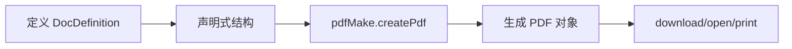

# pdfmake 使用文档

## 📋 目录

- [基本介绍](#基本介绍)
- [核心特点](#核心特点)
- [性能数据](#性能数据)
- [分页能力](#分页能力)
- [完整 API 文档](#完整-api-文档)
- [中文字体支持](#中文字体支持)
- [实战示例](#实战示例)
- [最佳实践](#最佳实践)
- [常见问题](#常见问题)

---

## 基本介绍

### 什么是 pdfmake?

pdfmake 是一个强大的客户端/服务端 PDF 生成库，采用**声明式 API**，通过 JSON 对象定义文档结构。它提供了丰富的布局功能，支持表格、列表、多列、页眉页脚、样式等，是创建复杂 PDF 文档的理想选择。

### 官方资源

- 📦 **NPM**: [pdfmake](https://www.npmjs.com/package/pdfmake)
- 🌐 **官网**: http://pdfmake.org/
- 📚 **GitHub**: https://github.com/bpampuch/pdfmake
- ⭐ **Star数**: 11k+
- 📖 **Playground**: http://pdfmake.org/playground.html

### 工作原理



### 适用场景

✅ **推荐使用：**

- 复杂结构化文档
- 报表、发票、合同
- 需要自动分页和页眉页脚
- 表格密集型文档
- 客户端/服务端通用生成

❌ **不推荐使用：**

- 简单的页面打印
- HTML 直接转 PDF
- 对文件大小极其敏感
- 需要极致加载速度

---

## 核心特点

### ✨ 优势

| 特点           | 说明                         | 评分       |
| -------------- | ---------------------------- | ---------- |
| **声明式 API** | JSON 配置，易于理解和维护    | ⭐⭐⭐⭐⭐ |
| **功能完整**   | 表格、列表、图片、样式全支持 | ⭐⭐⭐⭐⭐ |
| **自动分页**   | 智能处理内容分页             | ⭐⭐⭐⭐⭐ |
| **页眉页脚**   | 内置支持，可动态生成         | ⭐⭐⭐⭐⭐ |
| **表格布局**   | 强大的表格功能               | ⭐⭐⭐⭐⭐ |
| **多列布局**   | 支持复杂的多列排版           | ⭐⭐⭐⭐⭐ |
| **样式系统**   | 灵活的样式定义和复用         | ⭐⭐⭐⭐⭐ |
| **跨平台**     | 浏览器和 Node.js 通用        | ⭐⭐⭐⭐⭐ |
| **文档详尽**   | 官方文档和示例丰富           | ⭐⭐⭐⭐⭐ |

### ⚠️ 劣势

| 问题           | 说明                 | 影响程度 |
| -------------- | -------------------- | -------- |
| **文件体积大** | ~600KB (包含字体)    | 🟡 中    |
| **首次加载慢** | 需要加载虚拟文件系统 | 🟡 中    |
| **中文配置**   | 需要配置中文字体     | 🟡 中    |
| **学习曲线**   | API 较多，需要学习   | 🟢 低    |

### 与其他方案对比

| 方案    | API友好度  | 功能完整度 | 体积     | 中文支持   | 综合评分   |
| ------- | ---------- | ---------- | -------- | ---------- | ---------- |
| pdfmake | ⭐⭐⭐⭐⭐ | ⭐⭐⭐⭐⭐ | ⭐⭐     | ⭐⭐⭐⭐⭐ | ⭐⭐⭐⭐⭐ |
| jsPDF   | ⭐⭐⭐     | ⭐⭐⭐⭐   | ⭐⭐⭐   | ⭐⭐⭐⭐   | ⭐⭐⭐⭐   |
| PDF-LIB | ⭐⭐⭐     | ⭐⭐⭐⭐⭐ | ⭐⭐⭐⭐ | ⭐⭐⭐⭐   | ⭐⭐⭐⭐   |

---

## 性能数据

### 基准测试结果

```
测试环境：Chrome 120, Windows 11
测试内容：100 页文档，包含表格和样式

┌─────────────────┬──────────────┬─────────────┐
│ 指标            │ 数值         │ 备注        │
├─────────────────┼──────────────┼─────────────┤
│ 库体积          │ 600 KB       │ 含虚拟字体  │
│ 中文字体        │ 17 MB        │ 可变字体    │
│ 初始化          │ 50-100 ms    │ 首次加载    │
│ 单页生成        │ 30-80 ms     │ 含表格样式  │
│ 100页生成       │ 3-6 秒       │ 含字体加载  │
│ 字体加载        │ 1-2 秒       │ 内网环境    │
│ PDF 输出        │ 300-600 ms   │ 转 Blob     │
│ 内存占用        │ 40-100 MB    │ 大文档时    │
│ CPU 占用        │ 25-45%       │ 生成时      │
└─────────────────┴──────────────┴─────────────┘
```

### 性能对比

| 方案              | 初始化   | 生成速度   | 内存     | 综合     |
| ----------------- | -------- | ---------- | -------- | -------- |
| pdfmake           | ⭐⭐⭐   | ⭐⭐⭐⭐⭐ | ⭐⭐⭐⭐ | ⭐⭐⭐⭐ |
| jsPDF             | ⭐⭐⭐⭐ | ⭐⭐⭐⭐   | ⭐⭐⭐   | ⭐⭐⭐⭐ |
| html2canvas+jsPDF | ⭐⭐     | ⭐⭐       | ⭐⭐     | ⭐⭐     |

**优势：**

- 生成速度快于 jsPDF
- 声明式 API，代码更清晰
- 自动分页，减少手动计算

---

## 分页能力

### 自动分页

pdfmake 会自动处理内容分页，无需手动计算：

```javascript
const docDefinition = {
  content: [
    // 内容会自动分页
    { text: '第一段' },
    { text: '第二段' },
    // ... 更多内容
  ],
}
```

### pageBreak 属性

#### before - 在元素前分页

```javascript
{
  text: '新页开始',
  pageBreak: 'before'
}
```

#### after - 在元素后分页

```javascript
{
  text: '这段后面换页',
  pageBreak: 'after'
}
```

### pageBreakBefore 函数

动态控制分页：

```javascript
{
  text: '标题',
  pageBreakBefore: (currentNode, followingNodesOnPage, nodesOnNextPage, previousNodesOnPage) => {
    // 如果是一级标题，前面换页
    return currentNode.headlineLevel === 1
  }
}
```

### 页面设置

```javascript
const docDefinition = {
  pageSize: 'A4', // A4, A3, LETTER, LEGAL, [width, height]
  pageOrientation: 'portrait', // portrait, landscape
  pageMargins: [40, 60, 40, 60], // [left, top, right, bottom]

  content: [
    // 内容
  ],
}
```

### 页眉和页脚

#### 静态页眉页脚

```javascript
const docDefinition = {
  header: 'Simple header text',
  footer: 'Simple footer text',
  content: [...]
}
```

#### 动态页眉页脚

```javascript
const docDefinition = {
  header: (currentPage, pageCount, pageSize) => {
    return {
      text: `Page ${currentPage} of ${pageCount}`,
      alignment: 'center',
      margin: [0, 20, 0, 0]
    }
  },

  footer: (currentPage, pageCount) => {
    return {
      columns: [
        { text: 'Left footer', alignment: 'left' },
        { text: `${currentPage}/${pageCount}`, alignment: 'right' }
      ],
      margin: [40, 0, 40, 0]
    }
  },

  content: [...]
}
```

### 表格跨页

```javascript
{
  table: {
    headerRows: 1,  // 表头在每页重复
    dontBreakRows: true,  // 避免行被截断
    keepWithHeaderRows: 1,  // 保持表头和第一行在一起
    body: [
      // 表格数据
    ]
  }
}
```

---

## 完整 API 文档

### 安装与配置

#### 安装

```bash
npm install pdfmake
# 或
yarn add pdfmake
# 或
pnpm add pdfmake
```

#### 基础配置

```javascript
import pdfMake from 'pdfmake/build/pdfmake'
import pdfFonts from 'pdfmake/build/vfs_fonts'

// 配置虚拟文件系统
pdfMake.vfs = pdfFonts.pdfMake.vfs

// 创建 PDF
const docDefinition = { content: ['Hello World'] }
pdfMake.createPdf(docDefinition).download()
```

---

### 文档定义 (DocDefinition)

#### 基本结构

```typescript
interface DocDefinition {
  content: Content[] // 文档内容
  styles?: StyleDictionary // 样式定义
  defaultStyle?: Style // 默认样式
  pageSize?: PageSize // 页面大小
  pageOrientation?: string // 页面方向
  pageMargins?: Margins // 页边距
  header?: DynamicContent // 页眉
  footer?: DynamicContent // 页脚
  background?: DynamicContent // 背景
  images?: { [key: string]: string } // 图片字典
  info?: DocumentInfo // 文档信息
}
```

---

### Content 类型

#### 文本 (Text)

```javascript
// 简单文本
'Simple text'

// 文本对象
{
  text: 'Text content',
  style: 'header',
  fontSize: 14,
  bold: true,
  italics: true,
  alignment: 'center',  // left, right, center, justify
  color: '#333',
  background: '#f0f0f0',
  margin: [0, 10, 0, 10],  // [left, top, right, bottom]
  lineHeight: 1.5
}

// 文本数组 (内联样式)
{
  text: [
    'This is ',
    { text: 'bold', bold: true },
    ' and ',
    { text: 'colored', color: 'red' }
  ]
}
```

#### 段落 (Paragraph)

```javascript
{
  text: 'Paragraph text',
  margin: [0, 5, 0, 5],
  alignment: 'justify',
  lineHeight: 1.5
}
```

#### 列表 (Lists)

**无序列表：**

```javascript
{
  ul: ['Item 1', 'Item 2', { text: 'Item 3', bold: true }, ['Nested item 1', 'Nested item 2']]
}
```

**有序列表：**

```javascript
{
  ol: [
    'First',
    'Second',
    'Third'
  ]
}

// 自定义序号
{
  ol: [
    'Item A',
    'Item B'
  ],
  type: 'lower-alpha'  // 1, a, A, i, I
}
```

#### 表格 (Table)

```javascript
{
  table: {
    // 表头行数（会在每页重复）
    headerRows: 1,

    // 列宽
    widths: ['*', 'auto', 100, '*'],
    // '*' - 平均分配, 'auto' - 自适应, 数字 - 固定宽度

    // 表格数据
    body: [
      ['Header 1', 'Header 2', 'Header 3', 'Header 4'],
      ['Cell 1', 'Cell 2', 'Cell 3', 'Cell 4'],
      [
        { text: 'Bold cell', bold: true },
        { text: 'Colored', color: 'red' },
        'Normal',
        'Cell'
      ]
    ]
  },

  // 表格布局
  layout: {
    fillColor: (rowIndex, node, columnIndex) => {
      return (rowIndex === 0) ? '#667eea' : (rowIndex % 2 === 0) ? '#f0f0f0' : null
    },
    hLineWidth: (i, node) => 1,
    vLineWidth: (i, node) => 1,
    hLineColor: (i, node) => '#ccc',
    vLineColor: (i, node) => '#ccc',
    paddingLeft: (i, node) => 4,
    paddingRight: (i, node) => 4,
    paddingTop: (i, node) => 2,
    paddingBottom: (i, node) => 2
  }
}
```

**预定义布局：**

- `noBorders` - 无边框
- `headerLineOnly` - 只有表头下边框
- `lightHorizontalLines` - 浅色横线

```javascript
{
  table: { /* ... */ },
  layout: 'lightHorizontalLines'
}
```

#### 图片 (Image)

```javascript
// Base64 图片
{
  image: 'data:image/jpeg;base64,/9j/4AAQ...',
  width: 150,
  height: 150,
  alignment: 'center'
}

// 引用图片字典
{
  image: 'logo',  // 引用 images.logo
  width: 100
}

// 完整配置
docDefinition = {
  images: {
    logo: 'data:image/png;base64,...',
    banner: 'data:image/jpeg;base64,...'
  },
  content: [
    { image: 'logo', width: 100 }
  ]
}
```

#### 多列布局 (Columns)

```javascript
{
  columns: [
    {
      // 固定宽度
      width: 100,
      text: 'Left column'
    },
    {
      // 百分比宽度
      width: '50%',
      text: 'Middle column'
    },
    {
      // 自动宽度
      width: 'auto',
      text: 'Right column'
    },
    {
      // 填充剩余空间
      width: '*',
      text: 'Fill remaining'
    }
  ],
  columnGap: 10  // 列间距
}
```

#### 堆叠 (Stack)

垂直堆叠元素：

```javascript
{
  stack: [{ text: 'First element' }, { text: 'Second element' }, { text: 'Third element' }]
}
```

---

### 样式系统

#### 内联样式

```javascript
{
  text: 'Styled text',
  fontSize: 14,
  bold: true,
  italics: true,
  color: '#333',
  background: '#f0f0f0',
  decoration: 'underline',  // underline, lineThrough, overline
  decorationStyle: 'solid', // solid, dashed, dotted, double, wavy
  decorationColor: 'red',
  alignment: 'center',
  margin: [0, 5, 0, 5],
  lineHeight: 1.5
}
```

#### 样式定义

```javascript
const docDefinition = {
  content: [
    { text: 'Title', style: 'header' },
    { text: 'Subtitle', style: 'subheader' },
    { text: 'Content', style: 'normal' },
  ],

  styles: {
    header: {
      fontSize: 22,
      bold: true,
      color: '#667eea',
      margin: [0, 0, 0, 10],
    },
    subheader: {
      fontSize: 16,
      bold: true,
      margin: [0, 10, 0, 5],
    },
    normal: {
      fontSize: 12,
      lineHeight: 1.5,
    },
  },

  // 默认样式
  defaultStyle: {
    fontSize: 12,
    font: 'SourceHanSansSC',
  },
}
```

#### 样式继承

```javascript
{
  text: 'Text',
  style: ['header', 'red'],  // 应用多个样式
  fontSize: 18  // 覆盖样式中的 fontSize
}

styles: {
  header: {
    fontSize: 22,
    bold: true
  },
  red: {
    color: 'red'
  }
}
```

---

### 高级功能

#### 目录 (TOC)

```javascript
{
  toc: {
    title: { text: 'INDEX', style: 'header' },
    numberStyle: { bold: true },
    textStyle: { italics: true }
  }
}

// 标记目录项
{
  text: 'Chapter 1',
  style: 'header',
  tocItem: true,        // 添加到目录
  tocStyle: 'tocEntry', // 目录样式
  tocMargin: [0, 5, 0, 0]
}
```

#### 链接 (Links)

```javascript
// 内部链接
{
  text: 'Go to Chapter 2',
  link: 'chapter2',  // 链接到 id
  color: 'blue',
  decoration: 'underline'
}

{
  text: 'Chapter 2',
  id: 'chapter2'  // 目标 id
}

// 外部链接
{
  text: 'Visit Website',
  link: 'https://example.com',
  color: 'blue'
}
```

#### 水印 (Watermark)

```javascript
const docDefinition = {
  watermark: {
    text: 'CONFIDENTIAL',
    color: 'blue',
    opacity: 0.3,
    bold: true,
    italics: false,
    fontSize: 60,
    angle: 45
  },
  content: [...]
}
```

#### 背景 (Background)

```javascript
const docDefinition = {
  background: (currentPage, pageSize) => {
    return {
      canvas: [
        {
          type: 'rect',
          x: 0,
          y: 0,
          w: pageSize.width,
          h: 100,
          color: '#667eea'
        }
      ]
    }
  },
  content: [...]
}
```

#### Canvas 绘图

```javascript
{
  canvas: [
    // 线条
    {
      type: 'line',
      x1: 0,
      y1: 0,
      x2: 100,
      y2: 100,
      lineWidth: 2,
      lineColor: 'blue',
    },

    // 矩形
    {
      type: 'rect',
      x: 10,
      y: 10,
      w: 50,
      h: 30,
      r: 5, // 圆角
      lineColor: 'black',
      color: 'red', // 填充色
    },

    // 圆形
    {
      type: 'ellipse',
      x: 50,
      y: 50,
      r1: 20,
      r2: 30, // 横向和纵向半径
      color: 'green',
    },

    // 多边形
    {
      type: 'polyline',
      points: [
        { x: 0, y: 0 },
        { x: 50, y: 50 },
        { x: 100, y: 0 },
      ],
      closePath: true,
      lineColor: 'blue',
    },
  ]
}
```

---

### 输出 API

#### download()

```javascript
pdfMake.createPdf(docDefinition).download('filename.pdf')

// 带回调
pdfMake.createPdf(docDefinition).download('filename.pdf', () => {
  console.log('PDF 下载完成')
})
```

#### open()

```javascript
// 在新窗口打开
pdfMake.createPdf(docDefinition).open()

// 在 iframe 中打开
pdfMake.createPdf(docDefinition).open({}, window.frames['iframe'])
```

#### print()

```javascript
// 打印
pdfMake.createPdf(docDefinition).print()

// 打开打印对话框后的回调
pdfMake.createPdf(docDefinition).print({}, window, () => {
  console.log('打印对话框已打开')
})
```

#### getBase64()

```javascript
pdfMake.createPdf(docDefinition).getBase64((data) => {
  console.log(data) // Base64 字符串
})
```

#### getBlob()

```javascript
pdfMake.createPdf(docDefinition).getBlob((blob) => {
  console.log(blob) // Blob 对象

  // 可以用于上传
  const formData = new FormData()
  formData.append('file', blob, 'document.pdf')
})
```

#### getBuffer()

```javascript
// 仅在 Node.js 中可用
pdfMake.createPdf(docDefinition).getBuffer((buffer) => {
  fs.writeFileSync('document.pdf', buffer)
})
```

#### getDataUrl()

```javascript
pdfMake.createPdf(docDefinition).getDataUrl((dataUrl) => {
  console.log(dataUrl) // data:application/pdf;base64,...

  // 可以用于 <embed> 或 <iframe>
  document.getElementById('pdf-viewer').src = dataUrl
})
```

---

## 中文字体支持

### 本项目中文字体方案

我们使用 **Noto Sans SC (思源黑体)** 可变字体：

```javascript
// 使用封装的工具函数
import { configurePdfMakeChinese, getChinesePdfMakeStyles } from '@/utils/fontLoader'

// 配置中文字体
await configurePdfMakeChinese()

// 获取中文样式配置
const chineseStyles = getChinesePdfMakeStyles()

// 创建文档
const docDefinition = {
  content: [{ text: '中文标题', style: 'header' }, '这是中文正文内容'],
  ...chineseStyles, // 应用中文样式
}

pdfMake.createPdf(docDefinition).download()
```

### fontLoader.ts 实现

```javascript
// src/utils/fontLoader.ts
import pdfMake from 'pdfmake/build/pdfmake'

const FONT_PATH = '/Noto_Sans_SC/NotoSansSC-VariableFont_wght.ttf'

export async function configurePdfMakeChinese() {
  const fontBase64 = await loadFontAsBase64(FONT_PATH)

  // 配置字体
  pdfMake.fonts = {
    SourceHanSansSC: {
      normal: fontBase64,
      bold: fontBase64,
      italics: fontBase64,
      bolditalics: fontBase64,
    },
  }
}

export function getChinesePdfMakeStyles() {
  return {
    defaultStyle: {
      font: 'SourceHanSansSC',
      fontSize: 12,
    },
    styles: {
      header: {
        fontSize: 22,
        bold: true,
        margin: [0, 0, 0, 10],
      },
      subheader: {
        fontSize: 16,
        bold: true,
        margin: [0, 10, 0, 5],
      },
      tableHeader: {
        bold: true,
        fontSize: 13,
        color: 'white',
      },
    },
  }
}
```

### 使用自定义字体

```javascript
import pdfMake from 'pdfmake/build/pdfmake'

// 配置自定义字体
pdfMake.fonts = {
  CustomFont: {
    normal: 'base64-encoded-font-data',
    bold: 'base64-encoded-bold-font-data',
    italics: 'base64-encoded-italic-font-data',
    bolditalics: 'base64-encoded-bolditalic-font-data',
  },
}

// 使用
const docDefinition = {
  defaultStyle: {
    font: 'CustomFont',
  },
  content: ['使用自定义字体的文本'],
}
```

---

## 实战示例

### 示例 1：简单文档

```javascript
import pdfMake from 'pdfmake/build/pdfmake'
import pdfFonts from 'pdfmake/build/vfs_fonts'
pdfMake.vfs = pdfFonts.pdfMake.vfs

const docDefinition = {
  content: [
    'First paragraph',
    'Another paragraph',
    { text: 'Bold text', bold: true },
    { text: 'Red text', color: 'red' },
  ],
}

pdfMake.createPdf(docDefinition).download('simple.pdf')
```

### 示例 2：中文文档

```javascript
import { configurePdfMakeChinese, getChinesePdfMakeStyles } from '@/utils/fontLoader'

const generateChinesePDF = async () => {
  await configurePdfMakeChinese()
  const chineseStyles = getChinesePdfMakeStyles()

  const docDefinition = {
    content: [
      { text: '中文标题', style: 'header' },
      { text: '副标题', style: 'subheader' },
      '这是正文内容，完美支持中文字符。',
      '支持中文标点符号：，。！？、；：""''',
      { ul: ['列表项一', '列表项二', '列表项三'] }
    ],
    ...chineseStyles
  }

  pdfMake.createPdf(docDefinition).download('chinese.pdf')
}
```

### 示例 3：表格文档

```javascript
const generateTablePDF = async () => {
  await configurePdfMakeChinese()
  const chineseStyles = getChinesePdfMakeStyles()

  const docDefinition = {
    content: [
      { text: '员工信息表', style: 'header' },
      {
        table: {
          headerRows: 1,
          widths: ['*', 'auto', 'auto', 100],
          body: [
            [
              { text: '姓名', style: 'tableHeader' },
              { text: '年龄', style: 'tableHeader' },
              { text: '部门', style: 'tableHeader' },
              { text: '薪资', style: 'tableHeader' },
            ],
            ['张三', '28', '技术部', '¥15,000'],
            ['李四', '32', '销售部', '¥18,000'],
            ['王五', '25', '人事部', '¥12,000'],
          ],
        },
        layout: {
          fillColor: (rowIndex) => {
            return rowIndex === 0 ? '#667eea' : rowIndex % 2 === 0 ? '#f7fafc' : null
          },
          hLineColor: () => '#e2e8f0',
          vLineColor: () => '#e2e8f0',
        },
      },
    ],
    ...chineseStyles,
  }

  pdfMake.createPdf(docDefinition).download('table.pdf')
}
```

### 示例 4：多页文档带页眉页脚

```javascript
const generateMultiPagePDF = async () => {
  await configurePdfMakeChinese()
  const chineseStyles = getChinesePdfMakeStyles()

  const docDefinition = {
    header: (currentPage, pageCount, pageSize) => {
      return {
        text: '公司内部文档',
        alignment: 'center',
        margin: [0, 20, 0, 0],
        fontSize: 10,
        color: '#718096',
      }
    },

    footer: (currentPage, pageCount) => {
      return {
        columns: [
          {
            text: '机密文件',
            alignment: 'left',
            margin: [40, 0, 0, 0],
            fontSize: 8,
            color: '#a0aec0',
          },
          {
            text: `第 ${currentPage} 页 / 共 ${pageCount} 页`,
            alignment: 'right',
            margin: [0, 0, 40, 0],
            fontSize: 8,
            color: '#a0aec0',
          },
        ],
      }
    },

    content: [
      { text: '第一章', style: 'header' },
      '第一章内容...',

      { text: '第二章', style: 'header', pageBreak: 'before' },
      '第二章内容...',

      { text: '第三章', style: 'header', pageBreak: 'before' },
      '第三章内容...',
    ],

    ...chineseStyles,
  }

  pdfMake.createPdf(docDefinition).download('multipage.pdf')
}
```

### 示例 5：复杂报表

```javascript
const generateReportPDF = async () => {
  await configurePdfMakeChinese()
  const chineseStyles = getChinesePdfMakeStyles()

  const docDefinition = {
    pageSize: 'A4',
    pageMargins: [40, 80, 40, 60],

    header: {
      columns: [
        { text: '销售报表', margin: [40, 30, 0, 0] },
        {
          text: new Date().toLocaleDateString('zh-CN'),
          alignment: 'right',
          margin: [0, 30, 40, 0],
        },
      ],
    },

    footer: (currentPage, pageCount) => {
      return {
        text: `第 ${currentPage} 页 / 共 ${pageCount} 页`,
        alignment: 'center',
        margin: [0, 0, 0, 20],
      }
    },

    background: {
      canvas: [
        {
          type: 'rect',
          x: 0,
          y: 0,
          w: 595.28,
          h: 60,
          color: '#667eea',
        },
      ],
    },

    content: [
      {
        text: '2024年度销售报告',
        style: 'title',
        color: 'white',
        margin: [0, -60, 0, 40],
      },

      { text: '一、销售概况', style: 'sectionHeader' },
      {
        columns: [
          {
            width: '33%',
            stack: [
              { text: '总销售额', fontSize: 10, color: '#718096' },
              {
                text: '¥1,234,567',
                fontSize: 24,
                bold: true,
                color: '#667eea',
                margin: [0, 5, 0, 0],
              },
            ],
          },
          {
            width: '33%',
            stack: [
              { text: '订单数量', fontSize: 10, color: '#718096' },
              { text: '456', fontSize: 24, bold: true, color: '#48bb78', margin: [0, 5, 0, 0] },
            ],
          },
          {
            width: '34%',
            stack: [
              { text: '客户数量', fontSize: 10, color: '#718096' },
              { text: '123', fontSize: 24, bold: true, color: '#ed8936', margin: [0, 5, 0, 0] },
            ],
          },
        ],
        margin: [0, 0, 0, 20],
      },

      { text: '二、销售明细', style: 'sectionHeader' },
      {
        table: {
          headerRows: 1,
          widths: ['*', 'auto', 'auto', 80],
          body: [
            [
              { text: '产品', style: 'tableHeader' },
              { text: '数量', style: 'tableHeader' },
              { text: '单价', style: 'tableHeader' },
              { text: '总额', style: 'tableHeader' },
            ],
            ['产品 A', '100', '¥500', '¥50,000'],
            ['产品 B', '200', '¥300', '¥60,000'],
            ['产品 C', '150', '¥400', '¥60,000'],
          ],
        },
        layout: 'lightHorizontalLines',
      },

      { text: '三、趋势分析', style: 'sectionHeader', pageBreak: 'before' },
      '本季度销售呈现稳定增长态势...',

      { text: '四、下季度规划', style: 'sectionHeader' },
      {
        ol: ['扩大市场覆盖范围', '优化产品结构', '提升客户满意度', '加强团队建设'],
      },
    ],

    styles: {
      title: {
        fontSize: 28,
        bold: true,
        alignment: 'center',
      },
      sectionHeader: {
        fontSize: 16,
        bold: true,
        color: '#667eea',
        margin: [0, 15, 0, 10],
      },
    },

    ...chineseStyles,
  }

  pdfMake.createPdf(docDefinition).download('report.pdf')
}
```

### 示例 6：发票生成

```javascript
const generateInvoicePDF = async (invoiceData) => {
  await configurePdfMakeChinese()
  const chineseStyles = getChinesePdfMakeStyles()

  const docDefinition = {
    pageSize: 'A4',
    pageMargins: [40, 40, 40, 40],

    content: [
      // 标题
      {
        text: '发  票',
        fontSize: 32,
        bold: true,
        alignment: 'center',
        margin: [0, 0, 0, 20],
      },

      // 发票信息
      {
        columns: [
          { text: `发票号: ${invoiceData.number}`, width: '50%' },
          { text: `日期: ${invoiceData.date}`, width: '50%', alignment: 'right' },
        ],
        margin: [0, 0, 0, 20],
      },

      // 分隔线
      {
        canvas: [
          {
            type: 'line',
            x1: 0,
            y1: 0,
            x2: 515,
            y2: 0,
            lineWidth: 1,
            lineColor: '#e2e8f0',
          },
        ],
        margin: [0, 0, 0, 20],
      },

      // 客户信息
      { text: '客户信息', bold: true, margin: [0, 0, 0, 10] },
      { text: `公司: ${invoiceData.customer.company}` },
      { text: `地址: ${invoiceData.customer.address}`, margin: [0, 0, 0, 20] },

      // 商品明细
      {
        table: {
          headerRows: 1,
          widths: ['*', 'auto', 'auto', 80],
          body: [
            [
              { text: '商品名称', style: 'tableHeader' },
              { text: '数量', style: 'tableHeader' },
              { text: '单价', style: 'tableHeader' },
              { text: '金额', style: 'tableHeader' },
            ],
            ...invoiceData.items.map((item) => [
              item.name,
              String(item.quantity),
              `¥${item.price}`,
              `¥${item.total}`,
            ]),
            [
              { text: '合计', colSpan: 3, alignment: 'right', bold: true },
              {},
              {},
              { text: `¥${invoiceData.total}`, bold: true },
            ],
          ],
        },
        layout: {
          fillColor: (rowIndex, node) => {
            return rowIndex === 0 ? '#667eea' : null
          },
        },
        margin: [0, 0, 0, 20],
      },

      // 备注
      { text: '备注:', bold: true, margin: [0, 20, 0, 5] },
      { text: invoiceData.notes || '无' },

      // 页脚
      {
        text: '感谢您的惠顾！',
        alignment: 'center',
        margin: [0, 40, 0, 0],
        fontSize: 10,
        color: '#718096',
      },
    ],

    ...chineseStyles,
  }

  pdfMake.createPdf(docDefinition).download(`invoice-${invoiceData.number}.pdf`)
}

// 使用
generateInvoicePDF({
  number: 'INV-2024-001',
  date: '2024-12-29',
  customer: {
    company: '北京某某科技有限公司',
    address: '北京市朝阳区某某大厦',
  },
  items: [
    { name: '产品A', quantity: 10, price: 100, total: 1000 },
    { name: '产品B', quantity: 5, price: 200, total: 1000 },
  ],
  total: 2000,
  notes: '款到发货',
})
```

### 示例 7：多列布局

```javascript
const generateColumnPDF = async () => {
  await configurePdfMakeChinese()
  const chineseStyles = getChinesePdfMakeStyles()

  const docDefinition = {
    content: [
      { text: '多列布局示例', style: 'header' },

      {
        columns: [
          {
            width: '50%',
            stack: [
              { text: '左栏标题', bold: true, margin: [0, 0, 0, 5] },
              '这是左栏的内容。',
              { ul: ['列表项 1', '列表项 2', '列表项 3'] },
            ],
          },
          {
            width: '50%',
            stack: [
              { text: '右栏标题', bold: true, margin: [0, 0, 0, 5] },
              '这是右栏的内容。',
              { ol: ['步骤 1', '步骤 2', '步骤 3'] },
            ],
          },
        ],
        columnGap: 20,
      },
    ],
    ...chineseStyles,
  }

  pdfMake.createPdf(docDefinition).download('columns.pdf')
}
```

### 示例 8：添加图片

```javascript
const generateImagePDF = async () => {
  await configurePdfMakeChinese()
  const chineseStyles = getChinesePdfMakeStyles()

  // 加载图片
  const imageData = await loadImageAsBase64('/path/to/image.jpg')

  const docDefinition = {
    content: [
      { text: '图片示例', style: 'header' },
      {
        image: imageData,
        width: 300,
        alignment: 'center',
        margin: [0, 20, 0, 10],
      },
      {
        text: '图 1: 示例图片',
        alignment: 'center',
        fontSize: 10,
        color: '#718096',
      },
    ],
    ...chineseStyles,
  }

  pdfMake.createPdf(docDefinition).download('image.pdf')
}

// 辅助函数
const loadImageAsBase64 = (src) => {
  return new Promise((resolve) => {
    const img = new Image()
    img.crossOrigin = 'anonymous'
    img.onload = () => {
      const canvas = document.createElement('canvas')
      canvas.width = img.width
      canvas.height = img.height
      const ctx = canvas.getContext('2d')
      ctx.drawImage(img, 0, 0)
      resolve(canvas.toDataURL('image/jpeg'))
    }
    img.src = src
  })
}
```

### 示例 9：水印文档

```javascript
const generateWatermarkPDF = async () => {
  await configurePdfMakeChinese()
  const chineseStyles = getChinesePdfMakeStyles()

  const docDefinition = {
    watermark: {
      text: '机密文件',
      color: 'red',
      opacity: 0.2,
      bold: true,
      italics: false,
      fontSize: 80,
      angle: 45,
    },

    content: [
      { text: '机密文档', style: 'header' },
      '这是一份机密文档，请妥善保管。',
      '未经授权，不得复制、传播或泄露。',
    ],

    ...chineseStyles,
  }

  pdfMake.createPdf(docDefinition).download('watermark.pdf')
}
```

---

## 最佳实践

### 1. 使用样式系统

```javascript
// ✅ 推荐：定义样式复用
const docDefinition = {
  content: [
    { text: 'Title 1', style: 'h1' },
    { text: 'Title 2', style: 'h1' },
    { text: 'Title 3', style: 'h1' },
  ],
  styles: {
    h1: {
      fontSize: 22,
      bold: true,
      margin: [0, 0, 0, 10],
    },
  },
}

// ❌ 不推荐：重复写样式
const docDefinition = {
  content: [
    { text: 'Title 1', fontSize: 22, bold: true, margin: [0, 0, 0, 10] },
    { text: 'Title 2', fontSize: 22, bold: true, margin: [0, 0, 0, 10] },
    { text: 'Title 3', fontSize: 22, bold: true, margin: [0, 0, 0, 10] },
  ],
}
```

### 2. 封装常用功能

```javascript
// 封装工具函数
class PDFBuilder {
  constructor() {
    this.content = []
    this.styles = {}
  }

  addTitle(text) {
    this.content.push({
      text,
      style: 'title',
    })
    return this
  }

  addParagraph(text) {
    this.content.push({
      text,
      margin: [0, 5, 0, 5],
    })
    return this
  }

  addTable(headers, data) {
    this.content.push({
      table: {
        headerRows: 1,
        widths: Array(headers.length).fill('*'),
        body: [headers, ...data],
      },
    })
    return this
  }

  build() {
    return {
      content: this.content,
      styles: this.styles,
    }
  }
}

// 使用
const builder = new PDFBuilder()
builder
  .addTitle('报告标题')
  .addParagraph('这是报告内容')
  .addTable(['姓名', '年龄'], [['张三', '28']])

const docDefinition = builder.build()
```

### 3. 性能优化

```javascript
// ✅ 推荐：预加载字体
import { configurePdfMakeChinese } from '@/utils/fontLoader'

// 应用启动时配置
configurePdfMakeChinese()

// 使用时直接生成
const generatePDF = () => {
  const docDefinition = {
    /* ... */
  }
  pdfMake.createPdf(docDefinition).download()
}
```

```javascript
// ✅ 推荐：大数据分批处理
const generateLargePDF = async (largeData) => {
  const batchSize = 100
  const tableBody = [['Header 1', 'Header 2']]

  for (let i = 0; i < largeData.length; i += batchSize) {
    const batch = largeData.slice(i, i + batchSize)
    tableBody.push(...batch.map((item) => [item.col1, item.col2]))

    // 让浏览器喘口气
    await new Promise((resolve) => setTimeout(resolve, 0))
  }

  const docDefinition = {
    content: [{ table: { body: tableBody } }],
  }

  pdfMake.createPdf(docDefinition).download()
}
```

### 4. 错误处理

```javascript
const generatePDF = async () => {
  try {
    await configurePdfMakeChinese()

    const docDefinition = {
      /* ... */
    }
    pdfMake.createPdf(docDefinition).download('document.pdf')
  } catch (error) {
    console.error('PDF 生成失败:', error)

    if (error.message.includes('font')) {
      alert('字体加载失败，请刷新页面重试')
    } else if (error.message.includes('memory')) {
      alert('内存不足，请关闭其他标签页后重试')
    } else {
      alert('PDF 生成失败，请联系技术支持')
    }
  }
}
```

### 5. 模块化设计

```javascript
// pdf-templates.js

export const createInvoiceTemplate = (data) => ({
  content: [
    { text: '发票', style: 'title' },
    // ... 发票内容
  ],
  styles: {
    /* ... */
  },
})

export const createReportTemplate = (data) => ({
  content: [
    { text: '报告', style: 'title' },
    // ... 报告内容
  ],
  styles: {
    /* ... */
  },
})

// 使用
import { createInvoiceTemplate } from './pdf-templates'

const generateInvoice = (data) => {
  const docDefinition = createInvoiceTemplate(data)
  pdfMake.createPdf(docDefinition).download()
}
```

### 6. TypeScript 类型支持

```typescript
import { TDocumentDefinitions, Content } from 'pdfmake/interfaces'

const docDefinition: TDocumentDefinitions = {
  content: [{ text: 'Hello World', fontSize: 14 }],
  styles: {
    header: {
      fontSize: 22,
      bold: true,
    },
  },
}

pdfMake.createPdf(docDefinition).download()
```

---

## 常见问题

### Q1: 中文显示为方块？

**问题**：中文字符显示为 `□□□`

**原因**：未配置中文字体

**解决方案：**

```javascript
import { configurePdfMakeChinese, getChinesePdfMakeStyles } from '@/utils/fontLoader'

const generatePDF = async () => {
  // 配置中文字体
  await configurePdfMakeChinese()
  const chineseStyles = getChinesePdfMakeStyles()

  const docDefinition = {
    content: ['中文正常显示'],
    ...chineseStyles,
  }

  pdfMake.createPdf(docDefinition).download()
}
```

### Q2: 字体加载失败？

**问题**：`Failed to load font` 错误

**解决方案：**

```javascript
// 1. 检查字体文件路径
// public/Noto_Sans_SC/NotoSansSC-VariableFont_wght.ttf

// 2. 添加错误处理
try {
  await configurePdfMakeChinese()
} catch (error) {
  console.error('字体加载失败:', error)
  alert('字体加载失败，请刷新页面重试')
}
```

### Q3: 表格换页被截断？

**问题**：表格行在页面边界处被切断

**解决方案：**

```javascript
{
  table: {
    headerRows: 1,
    dontBreakRows: true,  // 避免行被截断
    keepWithHeaderRows: 1,  // 表头和第一行保持在一起
    body: [
      // 表格数据
    ]
  }
}
```

### Q4: 图片不显示？

**问题**：PDF 中图片是空白

**原因**：

1. 图片未加载完成
2. 跨域问题
3. Base64 格式错误

**解决方案：**

```javascript
// 正确加载图片
const loadImage = (src) => {
  return new Promise((resolve, reject) => {
    const img = new Image()
    img.crossOrigin = 'anonymous'
    img.onload = () => {
      const canvas = document.createElement('canvas')
      canvas.width = img.width
      canvas.height = img.height
      const ctx = canvas.getContext('2d')
      ctx.drawImage(img, 0, 0)
      resolve(canvas.toDataURL('image/jpeg'))
    }
    img.onerror = reject
    img.src = src
  })
}

const imageData = await loadImage('/path/to/image.jpg')

const docDefinition = {
  content: [{ image: imageData, width: 200 }],
}
```

### Q5: PDF 文件过大？

**问题**：生成的 PDF 文件几十 MB

**解决方案：**

```javascript
// 1. 压缩图片
canvas.toDataURL('image/jpeg', 0.7) // 70% 质量

// 2. 优化表格数据
// 避免在表格中使用复杂样式

// 3. 分页处理大数据
// 不要一次性生成上千页的文档
```

### Q6: 样式不生效？

**问题**：定义的样式没有应用

**原因**：

1. 样式名称拼写错误
2. 样式被覆盖
3. 样式定义位置错误

**解决方案：**

```javascript
// ✅ 正确
const docDefinition = {
  content: [
    { text: 'Styled text', style: 'header' }  // 使用样式
  ],
  styles: {
    header: {  // 定义样式
      fontSize: 22,
      bold: true
    }
  }
}

// ❌ 错误：样式名称不匹配
content: [
  { text: 'Text', style: 'heading' }  // heading
],
styles: {
  header: { /* ... */ }  // header
}
```

### Q7: 如何调试 PDF？

**问题**：PDF 生成结果不符合预期

**解决方案：**

```javascript
// 1. 使用 open() 预览
pdfMake.createPdf(docDefinition).open()

// 2. 输出 docDefinition 检查
console.log(JSON.stringify(docDefinition, null, 2))

// 3. 使用官方 Playground
// http://pdfmake.org/playground.html

// 4. 分步骤生成
const docDefinition = {
  content: [],
}

// 逐步添加内容，找出问题
docDefinition.content.push({ text: 'Test 1' })
pdfMake.createPdf(docDefinition).open()

docDefinition.content.push({ text: 'Test 2' })
pdfMake.createPdf(docDefinition).open()
```

### Q8: 性能慢怎么办？

**问题**：大文档生成很慢

**解决方案：**

```javascript
// 1. 显示加载提示
const generatePDF = async () => {
  showLoading('正在生成 PDF，请稍候...')

  try {
    const docDefinition = {
      /* ... */
    }
    await pdfMake.createPdf(docDefinition).download()
  } finally {
    hideLoading()
  }
}

// 2. 使用 Web Worker (高级)
// 在 worker 中生成 PDF

// 3. 优化文档结构
// 减少不必要的样式和嵌套
```

---

## 总结

### 适用场景评分

| 场景           | 适用度     | 说明       |
| -------------- | ---------- | ---------- |
| 复杂结构化文档 | ⭐⭐⭐⭐⭐ | 最佳选择   |
| 报表生成       | ⭐⭐⭐⭐⭐ | 推荐       |
| 发票/合同      | ⭐⭐⭐⭐⭐ | 推荐       |
| 表格密集文档   | ⭐⭐⭐⭐⭐ | 推荐       |
| 自动分页       | ⭐⭐⭐⭐⭐ | 推荐       |
| 页眉页脚       | ⭐⭐⭐⭐⭐ | 推荐       |
| 简单打印       | ⭐⭐       | 过于复杂   |
| HTML 转 PDF    | ⭐⭐       | 不直接支持 |

### 技术选型建议

**✅ 选择 pdfmake 当：**

- 需要生成复杂结构化文档
- 需要自动分页和页眉页脚
- 表格密集型文档
- 喜欢声明式 API
- 需要客户端/服务端通用方案

**❌ 不选择 pdfmake 当：**

- 简单的页面打印
- HTML 直接转 PDF（用 html2pdf.js）
- 对文件大小极其敏感
- 需要像素级控制（用 jsPDF）

### 与其他方案的配合

pdfmake 可以与其他库配合使用：

```javascript
// 1. 与图表库配合
// 使用 Chart.js 生成图表，转为图片嵌入 PDF
const chart = generateChart()
const imageData = chart.toBase64Image()
docDefinition.content.push({ image: imageData, width: 400 })

// 2. 与数据库配合
// 从数据库查询数据，用 pdfmake 生成报表
const data = await fetchData()
const docDefinition = createReportTemplate(data)
pdfMake.createPdf(docDefinition).download()
```

---

## 相关资源

- [pdfmake 官网](http://pdfmake.org/)
- [GitHub 仓库](https://github.com/bpampuch/pdfmake)
- [在线 Playground](http://pdfmake.org/playground.html)
- [API 文档](https://pdfmake.github.io/docs/)
- [示例集合](http://pdfmake.org/#/gettingstarted)
