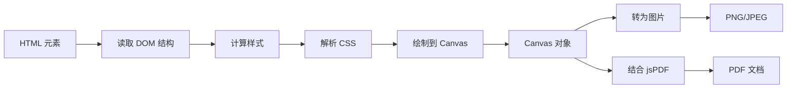

# html2canvas 使用文档

## 📋 目录

- [基本介绍](#基本介绍)
- [核心特点](#核心特点)
- [性能数据](#性能数据)
- [分页能力](#分页能力)
- [完整 API 文档](#完整-api-文档)
- [实战示例](#实战示例)
- [最佳实践](#最佳实践)
- [常见问题](#常见问题)
- [总结](#总结)

---

## 基本介绍

### 什么是 html2canvas？

html2canvas 是一个纯 JavaScript 库，可以在浏览器端将 HTML 元素截图并转换为 Canvas 元素，实现"所见即所得"的截图效果。它通过读取 DOM 和元素的样式信息，在 Canvas 上重新绘制出来。

**关键概念：**

- 📸 **DOM 截图**：将网页元素转换为 Canvas
- 🎨 **样式还原**：保留 CSS 样式和布局
- 🖼️ **图片导出**：支持 PNG、JPEG 等格式
- 📄 **PDF 转换**：结合 jsPDF 生成 PDF

### 官方资源

- 🌐 **官网**：https://html2canvas.hertzen.com/
- 📦 **NPM**：https://www.npmjs.com/package/html2canvas
- 📖 **GitHub**：https://github.com/niklasvh/html2canvas
- 📚 **在线演示**：https://html2canvas.hertzen.com/getting-started

### 工作原理



**核心步骤：**

1. **DOM 遍历**：递归遍历目标元素及其子元素
2. **样式计算**：获取每个元素的计算样式
3. **Canvas 绘制**：根据样式信息在 Canvas 上重绘
4. **图像导出**：将 Canvas 转换为图片或 PDF

### 适用场景

| 场景类型      | 推荐度     | 说明               |
| ------------- | ---------- | ------------------ |
| 📸 网页截图   | ⭐⭐⭐⭐⭐ | 完美保留样式和布局 |
| 📊 数据可视化 | ⭐⭐⭐⭐⭐ | 适合截取图表和图形 |
| 🎨 设计稿导出 | ⭐⭐⭐⭐   | 所见即所得         |
| 📄 简单 PDF   | ⭐⭐⭐     | 生成图片型 PDF     |
| 📑 多页文档   | ⭐⭐       | 需要额外处理分页   |
| 📝 文本为主   | ⭐         | 生成的文字不可选   |

---

## 核心特点

### 核心优势

| 特性            | 评分       | 说明                                   |
| --------------- | ---------- | -------------------------------------- |
| 📸 所见即所得   | ⭐⭐⭐⭐⭐ | 完美保留网页样式和布局                 |
| 🎨 样式还原度   | ⭐⭐⭐⭐⭐ | CSS 样式完整保留（渐变、阴影、圆角等） |
| 🖼️ 复杂布局支持 | ⭐⭐⭐⭐⭐ | Flexbox、Grid 等现代布局完美支持       |
| 🔧 易用性       | ⭐⭐⭐⭐⭐ | API 简单，上手快                       |
| 📊 图表截取     | ⭐⭐⭐⭐⭐ | 适合 ECharts、Chart.js 等可视化库      |
| 🌐 浏览器兼容   | ⭐⭐⭐⭐   | 主流浏览器都支持                       |
| 📦 体积         | ⭐⭐⭐     | ~180 KB（gzip 后 ~65 KB）              |
| ⚡ 性能         | ⭐⭐       | DOM 遍历和绘制较慢                     |
| 💾 内存占用     | ⭐⭐       | 大尺寸截图占用内存大                   |
| 📄 PDF 质量     | ⭐⭐       | 生成的是图片型 PDF，文字不可选         |

### 主要缺点

| 缺点            | 影响程度 | 说明                                |
| --------------- | -------- | ----------------------------------- |
| ⚠️ 性能开销     | 高       | 需要遍历 DOM 并重绘，复杂页面耗时长 |
| ⚠️ 内存占用     | 高       | 大尺寸截图消耗大量内存              |
| ⚠️ 文字不可选   | 高       | 生成的是图片，文字无法选择和搜索    |
| ⚠️ 文件体积     | 中       | 图片型 PDF 文件较大                 |
| ⚠️ 跨域限制     | 中       | 外部图片需要 CORS 支持              |
| ⚠️ 不支持的 CSS | 低       | 部分 CSS3 特性无法完美还原          |

### 与其他方案对比

| 特性     | html2canvas | jsPDF    | pdfmake  | window.print() |
| -------- | ----------- | -------- | -------- | -------------- |
| 样式还原 | ⭐⭐⭐⭐⭐  | ⭐⭐     | ⭐⭐⭐   | ⭐⭐⭐⭐⭐     |
| 文字可选 | ❌          | ✅       | ✅       | ✅             |
| 性能     | ⭐⭐        | ⭐⭐⭐⭐ | ⭐⭐⭐   | ⭐⭐⭐⭐⭐     |
| 文件大小 | 大          | 小       | 小       | 无             |
| 复杂布局 | ⭐⭐⭐⭐⭐  | ⭐⭐     | ⭐⭐⭐⭐ | ⭐⭐⭐⭐⭐     |
| 学习成本 | 低          | 中       | 中       | 低             |

---

## 性能数据

### 基准测试

以下是在不同场景下的性能测试结果（测试环境：Chrome 120，MacBook Pro M1）：

#### 1. 简单页面截图（1000x800px）

```
DOM 节点数：50
截图时间：~200-300ms
Canvas 尺寸：2000x1600 (scale=2)
图片大小：~150 KB (PNG)
内存占用：~30 MB
```

#### 2. 中等复杂页面（1200x1500px）

```
DOM 节点数：200
截图时间：~500-800ms
Canvas 尺寸：2400x3000 (scale=2)
图片大小：~500 KB (PNG)
内存占用：~80 MB
```

#### 3. 复杂页面（1920x3000px）

```
DOM 节点数：500+
截图时间：~1500-2500ms
Canvas 尺寸：3840x6000 (scale=2)
图片大小：~2 MB (PNG)
内存占用：~200 MB
```

#### 4. 超大页面（1920x10000px）

```
DOM 节点数：1000+
截图时间：~4000-6000ms
Canvas 尺寸：3840x20000 (scale=2)
图片大小：~5-8 MB (PNG)
内存占用：~500 MB+
⚠️ 可能导致浏览器卡顿或崩溃
```

### 性能影响因素

| 因素         | 影响程度   | 说明                          |
| ------------ | ---------- | ----------------------------- |
| DOM 节点数量 | ⭐⭐⭐⭐⭐ | 节点越多，遍历和绘制越慢      |
| Canvas 尺寸  | ⭐⭐⭐⭐⭐ | 尺寸越大，内存占用越高        |
| scale 倍数   | ⭐⭐⭐⭐   | 高 scale 提升清晰度但降低性能 |
| 图片数量     | ⭐⭐⭐⭐   | 需要加载和绘制，影响速度      |
| CSS 复杂度   | ⭐⭐⭐     | 复杂样式计算耗时              |
| 浏览器       | ⭐⭐       | Chrome 性能最好               |

### 性能优化建议

```javascript
// ❌ 不推荐：全页面高清截图
html2canvas(document.body, {
  scale: 3,
  useCORS: true,
})

// ✅ 推荐：只截取需要的部分，适当降低 scale
const element = document.getElementById('target')
html2canvas(element, {
  scale: 2,
  backgroundColor: '#ffffff',
  logging: false, // 关闭日志
  onclone: (clonedDoc) => {
    // 在克隆的文档上做优化
    const clonedElement = clonedDoc.getElementById('target')
    // 移除不需要的元素
    clonedElement.querySelector('.no-need')?.remove()
  },
})
```

---

## 分页能力

### 分页限制

html2canvas **不直接支持分页**，它只是将 HTML 转换为单个 Canvas/图片。要实现分页，需要：

1. **手动计算分页位置**
2. **多次调用 html2canvas**（分段截图）
3. **或结合 jsPDF 手动处理分页**

### 分页方案

#### 方案一：完整截图 + PDF 裁剪（推荐）

```javascript
import html2canvas from 'html2canvas'
import { jsPDF } from 'jspdf'

async function captureToMultiPagePDF(element) {
  // 1. 整体截图
  const canvas = await html2canvas(element, {
    scale: 2,
    backgroundColor: '#ffffff',
  })

  const imgData = canvas.toDataURL('image/png')

  // 2. PDF 设置
  const pdf = new jsPDF('p', 'mm', 'a4')
  const pageWidth = 210 // A4 宽度
  const pageHeight = 297 // A4 高度

  // 3. 计算图片尺寸
  const imgWidth = pageWidth
  const imgHeight = (canvas.height * imgWidth) / canvas.width

  // 4. 计算需要多少页
  let heightLeft = imgHeight
  let position = 0

  // 5. 第一页
  pdf.addImage(imgData, 'PNG', 0, 0, imgWidth, imgHeight)
  heightLeft -= pageHeight

  // 6. 后续页
  while (heightLeft > 0) {
    position = heightLeft - imgHeight
    pdf.addPage()
    pdf.addImage(imgData, 'PNG', 0, position, imgWidth, imgHeight)
    heightLeft -= pageHeight
  }

  pdf.save('document.pdf')
}
```

**优点：**

- ✅ 实现简单
- ✅ 保证样式一致

**缺点：**

- ⚠️ 可能从元素中间截断
- ⚠️ 图片会跨页

#### 方案二：分段截图（更精确）

```javascript
async function captureBySegments(element) {
  const pdf = new jsPDF('p', 'mm', 'a4')
  const pageHeight = 297 // A4 高度 mm
  const elementHeight = element.scrollHeight

  // 计算每页的像素高度
  const pageHeightPx = (element.scrollWidth / 210) * pageHeight
  const totalPages = Math.ceil(elementHeight / pageHeightPx)

  for (let i = 0; i < totalPages; i++) {
    // 设置滚动位置
    const scrollTop = i * pageHeightPx

    // 截取当前页
    const canvas = await html2canvas(element, {
      scale: 2,
      y: scrollTop,
      height: pageHeightPx,
      windowHeight: pageHeightPx,
    })

    const imgData = canvas.toDataURL('image/png')

    if (i > 0) {
      pdf.addPage()
    }

    pdf.addImage(imgData, 'PNG', 0, 0, 210, pageHeight)
  }

  pdf.save('document.pdf')
}
```

**优点：**

- ✅ 每页单独截图
- ✅ 可以控制每页内容

**缺点：**

- ⚠️ 可能出现样式不一致
- ⚠️ 性能更差（多次截图）

#### 方案三：预先插入分页符

```javascript
async function captureWithPageBreaks() {
  const element = document.getElementById('content')

  // 1. 找到所有分页符
  const pageBreaks = element.querySelectorAll('.page-break')
  const pages = []

  let currentPage = []
  let children = Array.from(element.children)

  children.forEach((child) => {
    if (child.classList.contains('page-break')) {
      pages.push(currentPage)
      currentPage = []
    } else {
      currentPage.push(child)
    }
  })

  if (currentPage.length > 0) {
    pages.push(currentPage)
  }

  // 2. 逐页截图
  const pdf = new jsPDF()

  for (let i = 0; i < pages.length; i++) {
    // 创建临时容器
    const tempDiv = document.createElement('div')
    pages[i].forEach((el) => tempDiv.appendChild(el.cloneNode(true)))
    document.body.appendChild(tempDiv)

    // 截图
    const canvas = await html2canvas(tempDiv, { scale: 2 })
    const imgData = canvas.toDataURL('image/png')

    if (i > 0) pdf.addPage()
    pdf.addImage(imgData, 'PNG', 0, 0, 210, 297)

    // 清理
    document.body.removeChild(tempDiv)
  }

  pdf.save('document.pdf')
}
```

```html
<!-- HTML 中插入分页符 -->
<div id="content">
  <div>第一页内容</div>
  <div class="page-break"></div>

  <div>第二页内容</div>
  <div class="page-break"></div>

  <div>第三页内容</div>
</div>
```

### 分页最佳实践

| 场景         | 推荐方案         | 说明                |
| ------------ | ---------------- | ------------------- |
| 简单短页面   | 方案一：完整截图 | 最简单，适合 1-2 页 |
| 长页面       | 方案一：完整截图 | 可接受跨页元素      |
| 需要精确控制 | 方案三：分页符   | 手动控制每页内容    |
| 滚动内容     | 方案二：分段截图 | 适合滚动容器        |

---

## 完整 API 文档

### 安装

```bash
# npm
npm install html2canvas

# yarn
yarn add html2canvas

# pnpm
pnpm add html2canvas
```

### 基本导入

```javascript
// ES Module
import html2canvas from 'html2canvas'

// CommonJS
const html2canvas = require('html2canvas')

// CDN
;<script src="https://cdn.jsdelivr.net/npm/html2canvas@latest/dist/html2canvas.min.js"></script>
```

### 核心 API

#### html2canvas(element, options)

将指定的 HTML 元素截图为 Canvas。

```typescript
function html2canvas(element: HTMLElement, options?: Partial<Options>): Promise<HTMLCanvasElement>
```

**参数：**

| 参数    | 类型        | 必填 | 说明              |
| ------- | ----------- | ---- | ----------------- |
| element | HTMLElement | 是   | 要截图的 DOM 元素 |
| options | Options     | 否   | 配置选项          |

**返回值：**

- `Promise<HTMLCanvasElement>` - 返回包含截图的 Canvas 元素

**基本示例：**

```javascript
const element = document.getElementById('capture')

html2canvas(element).then((canvas) => {
  // canvas 是一个 HTMLCanvasElement
  document.body.appendChild(canvas)
})
```

### 配置选项（Options）

#### 基础选项

| 选项                     | 类型                                               | 默认值                  | 说明                                          |
| ------------------------ | -------------------------------------------------- | ----------------------- | --------------------------------------------- |
| `async`                  | boolean                                            | true                    | 是否异步解析和渲染                            |
| `allowTaint`             | boolean                                            | false                   | 是否允许跨域图片污染 Canvas（会导致无法导出） |
| `backgroundColor`        | string \| null                                     | '#ffffff'               | Canvas 背景色，null 为透明                    |
| `canvas`                 | HTMLCanvasElement \| null                          | null                    | 使用现有的 Canvas 元素                        |
| `foreignObjectRendering` | boolean                                            | false                   | 是否使用 ForeignObject 渲染（实验性）         |
| `imageTimeout`           | number                                             | 15000                   | 图片加载超时时间（ms）                        |
| `ignoreElements`         | (element: Element) => boolean                      | -                       | 过滤函数，返回 true 则忽略该元素              |
| `logging`                | boolean                                            | true                    | 是否在控制台输出日志                          |
| `onclone`                | (document: Document, element: HTMLElement) => void | -                       | 克隆文档后的回调                              |
| `proxy`                  | string \| null                                     | null                    | 代理服务器 URL（用于跨域图片）                |
| `removeContainer`        | boolean                                            | true                    | 是否移除克隆的容器                            |
| `scale`                  | number                                             | window.devicePixelRatio | 缩放比例，用于提高清晰度                      |
| `useCORS`                | boolean                                            | false                   | 是否尝试使用 CORS 加载图片                    |
| `width`                  | number                                             | element.scrollWidth     | Canvas 宽度                                   |
| `height`                 | number                                             | element.scrollHeight    | Canvas 高度                                   |
| `x`                      | number                                             | 0                       | 截图的 x 起始位置                             |
| `y`                      | number                                             | 0                       | 截图的 y 起始位置                             |
| `scrollX`                | number                                             | 0                       | 滚动偏移 x                                    |
| `scrollY`                | number                                             | 0                       | 滚动偏移 y                                    |
| `windowWidth`            | number                                             | window.innerWidth       | 窗口宽度                                      |
| `windowHeight`           | number                                             | window.innerHeight      | 窗口高度                                      |

#### 选项详解

##### 1. backgroundColor

设置 Canvas 的背景颜色。

```javascript
// 白色背景
html2canvas(element, {
  backgroundColor: '#ffffff',
})

// 透明背景
html2canvas(element, {
  backgroundColor: null,
})

// 自定义颜色
html2canvas(element, {
  backgroundColor: 'rgba(255, 0, 0, 0.5)',
})
```

##### 2. scale

控制输出的清晰度，值越大越清晰，但性能越差。

```javascript
// 默认：使用设备像素比
html2canvas(element, {
  scale: window.devicePixelRatio,
})

// 标准清晰度（1倍）
html2canvas(element, {
  scale: 1,
})

// 高清（2倍）
html2canvas(element, {
  scale: 2,
})

// 超高清（3倍）⚠️ 性能差
html2canvas(element, {
  scale: 3,
})
```

**性能对比：**

| scale | 文件大小 | 渲染时间 | 内存占用 | 清晰度 |
| ----- | -------- | -------- | -------- | ------ |
| 1     | 100 KB   | 300ms    | 30 MB    | 普通   |
| 2     | 400 KB   | 600ms    | 120 MB   | 高清   |
| 3     | 900 KB   | 1200ms   | 270 MB   | 超清   |

##### 3. useCORS

允许加载跨域图片（图片服务器需支持 CORS）。

```javascript
html2canvas(element, {
  useCORS: true,
})
```

**注意：**

- ✅ 图片服务器必须设置 `Access-Control-Allow-Origin` 头
- ⚠️ 与 `allowTaint` 互斥，不能同时为 true
- 🔒 Canvas 不会被污染，可以正常导出

##### 4. allowTaint

允许跨域图片污染 Canvas（不推荐）。

```javascript
html2canvas(element, {
  allowTaint: true,
})
```

**注意：**

- ⚠️ Canvas 会被污染
- ❌ 无法使用 `toDataURL()` 或 `toBlob()` 导出
- ⚠️ 仅用于预览，不用于导出

##### 5. ignoreElements

过滤不需要截图的元素。

```javascript
html2canvas(element, {
  ignoreElements: (element) => {
    // 忽略特定类名
    if (element.classList.contains('no-capture')) {
      return true
    }

    // 忽略特定标签
    if (element.tagName === 'SCRIPT') {
      return true
    }

    // 忽略隐藏元素
    if (window.getComputedStyle(element).display === 'none') {
      return true
    }

    return false
  },
})
```

##### 6. onclone

在克隆的文档上进行修改。

```javascript
html2canvas(element, {
  onclone: (clonedDoc, clonedElement) => {
    // 修改克隆的元素
    clonedElement.style.backgroundColor = 'white'

    // 移除某些元素
    const unwantedElements = clonedDoc.querySelectorAll('.remove-me')
    unwantedElements.forEach((el) => el.remove())

    // 修改文本内容
    const texts = clonedDoc.querySelectorAll('.replace-text')
    texts.forEach((el) => (el.textContent = '已替换'))
  },
})
```

##### 7. width / height / x / y

控制截图区域。

```javascript
// 只截取元素的部分区域
html2canvas(element, {
  x: 100, // 从 x=100 开始
  y: 50, // 从 y=50 开始
  width: 800, // 宽度 800px
  height: 600, // 高度 600px
})

// 完整元素（默认）
html2canvas(element, {
  width: element.scrollWidth,
  height: element.scrollHeight,
})
```

##### 8. scrollX / scrollY

处理滚动偏移。

```javascript
// 考虑页面滚动
html2canvas(element, {
  scrollX: -window.scrollX,
  scrollY: -window.scrollY,
})
```

##### 9. logging

控制控制台日志输出。

```javascript
// 关闭日志（生产环境推荐）
html2canvas(element, {
  logging: false,
})

// 开启日志（调试时）
html2canvas(element, {
  logging: true,
})
```

##### 10. imageTimeout

图片加载超时时间。

```javascript
html2canvas(element, {
  imageTimeout: 30000, // 30秒超时
})
```

### Canvas 对象 API

截图完成后，返回的是一个标准的 `HTMLCanvasElement`，可以使用以下方法：

#### 1. toDataURL()

将 Canvas 转换为 Base64 字符串。

```javascript
html2canvas(element).then((canvas) => {
  // PNG 格式
  const pngData = canvas.toDataURL('image/png')

  // JPEG 格式（带质量参数）
  const jpegData = canvas.toDataURL('image/jpeg', 0.95)

  // WebP 格式
  const webpData = canvas.toDataURL('image/webp', 0.9)
})
```

**格式对比：**

| 格式 | 质量 | 文件大小 | 透明度支持 |
| ---- | ---- | -------- | ---------- |
| PNG  | 最高 | 大       | ✅         |
| JPEG | 高   | 中       | ❌         |
| WebP | 高   | 小       | ✅         |

#### 2. toBlob()

将 Canvas 转换为 Blob 对象。

```javascript
html2canvas(element).then((canvas) => {
  canvas.toBlob((blob) => {
    // 下载文件
    const url = URL.createObjectURL(blob)
    const a = document.createElement('a')
    a.href = url
    a.download = 'screenshot.png'
    a.click()
    URL.revokeObjectURL(url)
  }, 'image/png')
})
```

#### 3. getContext('2d')

获取 2D 绘图上下文。

```javascript
html2canvas(element).then((canvas) => {
  const ctx = canvas.getContext('2d')

  // 添加水印
  ctx.font = '30px Arial'
  ctx.fillStyle = 'rgba(255, 0, 0, 0.5)'
  ctx.fillText('水印', 10, 30)
})
```

---

## 实战示例

### 示例 1：基础截图

最简单的用法，将元素截图为 Canvas。

```vue
<template>
  <div>
    <div id="capture" class="capture-area">
      <h1>这是要截图的内容</h1>
      <p>html2canvas 会将这个区域转换为图片</p>
    </div>

    <button @click="capture">📸 截图</button>

    
  </div>
</template>

<script setup>
import { ref } from 'vue'
import html2canvas from 'html2canvas'

const screenshot = ref('')

const capture = async () => {
  const element = document.getElementById('capture')
  const canvas = await html2canvas(element)
  screenshot.value = canvas.toDataURL('image/png')
}
</script>
```

### 示例 2：高清截图

提高 scale 参数获得更清晰的截图。

```javascript
async function captureHighQuality(elementId) {
  const element = document.getElementById(elementId)

  const canvas = await html2canvas(element, {
    scale: 3, // 3倍清晰度
    backgroundColor: '#ffffff',
    logging: false,
    useCORS: true,
  })

  // 转为高质量 JPEG
  return canvas.toDataURL('image/jpeg', 0.95)
}

// 使用
captureHighQuality('content').then((dataUrl) => {
  console.log('高清截图完成')
})
```

### 示例 3：下载为 PNG 图片

截图后下载为文件。

```javascript
async function downloadAsPNG(element, filename = 'screenshot.png') {
  const canvas = await html2canvas(element, {
    scale: 2,
    backgroundColor: '#ffffff',
  })

  // 方式1：使用 toDataURL
  const link = document.createElement('a')
  link.download = filename
  link.href = canvas.toDataURL('image/png')
  link.click()

  // 方式2：使用 toBlob（推荐，更高效）
  canvas.toBlob((blob) => {
    const url = URL.createObjectURL(blob)
    const link = document.createElement('a')
    link.download = filename
    link.href = url
    link.click()
    URL.revokeObjectURL(url)
  }, 'image/png')
}

// 使用
const element = document.getElementById('content')
downloadAsPNG(element, 'my-screenshot.png')
```

### 示例 4：截图后生成 PDF

结合 jsPDF 生成 PDF。

```javascript
import html2canvas from 'html2canvas'
import { jsPDF } from 'jspdf'

async function generatePDF(element, filename = 'document.pdf') {
  // 1. 截图
  const canvas = await html2canvas(element, {
    scale: 2,
    backgroundColor: '#ffffff',
  })

  // 2. 转为图片数据
  const imgData = canvas.toDataURL('image/png')

  // 3. 创建 PDF
  const pdf = new jsPDF({
    orientation: 'portrait',
    unit: 'mm',
    format: 'a4',
  })

  // 4. 计算图片尺寸
  const pdfWidth = pdf.internal.pageSize.getWidth()
  const pdfHeight = pdf.internal.pageSize.getHeight()
  const imgWidth = pdfWidth
  const imgHeight = (canvas.height * pdfWidth) / canvas.width

  // 5. 添加图片到 PDF
  let heightLeft = imgHeight
  let position = 0

  pdf.addImage(imgData, 'PNG', 0, position, imgWidth, imgHeight)
  heightLeft -= pdfHeight

  // 6. 处理多页
  while (heightLeft > 0) {
    position = heightLeft - imgHeight
    pdf.addPage()
    pdf.addImage(imgData, 'PNG', 0, position, imgWidth, imgHeight)
    heightLeft -= pdfHeight
  }

  // 7. 保存
  pdf.save(filename)
}

// 使用
const element = document.getElementById('content')
generatePDF(element, 'my-document.pdf')
```

### 示例 5：截取滚动容器

截取超出可视区域的滚动内容。

```javascript
async function captureScrollableContainer(containerId) {
  const container = document.getElementById(containerId)

  // 保存原始滚动位置
  const originalScrollTop = container.scrollTop
  const originalScrollLeft = container.scrollLeft

  // 滚动到顶部
  container.scrollTop = 0
  container.scrollLeft = 0

  // 截图（包含完整的 scrollHeight）
  const canvas = await html2canvas(container, {
    scale: 2,
    height: container.scrollHeight,
    windowHeight: container.scrollHeight,
  })

  // 恢复滚动位置
  container.scrollTop = originalScrollTop
  container.scrollLeft = originalScrollLeft

  return canvas.toDataURL('image/png')
}
```

### 示例 6：过滤特定元素

截图时忽略某些元素。

```javascript
async function captureWithFilter(element) {
  const canvas = await html2canvas(element, {
    scale: 2,
    ignoreElements: (el) => {
      // 忽略带有 data-no-capture 属性的元素
      if (el.hasAttribute('data-no-capture')) {
        return true
      }

      // 忽略特定类名
      if (el.classList.contains('no-print')) {
        return true
      }

      // 忽略按钮
      if (el.tagName === 'BUTTON') {
        return true
      }

      return false
    },
  })

  return canvas
}
```

```html
<div id="content">
  <h1>这会被截图</h1>
  <button>这不会被截图</button>
  <p class="no-print">这也不会被截图</p>
  <div data-no-capture>这个也不会</div>
</div>
```

### 示例 7：添加水印

截图后在 Canvas 上添加水印。

```javascript
async function captureWithWatermark(element, watermarkText) {
  const canvas = await html2canvas(element, {
    scale: 2,
    backgroundColor: '#ffffff',
  })

  const ctx = canvas.getContext('2d')

  // 设置水印样式
  ctx.font = '48px Arial'
  ctx.fillStyle = 'rgba(0, 0, 0, 0.1)'
  ctx.textAlign = 'center'
  ctx.textBaseline = 'middle'

  // 旋转画布
  ctx.save()
  ctx.translate(canvas.width / 2, canvas.height / 2)
  ctx.rotate(-Math.PI / 6) // -30度

  // 绘制水印（重复）
  const rows = Math.ceil(canvas.height / 200)
  const cols = Math.ceil(canvas.width / 200)

  for (let i = -rows; i < rows; i++) {
    for (let j = -cols; j < cols; j++) {
      ctx.fillText(watermarkText, j * 200, i * 200)
    }
  }

  ctx.restore()

  return canvas.toDataURL('image/png')
}

// 使用
const element = document.getElementById('content')
captureWithWatermark(element, '机密文档').then((dataUrl) => {
  // 使用带水印的截图
})
```

### 示例 8：截取图表（ECharts）

截取 ECharts 等可视化库的图表。

```javascript
import * as echarts from 'echarts'
import html2canvas from 'html2canvas'

async function captureChart() {
  // 1. 初始化图表
  const chartDom = document.getElementById('chart')
  const myChart = echarts.init(chartDom)

  const option = {
    title: { text: '销售数据' },
    xAxis: { data: ['1月', '2月', '3月', '4月', '5月'] },
    yAxis: {},
    series: [
      {
        type: 'bar',
        data: [120, 200, 150, 80, 70],
      },
    ],
  }

  myChart.setOption(option)

  // 2. 等待渲染完成
  await new Promise((resolve) => setTimeout(resolve, 500))

  // 3. 截图
  const canvas = await html2canvas(chartDom, {
    scale: 2,
    backgroundColor: '#ffffff',
  })

  return canvas.toDataURL('image/png')
}
```

### 示例 9：批量截图

批量截取多个元素。

```javascript
async function batchCapture(elementIds) {
  const results = []

  for (const id of elementIds) {
    const element = document.getElementById(id)
    if (!element) continue

    const canvas = await html2canvas(element, {
      scale: 2,
      backgroundColor: '#ffffff',
    })

    results.push({
      id,
      dataUrl: canvas.toDataURL('image/png'),
    })
  }

  return results
}

// 使用
batchCapture(['section1', 'section2', 'section3']).then((screenshots) => {
  screenshots.forEach(({ id, dataUrl }) => {
    console.log(`${id} 截图完成`)
    // 下载或显示
  })
})
```

### 示例 10：进度提示

长时间截图显示进度。

```vue
<template>
  <div>
    <button @click="captureWithProgress" :disabled="loading">
      {{ loading ? '截图中...' : '开始截图' }}
    </button>

    <div v-if="loading" class="progress">
      <div class="progress-bar" :style="{ width: progress + '%' }"></div>
      <span>{{ progress }}%</span>
    </div>

    
  </div>
</template>

<script setup>
import { ref } from 'vue'
import html2canvas from 'html2canvas'

const loading = ref(false)
const progress = ref(0)
const result = ref('')

const captureWithProgress = async () => {
  loading.value = true
  progress.value = 0

  const element = document.getElementById('large-content')

  // 模拟进度更新
  const progressInterval = setInterval(() => {
    if (progress.value < 90) {
      progress.value += 10
    }
  }, 200)

  try {
    const canvas = await html2canvas(element, {
      scale: 2,
      backgroundColor: '#ffffff',
      logging: false,
    })

    clearInterval(progressInterval)
    progress.value = 100

    result.value = canvas.toDataURL('image/png')
  } catch (error) {
    console.error('截图失败:', error)
  } finally {
    loading.value = false
    setTimeout(() => {
      progress.value = 0
    }, 1000)
  }
}
</script>
```

---

## 最佳实践

### 1. 优化性能

```javascript
// ❌ 不推荐
html2canvas(document.body, {
  scale: 3,
  useCORS: true,
  logging: true,
})

// ✅ 推荐
const element = document.getElementById('specific-target')
html2canvas(element, {
  scale: 2, // 适中的清晰度
  backgroundColor: '#fff',
  logging: false, // 关闭日志
  imageTimeout: 10000, // 设置超时
  onclone: (clonedDoc) => {
    // 在克隆文档上做优化
    const cloned = clonedDoc.getElementById('specific-target')

    // 移除不需要的元素
    cloned.querySelectorAll('.no-need').forEach((el) => el.remove())

    // 简化复杂样式
    cloned.style.boxShadow = 'none'
  },
})
```

**性能优化建议：**

- ✅ 只截取需要的部分，不要截全页
- ✅ scale 设为 2 即可，不需要 3
- ✅ 关闭 logging
- ✅ 使用 onclone 移除不需要的元素
- ✅ 简化复杂的 CSS 效果
- ✅ 压缩输出图片

### 2. 处理跨域图片

```javascript
// 方式1：useCORS（推荐）
html2canvas(element, {
  useCORS: true,
})

// 方式2：代理服务器
html2canvas(element, {
  proxy: 'https://your-proxy-server.com',
})

// 方式3：将外部图片转为 base64
async function preloadImagesAsBase64(element) {
  const images = element.querySelectorAll('img')

  for (const img of images) {
    if (img.src.startsWith('http')) {
      const response = await fetch(img.src)
      const blob = await response.blob()
      const base64 = await blobToBase64(blob)
      img.src = base64
    }
  }
}

function blobToBase64(blob) {
  return new Promise((resolve) => {
    const reader = new FileReader()
    reader.onloadend = () => resolve(reader.result)
    reader.readAsDataURL(blob)
  })
}

// 先转换图片，再截图
await preloadImagesAsBase64(element)
const canvas = await html2canvas(element)
```

### 3. 错误处理

```javascript
async function safeCapturehtml(element, options = {}) {
  try {
    const canvas = await html2canvas(element, {
      ...options,
      logging: false,
    })

    return {
      success: true,
      canvas,
      dataUrl: canvas.toDataURL('image/png'),
    }
  } catch (error) {
    console.error('html2canvas 截图失败:', error)

    return {
      success: false,
      error: error.message,
    }
  }
}

// 使用
const result = await safeCapture(element)
if (result.success) {
  // 使用 result.canvas 或 result.dataUrl
} else {
  // 显示错误消息
  alert(`截图失败: ${result.error}`)
}
```

### 4. 内存管理

```javascript
async function captureAndCleanup(element) {
  // 截图
  const canvas = await html2canvas(element, { scale: 2 })

  // 导出数据
  const dataUrl = canvas.toDataURL('image/png')

  // 立即清理 Canvas
  canvas.width = 0
  canvas.height = 0

  // 如果不需要保留数据，及时释放
  // dataUrl = null;

  return dataUrl
}
```

### 5. 响应式截图

```javascript
async function captureResponsive(element, width = 1200) {
  // 保存原始宽度
  const originalWidth = element.style.width

  // 设置固定宽度
  element.style.width = `${width}px`

  // 等待重新布局
  await new Promise((resolve) => setTimeout(resolve, 100))

  // 截图
  const canvas = await html2canvas(element, {
    scale: 2,
    width: width,
  })

  // 恢复原始宽度
  element.style.width = originalWidth

  return canvas.toDataURL('image/png')
}

// 使用：生成不同尺寸的截图
const desktop = await captureResponsive(element, 1920)
const tablet = await captureResponsive(element, 768)
const mobile = await captureResponsive(element, 375)
```

### 6. TypeScript 类型支持

```typescript
import html2canvas, { Options } from 'html2canvas'

interface CaptureOptions extends Partial<Options> {
  filename?: string
  format?: 'png' | 'jpeg' | 'webp'
  quality?: number
}

async function captureElement(element: HTMLElement, options: CaptureOptions = {}): Promise<string> {
  const {
    filename = 'screenshot.png',
    format = 'png',
    quality = 0.92,
    ...html2canvasOptions
  } = options

  const canvas = await html2canvas(element, {
    scale: 2,
    backgroundColor: '#ffffff',
    ...html2canvasOptions,
  })

  const mimeType = `image/${format}`
  const dataUrl = canvas.toDataURL(mimeType, quality)

  return dataUrl
}

// 使用
const dataUrl = await captureElement(document.getElementById('content')!, {
  format: 'jpeg',
  quality: 0.95,
  scale: 3,
})
```

---

## 常见问题

### 1. 为什么截图模糊？

**原因：**

- scale 值太低
- 设备像素比未考虑

**解决方案：**

```javascript
// ❌ 默认 scale=1，在高清屏上会模糊
html2canvas(element)

// ✅ 使用设备像素比
html2canvas(element, {
  scale: window.devicePixelRatio,
})

// ✅ 固定高清晰度
html2canvas(element, {
  scale: 2, // 或 3
})
```

### 2. 跨域图片无法显示？

**原因：**

- 外部图片没有 CORS 头
- allowTaint 和 useCORS 配置错误

**解决方案：**

```javascript
// 方式1：启用 CORS（图片服务器需支持）
html2canvas(element, {
  useCORS: true,
})

// 方式2：使用代理
html2canvas(element, {
  proxy: 'https://your-proxy.com',
})

// 方式3：将图片转为 base64
async function convertImagesToBase64(element) {
  const images = element.querySelectorAll('img')
  for (const img of images) {
    const response = await fetch(img.src)
    const blob = await response.blob()
    img.src = URL.createObjectURL(blob)
  }
}
```

### 3. 某些 CSS 样式没有被截取？

**原因：**

- html2canvas 不支持所有 CSS3 特性
- 某些伪元素无法截取

**不支持的样式：**

- `::before` 和 `::after` 伪元素（部分支持）
- `box-shadow: inset`
- 3D transforms
- 某些 CSS filters

**解决方案：**

```javascript
// 使用 onclone 修改样式
html2canvas(element, {
  onclone: (clonedDoc) => {
    const cloned = clonedDoc.querySelector('#target')

    // 将伪元素内容转为真实元素
    const before = window.getComputedStyle(cloned, '::before')
    if (before.content) {
      const span = document.createElement('span')
      span.textContent = before.content.replace(/['"]/g, '')
      cloned.prepend(span)
    }
  },
})
```

### 4. 截图后 Canvas 无法导出？

**原因：**

- Canvas 被跨域图片污染
- 使用了 `allowTaint: true`

**解决方案：**

```javascript
// ❌ 不要同时使用
html2canvas(element, {
  allowTaint: true, // 会污染 Canvas
})

// ✅ 使用 useCORS
html2canvas(element, {
  useCORS: true,
})

// 检查 Canvas 是否被污染
try {
  canvas.toDataURL()
  console.log('Canvas 未被污染')
} catch (e) {
  console.error('Canvas 被污染，无法导出')
}
```

### 5. 长页面截图时浏览器卡顿？

**原因：**

- Canvas 尺寸过大
- 内存占用过高

**解决方案：**

```javascript
// 方式1：分段截图
async function captureByChunks(element, chunkHeight = 3000) {
  const totalHeight = element.scrollHeight
  const chunks = Math.ceil(totalHeight / chunkHeight)
  const canvases = []

  for (let i = 0; i < chunks; i++) {
    const canvas = await html2canvas(element, {
      y: i * chunkHeight,
      height: Math.min(chunkHeight, totalHeight - i * chunkHeight),
      windowHeight: chunkHeight,
    })
    canvases.push(canvas)
  }

  // 合并 canvases...
  return canvases
}

// 方式2：降低 scale
html2canvas(element, {
  scale: 1.5, // 降低清晰度以提高性能
})

// 方式3：使用 Worker（如果可能）
// 将处理放到 Worker 中执行
```

### 6. 如何截取动态内容（动画、视频）？

**原因：**

- html2canvas 只能截取静态快照
- 动画和视频是动态的

**解决方案：**

```javascript
// 暂停动画后截图
element.style.animationPlayState = 'paused'
await new Promise((resolve) => setTimeout(resolve, 100))
const canvas = await html2canvas(element)
element.style.animationPlayState = 'running'

// 视频需要单独处理
const video = document.querySelector('video')
const videoCanvas = document.createElement('canvas')
videoCanvas.width = video.videoWidth
videoCanvas.height = video.videoHeight
videoCanvas.getContext('2d').drawImage(video, 0, 0)
```

### 7. 如何优化大文件？

**问题：**

- PNG 文件过大

**解决方案：**

```javascript
// 方式1：使用 JPEG 格式
const dataUrl = canvas.toDataURL('image/jpeg', 0.85)

// 方式2：压缩
async function compressImage(canvas, maxWidth = 1920) {
  if (canvas.width > maxWidth) {
    const scale = maxWidth / canvas.width
    const compressed = document.createElement('canvas')
    compressed.width = maxWidth
    compressed.height = canvas.height * scale

    const ctx = compressed.getContext('2d')
    ctx.drawImage(canvas, 0, 0, compressed.width, compressed.height)

    return compressed
  }
  return canvas
}

// 使用
let canvas = await html2canvas(element)
canvas = await compressImage(canvas)
const dataUrl = canvas.toDataURL('image/jpeg', 0.8)
```

### 8. 如何处理固定定位元素（fixed）？

**问题：**

- `position: fixed` 的元素可能位置不对

**解决方案：**

```javascript
html2canvas(element, {
  scrollX: 0,
  scrollY: 0,
  onclone: (clonedDoc) => {
    // 将 fixed 元素改为 absolute
    const fixedElements = clonedDoc.querySelectorAll('[style*="position: fixed"]')
    fixedElements.forEach((el) => {
      el.style.position = 'absolute'
      el.style.top = el.offsetTop + 'px'
      el.style.left = el.offsetLeft + 'px'
    })
  },
})
```

---

## 总结

### 使用场景评分

| 场景         | 推荐度     | 说明                      |
| ------------ | ---------- | ------------------------- |
| 📸 网页截图  | ⭐⭐⭐⭐⭐ | 最佳选择，完美保留样式    |
| 📊 图表导出  | ⭐⭐⭐⭐⭐ | 适合 ECharts、Chart.js 等 |
| 🎨 UI 设计稿 | ⭐⭐⭐⭐   | 所见即所得                |
| 📄 简单 PDF  | ⭐⭐⭐     | 可用，但文件较大          |
| 📑 复杂文档  | ⭐⭐       | 需要额外处理分页          |
| 📝 文本文档  | ⭐         | 不推荐，文字不可选        |

### 选型建议

**适合使用 html2canvas：**

- ✅ 需要完美还原网页样式
- ✅ 截取复杂布局和 CSS 效果
- ✅ 导出数据可视化图表
- ✅ 生成简单的图片或 1-2 页 PDF
- ✅ 所见即所得的截图需求

**不适合使用 html2canvas：**

- ❌ 需要可选择文字的 PDF
- ❌ 多页复杂文档
- ❌ 对性能要求极高
- ❌ 需要小文件体积的 PDF
- ❌ 需要频繁生成大量截图

### 与其他方案对比

| 需求     | html2canvas | jsPDF    | pdfmake    | window.print() |
| -------- | ----------- | -------- | ---------- | -------------- |
| 样式还原 | ⭐⭐⭐⭐⭐  | ⭐⭐     | ⭐⭐⭐     | ⭐⭐⭐⭐⭐     |
| 文字可选 | ❌          | ✅       | ✅         | ✅             |
| 性能     | ⭐⭐        | ⭐⭐⭐⭐ | ⭐⭐⭐     | ⭐⭐⭐⭐⭐     |
| 文件大小 | 大          | 小       | 小         | 无             |
| 学习成本 | 低          | 中       | 中         | 低             |
| 适合场景 | 截图、图表  | 编程生成 | 报表、文档 | 打印           |

### 相关资源

- 📚 **官方文档**：https://html2canvas.hertzen.com/
- 🔧 **GitHub**：https://github.com/niklasvh/html2canvas
- 💬 **Issues**：https://github.com/niklasvh/html2canvas/issues
- 📦 **NPM**：https://www.npmjs.com/package/html2canvas
- 🎯 **在线演示**：https://html2canvas.hertzen.com/getting-started

### 组合使用推荐

| 组合方案                 | 适用场景     | 优势               |
| ------------------------ | ------------ | ------------------ |
| html2canvas + jsPDF      | 网页转 PDF   | 样式完美，灵活控制 |
| html2canvas + FileSaver  | 下载图片     | 简单高效           |
| html2canvas + Canvas API | 添加水印     | 二次编辑方便       |
| html2canvas + 压缩库     | 优化文件大小 | 减小体积           |

---

**本文档版本：** v1.0  
**最后更新：** 2024-12  
**适用版本：** html2canvas@1.4.1
