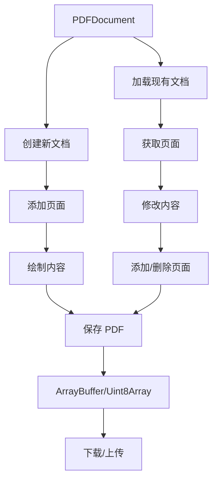
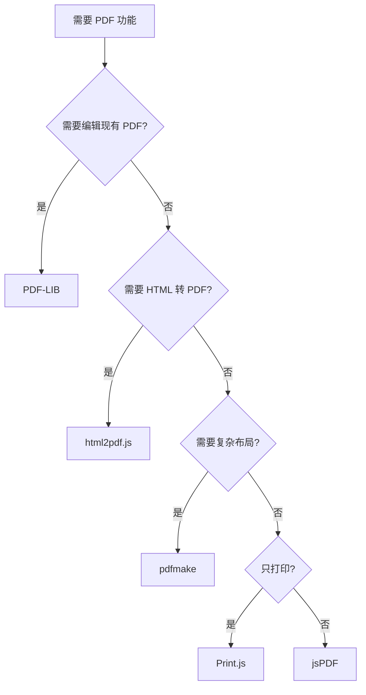

# PDF-LIB 使用文档

## 📋 目录

- [基本介绍](#基本介绍)
- [核心特点](#核心特点)
- [性能数据](#性能数据)
- [分页能力](#分页能力)
- [完整 API 文档](#完整-api-文档)
- [实战示例](#实战示例)
- [最佳实践](#最佳实践)
- [常见问题](#常见问题)
- [总结](#总结)

---

## 基本介绍

### 什么是 PDF-LIB？

PDF-LIB 是一个**现代化的纯 JavaScript PDF 操作库**，可以在浏览器和 Node.js 环境中创建和修改 PDF 文档。它是唯一能够**原生编辑现有 PDF** 的纯 JS 库，支持表单填写、页面合并、内容提取等高级功能。

**关键概念：**

- 📝 **创建 PDF**：从零开始创建 PDF 文档
- ✏️ **编辑 PDF**：修改现有 PDF（独特能力）
- 🔗 **合并拆分**：合并多个 PDF 或提取页面
- 📋 **表单操作**：创建、填写、验证 PDF 表单
- 💾 **无依赖**：纯 JavaScript，不依赖外部库

### 官方资源

- 🌐 **GitHub**：https://github.com/Hopding/pdf-lib
- 📦 **NPM**：https://www.npmjs.com/package/pdf-lib
- 📚 **文档**：https://pdf-lib.js.org/
- 🎯 **示例**：https://pdf-lib.js.org/docs/api/

### 工作原理



**核心特性：**

1. **创建模式**：使用 `PDFDocument.create()` 创建空白文档
2. **编辑模式**：使用 `PDFDocument.load(bytes)` 加载现有 PDF
3. **操作 API**：添加页面、绘制文本/图形、嵌入字体/图片
4. **保存输出**：保存为 `Uint8Array` 或 `ArrayBuffer`

### 与其他库的区别

| 能力      | PDF-LIB     | jsPDF | pdfmake | html2canvas |
| --------- | ----------- | ----- | ------- | ----------- |
| 创建 PDF  | ✅          | ✅    | ✅      | ❌          |
| 编辑 PDF  | ✅ 唯一支持 | ❌    | ❌      | ❌          |
| 合并 PDF  | ✅          | ❌    | ❌      | ❌          |
| 表单填写  | ✅          | ❌    | ❌      | ❌          |
| HTML 渲染 | ❌          | 部分  | ❌      | ✅          |

### 适用场景

| 场景类型        | 推荐度     | 说明                      |
| --------------- | ---------- | ------------------------- |
| ✏️ 编辑现有 PDF | ⭐⭐⭐⭐⭐ | 唯一能编辑 PDF 的纯 JS 库 |
| 📋 表单填写     | ⭐⭐⭐⭐⭐ | 完整的表单操作支持        |
| 🔗 PDF 合并拆分 | ⭐⭐⭐⭐⭐ | 原生支持，API 简洁        |
| 💧 添加水印     | ⭐⭐⭐⭐⭐ | 支持文本和图片水印        |
| 📄 创建 PDF     | ⭐⭐⭐⭐   | 功能完整，API 现代化      |
| 🔐 PDF 加密     | ⭐⭐⭐⭐   | 支持密码保护              |
| 📝 复杂布局     | ⭐⭐⭐     | 需要手动计算位置          |
| 🎨 HTML 转 PDF  | ⭐         | 不支持，需配合其他库      |

---

## 核心特点

### 核心优势

| 特性               | 评分       | 说明                              |
| ------------------ | ---------- | --------------------------------- |
| ✏️ PDF 编辑能力    | ⭐⭐⭐⭐⭐ | 唯一能原生编辑现有 PDF 的纯 JS 库 |
| 🔗 文档合并拆分    | ⭐⭐⭐⭐⭐ | 轻松合并多个 PDF 或提取页面       |
| 📋 表单操作        | ⭐⭐⭐⭐⭐ | 完整支持创建、填写、验证 PDF 表单 |
| 💾 无依赖设计      | ⭐⭐⭐⭐⭐ | 纯 JavaScript，不依赖任何外部库   |
| 🎯 现代化 API      | ⭐⭐⭐⭐⭐ | ES6+ 设计，Promise/async/await    |
| 📘 TypeScript 支持 | ⭐⭐⭐⭐⭐ | 原生 TypeScript 编写，类型完整    |
| 🌐 跨平台          | ⭐⭐⭐⭐⭐ | 浏览器和 Node.js 都可用           |
| 🔐 安全功能        | ⭐⭐⭐⭐   | 支持加密、权限设置                |
| 📦 体积            | ⭐⭐⭐     | ~200 KB (gzip 后 ~60 KB)          |
| 📚 文档质量        | ⭐⭐⭐     | 官方文档较完善，示例丰富          |

### 主要缺点

| 缺点           | 影响程度 | 说明                            |
| -------------- | -------- | ------------------------------- |
| ⚠️ 包体积较大  | 中       | ~200 KB，比 jsPDF 大            |
| ⚠️ 学习曲线    | 中       | API 较多，需要熟悉 PDF 概念     |
| ⚠️ 不支持 HTML | 高       | 无法直接渲染 HTML，需配合其他库 |
| ⚠️ 手动布局    | 中       | 需要手动计算坐标和尺寸          |
| ⚠️ 中文支持    | 中       | 需要手动嵌入中文字体            |
| ⚠️ 不支持 IE11 | 低       | 仅支持现代浏览器                |

### 与其他方案对比

| 特性       | PDF-LIB    | jsPDF    | pdfmake    | html2pdf.js |
| ---------- | ---------- | -------- | ---------- | ----------- |
| 创建 PDF   | ⭐⭐⭐⭐   | ⭐⭐⭐⭐ | ⭐⭐⭐⭐⭐ | ⭐⭐⭐⭐    |
| 编辑 PDF   | ⭐⭐⭐⭐⭐ | ❌       | ❌         | ❌          |
| 合并 PDF   | ⭐⭐⭐⭐⭐ | ❌       | ❌         | ❌          |
| 表单操作   | ⭐⭐⭐⭐⭐ | ❌       | ❌         | ❌          |
| API 设计   | ⭐⭐⭐⭐⭐ | ⭐⭐⭐   | ⭐⭐⭐⭐⭐ | ⭐⭐⭐⭐    |
| TypeScript | ⭐⭐⭐⭐⭐ | ⭐⭐⭐   | ⭐⭐⭐⭐⭐ | ⭐⭐⭐      |
| 文件大小   | ⭐⭐⭐     | ⭐⭐⭐⭐ | ⭐⭐       | ⭐⭐        |
| 学习成本   | ⭐⭐⭐     | ⭐⭐⭐   | ⭐⭐⭐⭐   | ⭐⭐⭐⭐⭐  |
| HTML 支持  | ❌         | 部分     | ❌         | ⭐⭐⭐⭐⭐  |

**选择建议：**

- ✅ **PDF-LIB**：需要编辑 PDF、表单填写、文档合并
- ✅ **jsPDF**：简单创建 PDF，需要精细控制
- ✅ **pdfmake**：声明式创建复杂报表
- ✅ **html2pdf.js**：HTML 转 PDF，快速开发

---

## 性能数据

### 基准测试

以下是在不同场景下的性能测试结果（测试环境：Chrome 120，MacBook Pro M1）：

#### 1. 创建简单 PDF（1 页，纯文本）

```
初始化时间：~50-80ms
创建文档：~20-30ms
添加页面：~5-10ms
绘制文本：~10-20ms
保存文件：~30-50ms
总耗时：~115-190ms
文件大小：~3-5 KB
内存占用：~10 MB
```

#### 2. 编辑现有 PDF（10 页，添加水印）

```
加载 PDF：~100-150ms（取决于文件大小）
获取页面：~10-20ms
修改内容：~50-100ms（每页 5-10ms）
保存文件：~80-120ms
总耗时：~240-390ms
文件大小：原文件 + 5-10 KB
内存占用：~30 MB
```

#### 3. 合并多个 PDF（3 个文件，共 15 页）

```
加载 PDF 1：~100ms
加载 PDF 2：~100ms
加载 PDF 3：~100ms
复制页面：~150-200ms
合并操作：~50-80ms
保存文件：~150-200ms
总耗时：~650-780ms
文件大小：三个文件之和
内存占用：~60 MB
```

#### 4. 表单填写（1 页，10 个字段）

```
加载表单 PDF：~120ms
获取表单：~10ms
填写字段：~50ms（10 个字段）
保存文件：~50ms
总耗时：~230ms
文件大小：原文件 + 2-3 KB
内存占用：~15 MB
```

### 性能对比

| 操作          | PDF-LIB | jsPDF  | pdfmake | html2canvas |
| ------------- | ------- | ------ | ------- | ----------- |
| 创建单页      | ~150ms  | ~150ms | ~200ms  | ~300ms      |
| 创建 10 页    | ~400ms  | ~600ms | ~800ms  | ~2.5s       |
| 编辑 PDF      | ~300ms  | ❌     | ❌      | ❌          |
| 合并 3 个 PDF | ~700ms  | ❌     | ❌      | ❌          |
| 表单填写      | ~230ms  | ❌     | ❌      | ❌          |

### 性能影响因素

| 因素         | 影响程度   | 说明                       |
| ------------ | ---------- | -------------------------- |
| PDF 文件大小 | ⭐⭐⭐⭐⭐ | 加载大文件耗时显著增加     |
| 页面数量     | ⭐⭐⭐⭐   | 页面越多，操作越慢         |
| 字体嵌入     | ⭐⭐⭐⭐   | 嵌入字体增加文件大小和耗时 |
| 图片嵌入     | ⭐⭐⭐⭐   | 大图片显著增加文件大小     |
| 操作复杂度   | ⭐⭐⭐     | 复杂操作（如合并）耗时更长 |
| 浏览器性能   | ⭐⭐       | Chrome 性能最好            |

### 性能优化建议

```javascript
// ❌ 不推荐：重复加载相同字体
for (let i = 0; i < 10; i++) {
  const page = pdfDoc.addPage()
  const font = await pdfDoc.embedFont(StandardFonts.Helvetica)
  page.drawText('Text', { font })
}

// ✅ 推荐：复用字体对象
const font = await pdfDoc.embedFont(StandardFonts.Helvetica)
for (let i = 0; i < 10; i++) {
  const page = pdfDoc.addPage()
  page.drawText('Text', { font })
}

// ✅ 批量操作
const pages = pdfDoc.getPages()
pages.forEach((page) => {
  page.drawText('Watermark', {
    x: 100,
    y: 100,
    size: 50,
    opacity: 0.2,
  })
})
```

---

## 分页能力

### 分页特点

PDF-LIB 是**底层 PDF 操作库**，不提供自动分页功能，需要**手动管理页面**。

**分页方式：**

- 📄 **手动添加页面**：使用 `addPage()` 创建新页面
- 📏 **手动计算位置**：需要自己计算内容是否超出页面
- 🔗 **页面操作**：可以插入、删除、重排页面

### 手动分页实现

#### 1. 基础分页

```javascript
import { PDFDocument, StandardFonts } from 'pdf-lib'

const pdfDoc = await PDFDocument.create()
const font = await pdfDoc.embedFont(StandardFonts.Helvetica)

// A4 尺寸：595 x 842 点
const pageWidth = 595
const pageHeight = 842
const margin = 50
const lineHeight = 20

let currentPage = pdfDoc.addPage([pageWidth, pageHeight])
let currentY = pageHeight - margin

// 添加文本，自动分页
function addText(text) {
  if (currentY < margin) {
    // 需要新页
    currentPage = pdfDoc.addPage([pageWidth, pageHeight])
    currentY = pageHeight - margin
  }

  currentPage.drawText(text, {
    x: margin,
    y: currentY,
    size: 12,
    font,
  })

  currentY -= lineHeight
}

// 使用
for (let i = 0; i < 100; i++) {
  addText(`Line ${i + 1}: This is some content`)
}

const pdfBytes = await pdfDoc.save()
```

#### 2. 智能分页（多行文本）

```javascript
async function addParagraph(pdfDoc, page, text, options) {
  const { x, y, size, font, maxWidth, lineHeight } = options

  const words = text.split(' ')
  const lines = []
  let currentLine = ''

  // 分割成多行
  for (const word of words) {
    const testLine = currentLine + (currentLine ? ' ' : '') + word
    const textWidth = font.widthOfTextAtSize(testLine, size)

    if (textWidth > maxWidth) {
      lines.push(currentLine)
      currentLine = word
    } else {
      currentLine = testLine
    }
  }
  if (currentLine) {
    lines.push(currentLine)
  }

  // 检查是否需要新页
  const totalHeight = lines.length * lineHeight
  let currentY = y
  let currentPage = page

  for (const line of lines) {
    if (currentY < 50) {
      // 需要新页
      currentPage = pdfDoc.addPage([595, 842])
      currentY = 842 - 50
    }

    currentPage.drawText(line, {
      x,
      y: currentY,
      size,
      font,
    })

    currentY -= lineHeight
  }

  return { page: currentPage, y: currentY }
}
```

#### 3. 表格分页

```javascript
async function addTable(pdfDoc, data, options) {
  const { startPage, x, y, rowHeight } = options
  const pageHeight = 842
  const margin = 50

  let currentPage = startPage
  let currentY = y

  for (const row of data) {
    // 检查是否需要新页
    if (currentY - rowHeight < margin) {
      currentPage = pdfDoc.addPage([595, pageHeight])
      currentY = pageHeight - margin
    }

    // 绘制行
    row.forEach((cell, index) => {
      currentPage.drawText(cell, {
        x: x + index * 100,
        y: currentY,
        size: 10,
      })
    })

    currentY -= rowHeight
  }

  return currentPage
}
```

### 页面管理

#### 1. 插入页面

```javascript
// 在指定位置插入页面
const newPage = pdfDoc.insertPage(2, [595, 842]) // 在索引 2 处插入
```

#### 2. 删除页面

```javascript
// 删除指定页面
pdfDoc.removePage(3) // 删除索引 3 的页面
```

#### 3. 复制页面

```javascript
// 从另一个 PDF 复制页面
const sourcePdf = await PDFDocument.load(pdfBytes)
const [copiedPage] = await pdfDoc.copyPages(sourcePdf, [0])
pdfDoc.addPage(copiedPage)
```

#### 4. 获取页面信息

```javascript
const pages = pdfDoc.getPages()
const pageCount = pdfDoc.getPageCount()
const page = pdfDoc.getPage(0)
const { width, height } = page.getSize()
```

### 分页最佳实践

| 场景     | 推荐方案                     |
| -------- | ---------------------------- |
| 简单文档 | 手动计算，及时添加新页       |
| 长文本   | 实现分段函数，自动换行和分页 |
| 表格     | 逐行检查，超出则新页继续     |
| 复杂布局 | 预先规划每页内容，精确控制   |

---

## 完整 API 文档

### 安装

```bash
# npm
npm install pdf-lib

# yarn
yarn add pdf-lib

# pnpm
pnpm add pdf-lib
```

### 基本导入

```javascript
// ES Module
import { PDFDocument, rgb, StandardFonts } from 'pdf-lib';

// CommonJS
const { PDFDocument, rgb, StandardFonts } = require('pdf-lib');

// CDN (UMD)
<script src="https://unpkg.com/pdf-lib@1.17.1/dist/pdf-lib.min.js"></script>
<script>
  const { PDFDocument, rgb } = PDFLib;
</script>
```

### 核心类和方法

#### PDFDocument

PDF 文档对象，所有操作的入口。

##### 静态方法

###### 1. PDFDocument.create()

创建新的空白 PDF 文档。

```typescript
static create(): Promise<PDFDocument>
```

```javascript
const pdfDoc = await PDFDocument.create()
```

###### 2. PDFDocument.load()

加载现有 PDF 文档。

```typescript
static load(
  pdf: string | Uint8Array | ArrayBuffer,
  options?: {
    ignoreEncryption?: boolean;
    parseSpeed?: number;
    throwOnInvalidObject?: boolean;
    updateMetadata?: boolean;
    capNumbers?: boolean;
  }
): Promise<PDFDocument>
```

```javascript
// 从文件加载
const existingPdfBytes = await fetch('/document.pdf').then((res) => res.arrayBuffer())
const pdfDoc = await PDFDocument.load(existingPdfBytes)

// 从 base64 加载
const base64Pdf = 'JVBERi0xLjcKJ...'
const pdfDoc = await PDFDocument.load(base64Pdf)
```

**options 参数：**

| 选项                 | 类型    | 默认值 | 说明                             |
| -------------------- | ------- | ------ | -------------------------------- |
| ignoreEncryption     | boolean | false  | 忽略加密（可能导致错误）         |
| parseSpeed           | number  | 1      | 解析速度（0 最慢最准确，2 最快） |
| throwOnInvalidObject | boolean | true   | 遇到无效对象是否抛出错误         |
| updateMetadata       | boolean | true   | 是否更新元数据                   |

##### 实例方法 - 页面操作

###### 1. addPage()

添加新页面。

```typescript
addPage(size?: [number, number]): PDFPage
```

```javascript
// 默认尺寸（US Letter: 612 x 792）
const page = pdfDoc.addPage()

// 自定义尺寸（A4: 595 x 842）
const a4Page = pdfDoc.addPage([595, 842])

// 常用尺寸
const sizes = {
  A4: [595, 842],
  A3: [842, 1191],
  A5: [420, 595],
  Letter: [612, 792],
  Legal: [612, 1008],
}
```

###### 2. insertPage()

在指定位置插入页面。

```typescript
insertPage(index: number, size?: [number, number]): PDFPage
```

```javascript
// 在索引 2 处插入页面
const page = pdfDoc.insertPage(2, [595, 842])
```

###### 3. removePage()

删除指定页面。

```typescript
removePage(index: number): void
```

```javascript
pdfDoc.removePage(0) // 删除第一页
```

###### 4. getPages()

获取所有页面。

```typescript
getPages(): PDFPage[]
```

```javascript
const pages = pdfDoc.getPages()
console.log(`共 ${pages.length} 页`)
```

###### 5. getPage()

获取指定页面。

```typescript
getPage(index: number): PDFPage
```

```javascript
const firstPage = pdfDoc.getPage(0)
```

###### 6. getPageCount()

获取页面总数。

```typescript
getPageCount(): number
```

```javascript
const count = pdfDoc.getPageCount()
```

###### 7. copyPages()

从另一个文档复制页面。

```typescript
copyPages(
  srcDoc: PDFDocument,
  indices: number[]
): Promise<PDFPage[]>
```

```javascript
const sourcePdf = await PDFDocument.load(sourceBytes)

// 复制第 0、1、3 页
const copiedPages = await pdfDoc.copyPages(sourcePdf, [0, 1, 3])

// 添加到当前文档
copiedPages.forEach((page) => pdfDoc.addPage(page))
```

##### 实例方法 - 字体操作

###### 1. embedFont()

嵌入标准字体。

```typescript
embedFont(
  font: StandardFonts | string | Uint8Array | ArrayBuffer,
  options?: { subset?: boolean }
): Promise<PDFFont>
```

```javascript
import { StandardFonts } from 'pdf-lib'

// 标准字体（14 种）
const helvetica = await pdfDoc.embedFont(StandardFonts.Helvetica)
const times = await pdfDoc.embedFont(StandardFonts.TimesRoman)
const courier = await pdfDoc.embedFont(StandardFonts.Courier)

// 自定义字体
const fontBytes = await fetch('/font.ttf').then((res) => res.arrayBuffer())
const customFont = await pdfDoc.embedFont(fontBytes)

// 字体子集化（减小文件大小）
const font = await pdfDoc.embedFont(fontBytes, { subset: true })
```

**StandardFonts 枚举：**

```typescript
enum StandardFonts {
  Courier = 'Courier',
  CourierBold = 'Courier-Bold',
  CourierOblique = 'Courier-Oblique',
  CourierBoldOblique = 'Courier-BoldOblique',
  Helvetica = 'Helvetica',
  HelveticaBold = 'Helvetica-Bold',
  HelveticaOblique = 'Helvetica-Oblique',
  HelveticaBoldOblique = 'Helvetica-BoldOblique',
  TimesRoman = 'Times-Roman',
  TimesRomanBold = 'Times-Bold',
  TimesRomanItalic = 'Times-Italic',
  TimesRomanBoldItalic = 'Times-BoldItalic',
  Symbol = 'Symbol',
  ZapfDingbats = 'ZapfDingbats',
}
```

##### 实例方法 - 图片操作

###### 1. embedPng()

嵌入 PNG 图片。

```typescript
embedPng(png: string | Uint8Array | ArrayBuffer): Promise<PDFImage>
```

```javascript
const pngBytes = await fetch('/image.png').then((res) => res.arrayBuffer())
const pngImage = await pdfDoc.embedPng(pngBytes)

// 从 base64
const base64Png = 'data:image/png;base64,iVBORw0KG...'
const pngImage2 = await pdfDoc.embedPng(base64Png)
```

###### 2. embedJpg()

嵌入 JPG 图片。

```typescript
embedJpg(jpg: string | Uint8Array | ArrayBuffer): Promise<PDFImage>
```

```javascript
const jpgBytes = await fetch('/photo.jpg').then((res) => res.arrayBuffer())
const jpgImage = await pdfDoc.embedJpg(jpgBytes)
```

###### 3. embedPdf()

嵌入另一个 PDF 作为页面。

```typescript
embedPdf(
  pdf: PDFDocument | Uint8Array | ArrayBuffer,
  indices?: number | number[]
): Promise<PDFEmbeddedPage[]>
```

```javascript
const sourcePdfBytes = await fetch('/source.pdf').then((res) => res.arrayBuffer())
const sourcePdf = await PDFDocument.load(sourcePdfBytes)

// 嵌入第一页
const [embeddedPage] = await pdfDoc.embedPdf(sourcePdf, [0])
```


##### 表单操作 - 获取和操作

###### 1. getForm()

获取 PDF 的表单。

```typescript
getForm(): PDFForm
```

```javascript
const form = pdfDoc.getForm();
```

###### 2. 表单字段操作

```javascript
// 文本字段
const textField = form.getTextField('fieldName');
textField.setText('内容');

// 复选框
const checkbox = form.getCheckBox('checkboxName');
checkbox.check();  // 勾选
checkbox.uncheck();  // 取消勾选

// 单选按钮
const radioGroup = form.getRadioGroup('radioGroupName');
radioGroup.select('optionValue');

// 下拉列表
const dropdown = form.getDropdown('dropdownName');
dropdown.select('optionValue');

// 使表单不可编辑
form.flatten();
```

##### 保存和导出

###### 1. save()

保存 PDF 文档为字节数组。

```typescript
save(options?: {
  useObjectStreams?: boolean;
  addDefaultPage?: boolean;
  objectsPerTick?: number;
  updateFieldAppearances?: boolean;
}): Promise<Uint8Array>
```

```javascript
const pdfBytes = await pdfDoc.save();
const pdfBytes2 = await pdfDoc.save({
  useObjectStreams: false,  // 不使用对象流（减小文件大小）
  addDefaultPage: true,  // 如果文档为空则添加默认页
  updateFieldAppearances: true  // 更新表单字段外观
});
```

###### 2. saveAsBase64()

保存为 Base64 字符串。

```typescript
saveAsBase64(options?: SaveOptions): Promise<string>
```

```javascript
const base64Pdf = await pdfDoc.saveAsBase64();
```

###### 3. copy()

复制整个文档。

```typescript
copy(): Promise<PDFDocument>
```

```javascript
const copiedDoc = await pdfDoc.copy();
```

##### 元数据操作

```javascript
// 设置标题
pdfDoc.setTitle('文档标题');

// 设置作者
pdfDoc.setAuthor('作者名');

// 设置主题
pdfDoc.setSubject('主题');

// 设置关键词
pdfDoc.setKeywords(['关键词1', '关键词2']);

// 设置生产者
pdfDoc.setProducer('PDF-LIB');

// 设置创建者
pdfDoc.setCreator('我的应用');

// 设置创建日期
pdfDoc.setCreationDate(new Date());

// 设置修改日期
pdfDoc.setModificationDate(new Date());
```

---

#### PDFPage 类

`PDFPage` 表示 PDF 中的一个页面，提供绘制和布局方法。

##### 页面属性

```javascript
// 获取页面尺寸
const { width, height } = page.getSize();

// 设置页面尺寸
page.setSize(595, 842);  // A4

// 获取旋转角度
const rotation = page.getRotation();

// 设置旋转角度
page.setRotation(degrees(90));
```

##### 绘制方法

###### 1. drawText()

在页面上绘制文本。

```typescript
drawText(text: string, options?: {
  x?: number;
  y?: number;
  size?: number;
  font?: PDFFont;
  color?: Color;
  lineHeight?: number;
  opacity?: number;
  rotate?: Rotation;
  xSkew?: Rotation;
  ySkew?: Rotation;
  maxWidth?: number;
}): void
```

```javascript
page.drawText('Hello World', {
  x: 50,
  y: 700,
  size: 24,
  font: helveticaFont,
  color: rgb(0, 0.53, 0.71),
  rotate: degrees(15)
});
```

###### 2. drawRectangle()

绘制矩形。

```typescript
drawRectangle(options?: {
  x?: number;
  y?: number;
  width?: number;
  height?: number;
  color?: Color;
  borderColor?: Color;
  borderWidth?: number;
  opacity?: number;
  borderOpacity?: number;
  rotate?: Rotation;
  xSkew?: Rotation;
  ySkew?: Rotation;
}): void
```

```javascript
page.drawRectangle({
  x: 50,
  y: 500,
  width: 200,
  height: 100,
  color: rgb(0, 0, 1),
  borderColor: rgb(1, 0, 0),
  borderWidth: 2
});
```

###### 3. drawLine()

绘制直线。

```typescript
drawLine(options?: {
  start: { x: number; y: number };
  end: { x: number; y: number };
  thickness?: number;
  color?: Color;
  opacity?: number;
  dashArray?: number[];
  dashPhase?: number;
}): void
```

```javascript
page.drawLine({
  start: { x: 50, y: 400 },
  end: { x: 250, y: 400 },
  thickness: 2,
  color: rgb(0, 0, 0)
});
```

###### 4. drawCircle()

绘制圆形。

```typescript
drawCircle(options?: {
  x?: number;
  y?: number;
  size?: number;
  color?: Color;
  borderColor?: Color;
  borderWidth?: number;
  opacity?: number;
  borderOpacity?: number;
}): void
```

```javascript
page.drawCircle({
  x: 150,
  y: 300,
  size: 50,
  color: rgb(1, 0, 0),
  borderColor: rgb(0, 0, 1),
  borderWidth: 3
});
```

###### 5. drawEllipse()

绘制椭圆。

```typescript
drawEllipse(options?: {
  x?: number;
  y?: number;
  xScale?: number;
  yScale?: number;
  color?: Color;
  borderColor?: Color;
  borderWidth?: number;
  opacity?: number;
  borderOpacity?: number;
  rotate?: Rotation;
}): void
```

```javascript
page.drawEllipse({
  x: 150,
  y: 200,
  xScale: 100,
  yScale: 50,
  color: rgb(0, 1, 0)
});
```

###### 6. drawImage()

绘制图片。

```typescript
drawImage(image: PDFImage, options?: {
  x?: number;
  y?: number;
  width?: number;
  height?: number;
  opacity?: number;
  rotate?: Rotation;
  xSkew?: Rotation;
  ySkew?: Rotation;
}): void
```

```javascript
const pngImage = await pdfDoc.embedPng(pngBytes);
page.drawImage(pngImage, {
  x: 50,
  y: 100,
  width: 200,
  height: 150,
  opacity: 0.8
});
```

###### 7. drawSvgPath()

绘制 SVG 路径。

```typescript
drawSvgPath(path: string, options?: {
  x?: number;
  y?: number;
  scale?: number;
  color?: Color;
  borderColor?: Color;
  borderWidth?: number;
  opacity?: number;
  borderOpacity?: number;
  rotate?: Rotation;
}): void
```

```javascript
page.drawSvgPath('M 0,20 L 100,160 Q 130,200 150,120 C 190,-40 200,200 300,150 L 400,90', {
  x: 50,
  y: 50,
  color: rgb(0.5, 0, 0.5),
  borderColor: rgb(0, 0, 0),
  borderWidth: 2
});
```

#### 颜色系统

```javascript
import { rgb, cmyk, grayscale } from 'pdf-lib';

// RGB 颜色（0-1）
const red = rgb(1, 0, 0);
const blue = rgb(0, 0, 1);
const gray = rgb(0.5, 0.5, 0.5);

// CMYK 颜色
const cyan = cmyk(1, 0, 0, 0);

// 灰度
const black = grayscale(0);
const white = grayscale(1);
```

#### 角度和旋转

```javascript
import { degrees, radians } from 'pdf-lib';

// 使用度数
const rotation90 = degrees(90);
const rotation180 = degrees(180);

// 使用弧度
const rotationPi = radians(Math.PI);

// 应用旋转
page.drawText('Rotated', {
  x: 100,
  y: 100,
  rotate: degrees(-45)
});
```

---

## 实战示例

### 示例 1：创建基础 PDF

```javascript
import { PDFDocument, StandardFonts, rgb } from 'pdf-lib';

async function createBasicPDF() {
  const pdfDoc = await PDFDocument.create();
  const page = pdfDoc.addPage([595, 842]);  // A4
  
  const font = await pdfDoc.embedFont(StandardFonts.Helvetica);
  const { width, height } = page.getSize();
  
  // 标题
  page.drawText('My First PDF', {
    x: 50,
    y: height - 50,
    size: 30,
    font,
    color: rgb(0, 0.53, 0.71)
  });
  
  // 内容
  page.drawText('Created with PDF-LIB', {
    x: 50,
    y: height - 100,
    size: 16,
    font,
    color: rgb(0.2, 0.2, 0.2)
  });
  
  // 保存
  const pdfBytes = await pdfDoc.save();
  
  // 下载
  const blob = new Blob([pdfBytes], { type: 'application/pdf' });
  const url = URL.createObjectURL(blob);
  const link = document.createElement('a');
  link.href = url;
  link.download = 'basic.pdf';
  link.click();
}
```

### 示例 2：编辑现有 PDF

```javascript
async function editExistingPDF() {
  // 加载 PDF
  const existingPdfBytes = await fetch('/document.pdf')
    .then(res => res.arrayBuffer());
  
  const pdfDoc = await PDFDocument.load(existingPdfBytes);
  
  // 获取第一页
  const pages = pdfDoc.getPages();
  const firstPage = pages[0];
  
  // 添加水印
  const font = await pdfDoc.embedFont(StandardFonts.HelveticaBold);
  
  firstPage.drawText('EDITED', {
    x: 50,
    y: 50,
    size: 20,
    font,
    color: rgb(0.95, 0.1, 0.1),
    opacity: 0.5
  });
  
  // 保存
  const pdfBytes = await pdfDoc.save();
  downloadPDF(pdfBytes, 'edited.pdf');
}
```

### 示例 3：合并多个 PDF

```javascript
async function mergePDFs(pdfUrls) {
  const mergedPdf = await PDFDocument.create();
  
  for (const url of pdfUrls) {
    const pdfBytes = await fetch(url).then(res => res.arrayBuffer());
    const pdf = await PDFDocument.load(pdfBytes);
    
    const copiedPages = await mergedPdf.copyPages(pdf, pdf.getPageIndices());
    copiedPages.forEach(page => mergedPdf.addPage(page));
  }
  
  const mergedPdfBytes = await mergedPdf.save();
  downloadPDF(mergedPdfBytes, 'merged.pdf');
}

// 使用
mergePDFs(['/pdf1.pdf', '/pdf2.pdf', '/pdf3.pdf']);
```

### 示例 4：添加水印

```javascript
import { degrees } from 'pdf-lib';

async function addWatermark(pdfUrl, watermarkText) {
  const existingPdfBytes = await fetch(pdfUrl)
    .then(res => res.arrayBuffer());
  
  const pdfDoc = await PDFDocument.load(existingPdfBytes);
  const font = await pdfDoc.embedFont(StandardFonts.HelveticaBold);
  
  const pages = pdfDoc.getPages();
  
  pages.forEach(page => {
    const { width, height } = page.getSize();
    
    // 对角水印
    page.drawText(watermarkText, {
      x: width / 2 - 100,
      y: height / 2,
      size: 80,
      font,
      color: rgb(0.95, 0.1, 0.1),
      opacity: 0.2,
      rotate: degrees(-45)
    });
  });
  
  const pdfBytes = await pdfDoc.save();
  downloadPDF(pdfBytes, 'watermarked.pdf');
}

// 使用
addWatermark('/document.pdf', 'CONFIDENTIAL');
```

### 示例 5：填写 PDF 表单

```javascript
async function fillPDFForm(formPdfUrl, formData) {
  const formPdfBytes = await fetch(formPdfUrl)
    .then(res => res.arrayBuffer());
  
  const pdfDoc = await PDFDocument.load(formPdfBytes);
  const form = pdfDoc.getForm();
  
  // 填写文本字段
  if (formData.name) {
    const nameField = form.getTextField('name');
    nameField.setText(formData.name);
  }
  
  if (formData.email) {
    const emailField = form.getTextField('email');
    emailField.setText(formData.email);
  }
  
  // 勾选复选框
  if (formData.agree) {
    const agreeCheckBox = form.getCheckBox('agree');
    agreeCheckBox.check();
  }
  
  // 选择单选按钮
  if (formData.gender) {
    const genderRadio = form.getRadioGroup('gender');
    genderRadio.select(formData.gender);
  }
  
  // 使表单不可编辑
  form.flatten();
  
  const pdfBytes = await pdfDoc.save();
  downloadPDF(pdfBytes, 'filled-form.pdf');
}

// 使用
fillPDFForm('/form.pdf', {
  name: '张三',
  email: 'zhang@example.com',
  agree: true,
  gender: 'male'
});
```

### 示例 6：嵌入图片

```javascript
async function embedImagesInPDF() {
  const pdfDoc = await PDFDocument.create();
  const page = pdfDoc.addPage([600, 800]);
  
  // PNG 图片
  const pngBytes = await fetch('/logo.png').then(res => res.arrayBuffer());
  const pngImage = await pdfDoc.embedPng(pngBytes);
  
  // JPG 图片
  const jpgBytes = await fetch('/photo.jpg').then(res => res.arrayBuffer());
  const jpgImage = await pdfDoc.embedJpg(jpgBytes);
  
  // 绘制 PNG
  const pngDims = pngImage.scale(0.5);
  page.drawImage(pngImage, {
    x: 50,
    y: 600,
    width: pngDims.width,
    height: pngDims.height
  });
  
  // 绘制 JPG
  page.drawImage(jpgImage, {
    x: 50,
    y: 300,
    width: 200,
    height: 150
  });
  
  const pdfBytes = await pdfDoc.save();
  downloadPDF(pdfBytes, 'images.pdf');
}
```

### 示例 7：提取特定页面

```javascript
async function extractPages(pdfUrl, pageIndices) {
  const existingPdfBytes = await fetch(pdfUrl)
    .then(res => res.arrayBuffer());
  
  const sourcePdf = await PDFDocument.load(existingPdfBytes);
  const newPdf = await PDFDocument.create();
  
  // 复制指定页面
  const copiedPages = await newPdf.copyPages(sourcePdf, pageIndices);
  copiedPages.forEach(page => newPdf.addPage(page));
  
  const pdfBytes = await newPdf.save();
  downloadPDF(pdfBytes, 'extracted.pdf');
}

// 使用：提取第 0、2、4 页
extractPages('/document.pdf', [0, 2, 4]);
```

### 示例 8：Vue 3 组件示例

```vue
<template>
  <div class="pdf-operations">
    <h2>PDF 操作工具</h2>
    
    <div class="operations">
      <button @click="createPDF">创建 PDF</button>
      <button @click="mergePDFs">合并 PDF</button>
      <button @click="addWatermark">添加水印</button>
      
      <input type="file" @change="handleFileUpload" accept=".pdf" />
    </div>
    
    <div v-if="loading">处理中...</div>
  </div>
</template>

<script setup>
import { ref } from 'vue';
import { PDFDocument, StandardFonts, rgb, degrees } from 'pdf-lib';

const loading = ref(false);

const createPDF = async () => {
  loading.value = true;
  
  try {
    const pdfDoc = await PDFDocument.create();
    const page = pdfDoc.addPage([595, 842]);
    const font = await pdfDoc.embedFont(StandardFonts.Helvetica);
    
    page.drawText('Hello from Vue 3!', {
      x: 50,
      y: 750,
      size: 24,
      font,
      color: rgb(0, 0.53, 0.71)
    });
    
    const pdfBytes = await pdfDoc.save();
    downloadPDF(pdfBytes, 'vue-pdf.pdf');
  } catch (error) {
    console.error('创建 PDF 失败:', error);
  } finally {
    loading.value = false;
  }
};

const handleFileUpload = async (event) => {
  const file = event.target.files[0];
  if (!file) return;
  
  loading.value = true;
  
  try {
    const arrayBuffer = await file.arrayBuffer();
    const pdfDoc = await PDFDocument.load(arrayBuffer);
    
    console.log(`PDF 有 ${pdfDoc.getPageCount()} 页`);
    
    // 进一步处理...
  } catch (error) {
    console.error('加载 PDF 失败:', error);
  } finally {
    loading.value = false;
  }
};

function downloadPDF(pdfBytes, filename) {
  const blob = new Blob([pdfBytes], { type: 'application/pdf' });
  const url = URL.createObjectURL(blob);
  const link = document.createElement('a');
  link.href = url;
  link.download = filename;
  link.click();
  URL.revokeObjectURL(url);
}
</script>
```

---

## 最佳实践

### 1. 复用字体和图片对象

```javascript
//  不好：每次都嵌入
for (let i = 0; i < 10; i++) {
  const page = pdfDoc.addPage();
  const font = await pdfDoc.embedFont(StandardFonts.Helvetica);  // 重复嵌入
  page.drawText('Text', { font });
}

//  好：一次嵌入，多次使用
const font = await pdfDoc.embedFont(StandardFonts.Helvetica);
for (let i = 0; i < 10; i++) {
  const page = pdfDoc.addPage();
  page.drawText('Text', { font });
}
```

### 2. 错误处理

```javascript
async function loadPDF(url) {
  try {
    const pdfBytes = await fetch(url).then(res => res.arrayBuffer());
    const pdfDoc = await PDFDocument.load(pdfBytes);
    return pdfDoc;
  } catch (error) {
    if (error.message.includes('encrypted')) {
      // 处理加密的 PDF
      console.error('PDF 是加密的，需要密码');
      return await PDFDocument.load(pdfBytes, { ignoreEncryption: true });
    } else if (error.message.includes('Invalid')) {
      // 处理损坏的 PDF
      console.error('PDF 文件损坏或格式不正确');
    }
    throw error;
  }
}
```

### 3. 性能优化

```javascript
// 批量操作
async function batchProcess(urls) {
  const mergedPdf = await PDFDocument.create();
  
  // 预先嵌入字体（只嵌入一次）
  const font = await mergedPdf.embedFont(StandardFonts.Helvetica);
  
  for (const url of urls) {
    const pdfBytes = await fetch(url).then(res => res.arrayBuffer());
    const pdf = await PDFDocument.load(pdfBytes);
    
    // 批量复制页面
    const pages = await mergedPdf.copyPages(pdf, pdf.getPageIndices());
    pages.forEach(page => {
      mergedPdf.addPage(page);
      
      // 使用预先嵌入的字体
      page.drawText('Processed', { font, x: 10, y: 10 });
    });
  }
  
  // 优化保存选项
  const pdfBytes = await mergedPdf.save({
    useObjectStreams: false,  // 减小文件大小
    updateFieldAppearances: false  // 跳过不必要的更新
  });
  
  return pdfBytes;
}
```

### 4. TypeScript 类型支持

```typescript
import { PDFDocument, PDFPage, PDFFont, StandardFonts, rgb } from 'pdf-lib';

interface PDFOptions {
  title: string;
  author: string;
  pageSize: [number, number];
}

async function createTypedPDF(options: PDFOptions): Promise<Uint8Array> {
  const pdfDoc: PDFDocument = await PDFDocument.create();
  const page: PDFPage = pdfDoc.addPage(options.pageSize);
  const font: PDFFont = await pdfDoc.embedFont(StandardFonts.Helvetica);
  
  pdfDoc.setTitle(options.title);
  pdfDoc.setAuthor(options.author);
  
  page.drawText(options.title, {
    x: 50,
    y: 750,
    font,
    size: 24,
    color: rgb(0, 0, 0)
  });
  
  return await pdfDoc.save();
}
```

### 5. 内存管理

```javascript
// 处理大文件时
async function processLargePDF(url) {
  let pdfDoc;
  
  try {
    const response = await fetch(url);
    const pdfBytes = await response.arrayBuffer();
    
    pdfDoc = await PDFDocument.load(pdfBytes);
    
    // 只提取需要的页面
    const newPdf = await PDFDocument.create();
    const [firstPage] = await newPdf.copyPages(pdfDoc, [0]);
    newPdf.addPage(firstPage);
    
    return await newPdf.save();
  } finally {
    // 释放资源
    pdfDoc = null;
  }
}
```

### 6. 安全性考虑

```javascript
// 验证 PDF 文件
async function validateAndLoadPDF(file) {
  // 检查文件类型
  if (file.type !== 'application/pdf') {
    throw new Error('不是 PDF 文件');
  }
  
  // 检查文件大小（限制为 10MB）
  if (file.size > 10 * 1024 * 1024) {
    throw new Error('文件太大');
  }
  
  const arrayBuffer = await file.arrayBuffer();
  
  // 验证 PDF 签名
  const uint8Array = new Uint8Array(arrayBuffer);
  const header = String.fromCharCode(...uint8Array.slice(0, 5));
  
  if (header !== '%PDF-') {
    throw new Error('不是有效的 PDF 文件');
  }
  
  return await PDFDocument.load(arrayBuffer);
}
```

---

## 常见问题

### 1. 如何支持中文？

```javascript
// 需要嵌入中文字体
import fontkit from '@pdf-lib/fontkit';

const pdfDoc = await PDFDocument.create();
pdfDoc.registerFontkit(fontkit);

// 加载中文字体文件
const fontBytes = await fetch('/fonts/NotoSansSC-Regular.ttf')
  .then(res => res.arrayBuffer());

const customFont = await pdfDoc.embedFont(fontBytes);

page.drawText('你好，世界！', {
  x: 50,
  y: 700,
  font: customFont,
  size: 24
});
```

### 2. 如何处理加密的 PDF？

```javascript
// 忽略加密（只读模式）
const pdfDoc = await PDFDocument.load(pdfBytes, {
  ignoreEncryption: true
});

// 注意：无法修改加密的 PDF，只能读取
```

### 3. 合并 PDF 后文件很大怎么办？

```javascript
// 优化保存选项
const pdfBytes = await mergedPdf.save({
  useObjectStreams: false,  // 不使用对象流
  addDefaultPage: false,
  updateFieldAppearances: false
});
```

### 4. 如何添加页码？

```javascript
const pages = pdfDoc.getPages();
const font = await pdfDoc.embedFont(StandardFonts.Helvetica);

pages.forEach((page, index) => {
  const { width, height } = page.getSize();
  page.drawText(`第 ${index + 1} 页 / 共 ${pages.length} 页`, {
    x: width / 2 - 50,
    y: 20,
    size: 10,
    font,
    color: rgb(0.5, 0.5, 0.5)
  });
});
```

### 5. 表单字段找不到？

```javascript
// 列出所有字段
const form = pdfDoc.getForm();
const fields = form.getFields();

fields.forEach(field => {
  console.log(field.getName());
});
```

### 6. 图片不显示？

```javascript
// 确保使用正确的嵌入方法
const imageBytes = await fetch('/image.png').then(res => res.arrayBuffer());

// PNG 图片
if (imageUrl.endsWith('.png')) {
  const image = await pdfDoc.embedPng(imageBytes);
  page.drawImage(image, { x: 50, y: 100 });
}

// JPG 图片
if (imageUrl.endsWith('.jpg') || imageUrl.endsWith('.jpeg')) {
  const image = await pdfDoc.embedJpg(imageBytes);
  page.drawImage(image, { x: 50, y: 100 });
}
```

### 7. 如何实现文本换行？

```javascript
// PDF-LIB 不自动换行，需要手动实现
function drawMultilineText(page, text, options) {
  const lines = text.split('\n');
  const { font, size, x, y } = options;
  const lineHeight = size * 1.2;
  
  lines.forEach((line, index) => {
    page.drawText(line, {
      x,
      y: y - (index * lineHeight),
      font,
      size
    });
  });
}

// 使用
const font = await pdfDoc.embedFont(StandardFonts.Helvetica);
drawMultilineText(page, '第一行\n第二行\n第三行', {
  font,
  size: 12,
  x: 50,
  y: 700
});
```

### 8. 在 Node.js 中使用？

```javascript
import { PDFDocument, StandardFonts } from 'pdf-lib';
import fs from 'fs';

async function createPDFInNode() {
  const pdfDoc = await PDFDocument.create();
  const page = pdfDoc.addPage([595, 842]);
  const font = await pdfDoc.embedFont(StandardFonts.Helvetica);
  
  page.drawText('Node.js PDF', { x: 50, y: 700, font });
  
  const pdfBytes = await pdfDoc.save();
  
  // 保存到文件
  fs.writeFileSync('output.pdf', pdfBytes);
}
```

---

## 总结

### 使用场景评分

| 场景 | 评分 | 说明 |
|------|------|------|
| 编辑现有 PDF |  | 唯一能编辑的纯 JS 库 |
| PDF 表单填写 |  | 完整的表单支持 |
| 合并拆分 PDF |  | 强大的页面操作 |
| 创建简单 PDF |  | API 现代但需手动布局 |
| 中文支持 |  | 需要额外嵌入字体 |
| 复杂文档 |  | 手动控制，灵活但费时 |
| HTML 转 PDF |  | 不支持 |
| 文件大小 |  | ~200KB，中等 |

### 选型建议

**适合使用 PDF-LIB 的场景：**

1.  需要编辑现有 PDF 文档
2.  需要填写或创建 PDF 表单
3.  需要合并、拆分或重组 PDF
4.  需要提取 PDF 页面
5.  需要对 PDF 进行底层操作
6.  需要在 Node.js 环境中处理 PDF
7.  需要添加水印或注释到现有 PDF

**不适合使用 PDF-LIB 的场景：**

1.  需要将 HTML 直接转换为 PDF（用 html2pdf.js）
2.  需要自动布局的复杂表格（用 pdfmake）
3.  只需要打印网页内容（用 window.print 或 Print.js）
4.  需要大量中文文本且不想处理字体（用 pdfmake）
5.  需要 IE11 支持
6.  团队对现代 ES6+ 不熟悉

### 与其他方案对比

| 特性 | PDF-LIB | jsPDF | pdfmake | html2pdf.js |
|------|---------|-------|---------|-------------|
| 编辑 PDF |  |  |  |  |
| 合并 PDF |  |  |  |  |
| 表单操作 |  |  |  |  |
| HTML 转换 |  |  |  |  |
| 中文支持 |  |  |  |  |
| 自动布局 |  |  |  |  |
| 文件大小 | 200KB | 150KB | 500KB | 800KB |
| 学习曲线 | 中 | 低 | 中 | 低 |

### 方案选择流程



### 相关资源

-  **官方文档**: https://pdf-lib.js.org/
-  **GitHub**: https://github.com/Hopding/pdf-lib
-  **在线示例**: https://pdf-lib.js.org/docs/api/
-  **NPM**: https://www.npmjs.com/package/pdf-lib
-  **字体工具**: @pdf-lib/fontkit

### 最终建议

PDF-LIB 是**编辑和操作现有 PDF 的最佳选择**。它的核心价值在于：

1. **唯一性**：纯 JavaScript 中唯一能编辑 PDF 的库
2. **完整性**：支持表单、合并、拆分等高级功能
3. **现代化**：使用 ES6+、TypeScript、Promise/async-await
4. **灵活性**：底层 API，完全控制 PDF 结构

如果你的项目需要对 PDF 进行编辑、合并、表单填写等操作，PDF-LIB 是不二之选。但如果只是创建新文档，可能 pdfmake 或 html2pdf.js 会更简单。

---

*文档版本：1.0*  
*最后更新：2024-12-29*
